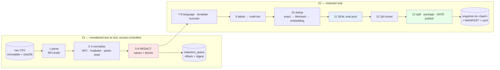

# Proposal: a dataset construction pipeline for the ticket → services classifier

Status: proposal, awaiting decisions in §8. **No code exists and none is written until this is approved.**
Date: 2026-08-18
Companion documents:
[`docs/specs/dataset-pipeline-ml.md`](../specs/dataset-pipeline-ml.md) — what the pipeline must do to the data and how each choice is proven (author: `ml-researcher`) ·
[`docs/specs/dataset-pipeline-architecture.md`](../specs/dataset-pipeline-architecture.md) — the software that does it (author: `system-architect`).
This document is the decision-level summary: the recommendation, the one question that decides the design, the cost, and what needs answering before implementation starts.

Upstream context, unchanged by this proposal: [classifier proposal](./ticket-services-classifier.md) · [classifier spec](../specs/ticket-services-classifier.md) · [dataset runbook](../specs/dataset-construction-runbook.md) · [LLM fallback policy](../specs/llm-fallback-policy.md).

---

## 1. Recommendation in one paragraph

Build a **13-stage, content-addressed dataset pipeline** whose first eight stages ship as a single versioned package (`ticketprep`) imported unchanged by the dataset build, the training job, and the inference service — because a preprocessing difference between training and serving is invisible offline and fatal in production. The redaction stage, which is the part that decides everything else, follows one rule: **destroy the value, keep the type.** Bank details, PII, government identifiers, secrets and machine payloads become typed placeholders (`<BANK_ACCT>`, `<PAN>`, `<PERSON>`) and structural blocks become typed placeholders carrying exactly one diagnostic attribute (`<PAYMENT_DECLINE: do_not_honor>`, `<SQL_ERROR: deadlock detected>`, `<NGINX_LOG: 503>`). Only one category is deleted outright: quoted and forwarded mail threads. Ship the pipeline as a typed Python CLI with a JSON manifest, not an orchestrator — it runs about ten times a quarter and its product is an audit trail and a hash.

**The policy above is a hypothesis, not a decision.** It ships only if it wins the six-arm ablation in [`dataset-pipeline-ml.md`](../specs/dataset-pipeline-ml.md) §5, whose decision rule is written down before the run. A pilot of that exact protocol has already been executed on the fixture; §3.3 reports what it found, including where it disagrees with the recommendation.

---

## 2. Scope

**In scope:** everything from `data/raw/tickets_export.csv` (or, later, a production DB extract) to an immutable, hashed, documented snapshot that a training job can open — plus the preprocessing unit that the inference service imports.

**Out of scope, and deliberately unchanged:** model choice, training recipe, evaluation protocol, thresholds, rollout. Those are settled in the [classifier proposal](./ticket-services-classifier.md) and [spec](../specs/ticket-services-classifier.md) and are treated here as fixed requirements. The dataset runbook's provenance procedure (Cases A/B/C/D) is not re-litigated either; §7 explains how this pipeline absorbs it without a rewrite.

**What the fixture is.** `data/raw/tickets_export.csv` is 5,013 synthetic rows, RU 66.8% / EN 28.5% / code-switched 4.7%, 20 services, mean cardinality 1.90, with a deliberately un-scaled rare tail (`terraform-provider` 15 positives, `message-queue` 31, `cdn` 38, `dns` 41). 1,500 rows (29.9%) carry pasted payloads including bank/transactional dumps, PII blocks, application secrets and company identifiers. It is a realistic-shape stand-in, not a training set — see §6.

---

## 3. The question that decides the design

> "Each ticket description may include additional information such as bank or transactional details, PII, company identifiers, etc which may not be useful to fine-tune a classifier."

That is the right instinct and it has a non-obvious answer. The premise splits into two claims that turn out to point in opposite directions.

### 3.1 The values are worse than useless — the types are among the strongest features we have

Measuring **lift** — `P(service | detector fires) ÷ P(service)` — over all 5,013 rows shows that the *presence and kind* of a pasted payload is one of the sharpest signals in the corpus [measured, `ml.md` §4.2]:

| Payload kind | Lift | Service it cues | Corpus positives for that service |
|---|---|---|---|
| `redis-cli` output | **×51.2** | `managed-redis` | 98 |
| `DNS zone` / `dig` output | ×10.0 | `networking` | — |
| SQL query / `EXPLAIN` plan | ×8.2 | `managed-postgres` | — |
| `docker-compose` with a `postgres` image | ×7.6 | `managed-postgres` | — |
| `smtp*` / `mail*` hostnames | ×7.3 | `notifications` | — |
| `cdn*` / `edge*` hostnames | ×10.8 | `cdn` | 38 |
| Bank requisites block (р/с, к/с, БИК, IBAN) | ×5.1 | `billing` | 851 |
| Payment / 3-DS decline dump | ×4.7 | `billing` | — |
| Card PAN, full or masked | ×4.6 | `billing` | — |
| ИНН / КПП / ОГРН / legal entity | ×3.9 | `billing` | — |

The bank details a customer pastes are simultaneously the most dangerous thing in the row and one of the best predictors of `billing`. The same holds for `redis-cli` output and `managed-redis` — a service with 98 positives, which needs every cue it can get.

So the naive reading of the request — "strip the bank details and the PII, they are not useful" — would delete the strongest available evidence for exactly the services that have the least data. **The resolution is that the signal lives in the payload's *kind*, and the liability lives in its *values*, and these separate cleanly.** `<PAYMENT_DECLINE: do_not_honor>` keeps the ×4.7 cue and destroys the PAN, the RRN and the auth code. `<REDIS_CLI: evicted_keys>` keeps the ×51.2 cue and destroys the hostnames and keyspace names.

Where nothing is safe to retain, nothing is: government IDs (`<GOV_ID>`) measure at ≤×2.4 on n=14, i.e. noise, and carry maximum liability — so no attribute survives. Bank requisite blocks collapse to a bare `<BANK_DETAILS>` for the same reason.

**One category keeps no content at all:** quoted and forwarded mail threads (176 rows) collapse to a bare `<QUOTED_MAIL>` marker with no attribute. Weakest measured signal of any block kind, densest concentration of names, addresses and phone numbers — it is where the corpus hides whole customer identities.

### 3.2 The identifiers really are useless — and they are expensive

The other half of the premise holds exactly as stated. UUIDs, request/trace/correlation ids, timestamps, hashes and base64 blobs carry near-zero signal and consume **18,505 tokens for ids alone (3.1% of the corpus) and 13,235 for hashes and blobs** [measured with the real `xlm-roberta-base` tokenizer]. A single JWT costs 178 tokens. Redacting them is a pure win on both axes.

Total token budget recovered [measured]:

| Policy | Token change |
|---|---|
| Typed value-level redaction only | **−9.9%** |
| + block type-collapse | **−25.9%** |
| + placeholders registered as tokenizer special tokens | **−30.0%** |
| Payload deletion instead of type-collapse | −28.8% |

This confirms the classifier spec's "10–30% of the token budget" estimate ([`ticket-services-classifier.md`](../specs/ticket-services-classifier.md) §4.6) with a measurement. Note the last two rows: **deleting payloads buys only 2.9pp more budget than collapsing them**, so deletion is not justified on cost grounds — it has to win on quality, which is what §3.3 tests.

### 3.3 The policy is chosen by experiment, and the pilot already disagrees with us

[`dataset-pipeline-ml.md`](../specs/dataset-pipeline-ml.md) §5 specifies six arms (raw / uniform `<REDACTED>` / typed values / typed values + type-collapsed blocks / typed values + bare-type blocks / payload-stripped), 5 seeds, paired bootstrap, and a decision rule fixed **before** the run: eliminate any arm that fails the leak gates, then take the cheapest arm not significantly worse than the best, subject to a tail guard that disqualifies an arm losing more than 2pp on any service with ≥30 validation positives.

That protocol was piloted end to end on the fixture with the cheap model (TF-IDF + one-vs-rest logistic regression). Two results are worth surfacing at decision level:

1. **Every redaction arm beats raw text** (+1.9 to +4.6pp micro-recall). The intuition that redaction can only remove information is wrong: high-entropy identifier spans are noise the model spends capacity on.
2. **Applied mechanically, the rule selects payload-deletion, not type-collapse** — the two arms land within noise of each other (0.676 ± 0.017 vs 0.674 ± 0.022, against a ±3pp resolution limit at this sample size), and deletion is cheaper. That contradicts the recommendation in §3.1, and the spec leaves the contradiction in place rather than hiding it.

The per-service table shows why the question is still open: the three services with the highest block-kind lift — `managed-postgres`, `networking`, `managed-redis` — are the only three where type-collapse beats deletion, in the direction the lift table predicts, at a magnitude (≈0.9pp AP) inside seed noise. A micro metric dominated by `billing`, `console-ui` and `auth` cannot see a tail collapse.

**The honest position: suggestive, not decided.** The pilot's job was to prove the harness runs and to calibrate effect sizes, and it did both. The decision needs the fine-tuned encoder (a linear model cannot exploit a `TYPE+ATTR` attribute the way a contextual one can) and production labels. Until then the recommendation in §3.1 stands as the default because it is the reversible choice: attributes can be dropped later, deleted payloads cannot be recovered.

### 3.4 Two findings that invert normal detector tuning

Both are consequences of the fixture being deliberately, verifiably fake — and both would cost real time if discovered during implementation:

- **Validators must score, not gate.** 0 of 89 ИНН instances have a valid check digit and only 2 of 35 digit-runs pass Luhn, because the corpus author made them arithmetically invalid on purpose. A detector that requires a valid check digit finds nothing here. In production the opposite holds. So check-digit validity raises a span's confidence; it never decides whether it is a span.
- **Recall measured on this file does not transfer.** 92% of secret-shaped spans sit within 120 characters of an `EXAMPLE` / `DO-NOT-USE` / `TEST` marker. Any recall number from this corpus is flattering. **A ~500-ticket hand-labelled redaction eval set on production text is therefore a blocking prerequisite** (§8 Q2), with per-category recall floors — proposed 0.99 for credentials and direct identifiers, 0.95 for quasi-identifiers — and those, never the fixture numbers, are what gets reported to legal.

---

## 4. The pipeline

Thirteen stages. **Stages 2–8 are the shared code path** required by [classifier proposal §5.3](./ticket-services-classifier.md); stages 9–13 are build-only and must not exist in the serving path.

Three nodes carry the design. **Redact** is the zone boundary — nothing unredacted crosses it, and that is enforced by a type the egress functions require, not by a convention. **Seal** runs before the QA funnel so gold and holdout rows are provably untouched by any automated label-changing process. **Gate** is the publication checkpoint: leak audit, split-leak audit, schema, determinism, train/serve round-trip.

The stage order is not arbitrary; each constraint has a measurement behind it [`ml.md` §4.5]. Mojibake repair precedes redaction because a `cp1251`-as-`latin1` row (`ÈÍÍ 6470590803, ÊÏÏ 630001001` in `TICKET-16991`) keeps its digits but loses every keyword a company-ID detector anchors on. Timestamps are matched before IPv6 because a standard IPv6 regex fires 903 times on this corpus and **68% of those are clock times**. Language identification runs after payload segmentation because 455 rows change language-slice membership depending on the order.

### 4.1 Architecture decisions worth the decision-maker's attention

Full reasoning and the rejected alternatives are in [`dataset-pipeline-architecture.md`](../specs/dataset-pipeline-architecture.md) §0 and §14.

| # | Decision | Why it matters here |
|---|---|---|
| **D1** | **Two packages.** `ticketprep` (pure, dependency-light, stages 2–8) is imported by the build, the training job **and** the inference container. `ticketpipe` (stages 1, 9–13) depends on it and never ships to production | This is the mechanism that satisfies [proposal §5.3](./ticket-services-classifier.md). One implementation, three consumers, enforced by an import-boundary test |
| **D2** | **`preprocess_version` is a hash of the resolved config**, not hand-maintained semver, and CI computes the blast radius of every rule change by diffing `build_input` over all 5,013 rows | Judgement calls about which regex edits are "harmless" are how skew ships. A changed row count > 0 forces a major bump automatically |
| **D3** | **A typed CLI plus `MANIFEST.json`; DVC as blob storage only; no orchestrator** | ~10 builds a quarter, no SLA, full cold build under two minutes. Dagster was the closest call and loses on a deployment to maintain plus a second answer to "what produced this file". Temporal is adopted later for the production DB extract *only* (§7) |
| **D4** | **The eval pool is sealed before the QA funnel**, enforced by an anti-join and a publication gate | The runbook's central rule — training and evaluation have opposite selection rules — becomes structural instead of documentary |
| **D5** | **The LLM in the QA funnel triages; it never commits a label** | [`llm-fallback-policy.md`](../specs/llm-fallback-policy.md) §5 makes every LLM output model provenance. Auto-applying its verdicts either excludes those rows from training anyway or launders model output as human labels — the exact contamination this project exists to escape. A human accepting a finding records `source: human, assisted_by: llm`, which also makes automation bias measurable |
| **D6** | **The span audit stores offsets, category, detector, action and a salted digest — never the matched plaintext for critical/high categories** | The literal "log every span" requirement would place an unredacted extract of every PEM block and PAN inside the snapshot, travelling into the training zone. Offsets into the immutable raw file reconstruct it inside Z1 when genuinely needed |

Two further calls worth flagging because they overturn instructions from the upstream documents on the evidence of this corpus:

- **Dedup groups rather than deletes, and `dedup_group_id` — not `organization_id` — is the split key.** The 99-row auto-alert clique spans 51 organisations, so org-grouping would scatter it across splits. Clustering at Jaccard ≥ 0.7 (at 0.8 the clique fragments into 7 components) and forbidding any group from straddling a boundary costs 10 test rows and removes the actual leak mechanism.
- **Temporal split wins; org-grouping is demoted to a diagnostic.** [measured] under a pure temporal split **all 186 test organisations also appear in train**, because 210 orgs file across 15 months — so the runbook's "no org straddles the boundary" rule cannot be satisfied without discarding the whole test set. Forcing it destroys temporality (99.9% of train tickets end up later than the earliest test ticket). The dataset card reports the org-overlap number and states that unseen-org generalisation is **not measurable** on this snapshot, rather than leaving a reader to assume it was checked.

---

## 5. What this costs

| Phase | Contents | Effort |
|---|---|---|
| **1 — the spine** | `ticketprep` (normalise, pattern + validator + block redaction, template, config hash, golden and corpus-diff tests); `ticketpipe` stages 1 and 9–13; CLI, manifest, `rebuild --verify`; the runbook §7 step-4 week-1 reports | **~2 weeks, 1 dev** |
| **1.5 — what makes phase 1 trustworthy** | NER tier + divergence report; embedding dedup tier; red-team injection harness; QA funnel stages F0/F1 with CSV round-trip; nightly repro job | ~1 week |
| **2 — after the model exists** | Cross-process train/serve parity test; LLM triage tier (if permitted); Label Studio gold flow; the §3.3 ablation on the encoder | ~1–2 weeks |
| **3 — production data** | `pg_extract` as a Temporal workflow; Cases A/B/C/D reconstruction; internal-message parser with the ≥95%/month gate; org pseudonymisation | ~2–3 weeks |
| **Human time, not developer time** | **Redaction eval set: ~500 tickets, ~30 person-hours.** Distinct from — and additional to — the ~70 hours of annotation the classifier proposal already budgets for the model gold set | ~30 h |

Compute is negligible: the full build is under two minutes on a laptop at 5k rows; the embedding dedup tier is the only stage that becomes expensive at production scale (~2.3 h on CPU at 500k, or ~5 min on a GPU box), and it shards without a redesign.

**Explicitly deferred:** any web review UI, incremental builds, a feature store, automated retrain triggers, a dataset registry service. None has a named requirement.

---

## 6. What the resulting dataset may and may not be used for

This needs to be stated at decision level because it is the easiest thing in this proposal to lose in translation.

The fixture's labels are **assigned by the generator that wrote the text**. There is no blind annotation, no second annotator, no inter-annotator agreement — α is *undefined*, not low. In the runbook's provenance vocabulary every row is a case the partition does not contain, and it behaves like Case B (the label agrees with whatever produced the text, by construction) rather than Case A.

| Question | Answer on this file |
|---|---|
| Build and measure the funnel's throughput, flag rates, cluster behaviour, runtime? | **Yes** |
| Measure flag *precision*? | **No** — "correct" is defined by the generator |
| Compute Krippendorff's α? | **No** — one annotator, and it is a program |
| Validate split logic, dedup logic, gate wiring, payload handling, latency, memory? | **Yes — this is what it is for** |
| Choose the redaction policy? | **Partially** — the pilot validates the mechanism and the effect-size scale; the decision needs production data |
| Claim a model is good? | **No.** Any accuracy number describes the generator |

Consequently the acceptance gates split into two tiers: **14 engineering gates** checkable here (parse integrity, label mapping, determinism, preprocessing idempotence, leak audit, mojibake, dedup/split leakage, shortcut scan, and the train/serve round-trip) and **5 evidence gates** that cannot pass on this file (redaction eval set, the encoder ablation, gold-set α ≥ 0.67, label provenance, funnel flag precision). A v1 declared from this fixture passes tier 1 only, and the dataset card is required to say so in its **first paragraph**.

One concrete illustration of why this matters: a shortcut scan of the fixture found a stray CJK character `長` inside one generated phrasing, replicated verbatim across 4 rows — all 4 labelled `access-control`. A rare token that perfectly predicts a class is precisely what a fine-tuned encoder will latch onto. Scanning every token appearing in 3–50 rows for label-conditional purity is therefore a required diagnostic on every snapshot, not an optional one.

---

## 7. How this extends to production data without a rewrite

The provenance columns are first-class in phase 1 even though the fixture cannot populate them. Two source adapters implement one contract, and **everything downstream of ingest is unchanged**:

| | `csv_export` (phase 1) | `pg_extract` (phase 3) |
|---|---|---|
| Emits | `tickets.parquet` | `tickets.parquet`, `messages.parquet`, `provenance.parquet` |
| `provenance_case` | constant `fixture` | `A \| B \| B_strong \| C \| D` per [runbook](../specs/dataset-construction-runbook.md) §2, or directly from `ticket_services_audit` once [proposal §5.4](./ticket-services-classifier.md) lands |
| `label_source` | constant `fixture` | `human` (A/C), `model` (B), `unknown` |
| Extra gates | none | internal-message parse rate ≥ 95% per month; Case C in-distribution window check |

The runbook's entire Case A/B/C/D procedure becomes a new adapter module plus a config section — a new module and a gate, not a migration. The internal-message parser is versioned like the redaction rule pack, and its per-month parse-rate report is a build gate, so a mid-corpus format drift fails the build instead of silently shrinking a month.

**One schema delta is requested** against [proposal §5.4](./ticket-services-classifier.md): add `preprocess_version text not null` to `service_predictions`. One column, and without it a shadow-mode discrepancy cannot be attributed between a model change and an input change.

---

## 8. Decisions needed

### Blocking the start of implementation

| # | Question | Owner | Recommendation |
|---|---|---|---|
| **1** | **Does the NER tier run at serve time, or in batch only?** The architecture doc proposes batch-only for latency; the ML spec calls that a silent train/serve skew, because training text would carry `<PERSON>` exactly where serving text carries a real name | `system-architect` + `ml-researcher` | **Build the training text with the *online* tier set**, and use the batch NER tier only for the leak audit and stored display columns. Measure the delta with the corpus-diff test first — if NER changes <1% of rows, the choice is cheap either way. This is the one genuine conflict between the two specs and it is resolvable in a meeting |
| **2** | **Who annotates the ~500-ticket redaction eval set (~30 h), and when?** | Support lead + security | Schedule it alongside the model gold set. Without it no redaction policy can be shipped to production, only to the fixture |
| **3** | **Sign-off on per-category recall floors and leak-rate gates** (proposed 0.99 credentials/direct identifiers, 0.95 quasi-identifiers; 0 residual credentials, ≤1 residual direct identifier per 10k) | Legal/DPO + security | These are risk-appetite decisions, not ML decisions. Gates cannot be enforced until they are numbers |
| **4** | **Will the pipeline ever run against the real `tickets` table, and does `ticket_messages` exist there?** | `dataset-provider` + backend | This is the same question as [proposal §9 Q1](./ticket-services-classifier.md), and it still determines whether any quality claim is possible at all |

### Blocking the v1 declaration

| # | Question | Owner | Recommendation |
|---|---|---|---|
| **5** | 152-FZ: may redacted ticket text leave the production perimeter for training? May a self-hosted LLM run the triage tier? | Legal/DPO | Design assumes **never** for the hosted case; the funnel works with the LLM tier off. Keep it off in phase 1 |
| **6** | Closed allowlists for the `TYPE+ATTR` attributes — host roles, resource kinds, error strings | Product owner + `ml-researcher` | An open attribute vocabulary is a re-identification channel; a too-narrow one throws away the ×7–×51 cues. Needs one working session |
| **7** | Tail services: annotate more, merge, or serve by rule? At 15 corpus positives, `terraform-provider` has **1** validation and **1** test positive; `message-queue` has **0** in test | Product owner | The pipeline can only make the shortage visible. Report services with test `n < 30` as "insufficient data" — never as a precision number |
| **8** | Where does the snapshot blob store live, and what is the retention policy for `interim/` (which contains unredacted text and offset maps)? | Infra + legal/DPO | S3-compatible, in-RU, object-lock on `processed/`; 30-day retention on `interim/` |
| **9** | Who is the named reviewer for redaction rule-pack changes? | Security | A named individual in CODEOWNERS. Without a name, this control does not exist |
| **10** | Is the 20-service taxonomy stable, and who owns `labels.json`? | Product owner | Renames and merges invalidate historical labels; a mapping table is required from the owner |

Decisions 1–4 block implementation. The rest block declaring v1.

---

## 9. Principal risks

| Risk | Why it is dangerous | Mitigation |
|---|---|---|
| **The redaction pack is flattered by the fixture** | Every secret says `EXAMPLE`, every ИНН has an invalid check digit, no digit run other than published test PANs passes Luhn. Measured recall here will not survive contact with real text | Red-team injection harness with per-category floors; report *those* numbers to legal, never the fixture's. **This is the top risk in both specs** |
| **Train/serve preprocessing skew** | A rule that runs in the build and not at inference is invisible offline and surfaces weeks later in shadow mode | One package (D1); `preprocess_version` compared at boot; the round-trip gate re-derives 500 snapshot rows through the serving path and CI byte-compares against a built serving image, not an in-process import |
| **The model learns the generator, not the task** | Compositional text, ~60 payload templates, 40% of sentence instances are repeated boilerplate | Mandatory shortcut scan; boilerplate-ratio slice in every metrics report; the tier-1/tier-2 gate split; the card's first paragraph |
| **Redaction destroys tail signal** | A micro metric dominated by `billing`/`console-ui`/`auth` cannot see `managed-redis` collapse | The §3.3 tail guard disqualifies an arm before the cheapness rule can select it; per-service and payload-row slices are first-class outputs |
| **`preprocess_version` churn forces retrains** | Every major bump invalidates the deployed model's compatibility check | CI prints the blast radius pre-merge; rule changes are batched into windows aligned with retrains |
| **MinHash misses semantic near-duplicates** | The corpus README states the Postgres connection-pool cluster scores 0.2–0.5 and MinHash *will* miss it — by design | Embedding tier at cosine ≥ 0.92; both tiers' cluster counts reported |
| **Z1 is the real compliance surface** | Raw text plus offset maps reconstruct every redacted span | Access control on Z1; 30-day `interim/` retention; no plaintext for critical/high spans in the audit artifact (D6) |

---

## 10. Reading order

1. **This document** — the recommendation, the redaction question, the cost, and what needs deciding.
2. [`docs/specs/dataset-pipeline-ml.md`](../specs/dataset-pipeline-ml.md) — the 46-row span taxonomy with a prescribed transform and measured lift per category, the detector cascade and its ordering proofs, the six-arm ablation and its pilot, label normalisation, dedup, splits, the QA funnel, and the two-tier acceptance gates. **If you read one section, read §5.**
3. [`docs/specs/dataset-pipeline-architecture.md`](../specs/dataset-pipeline-architecture.md) — the stage graph and contracts, the `ticketprep`/`ticketpipe` split, artifact schemas and audit trail, configuration and reproducibility, the orchestration trade study, the human-in-the-loop boundary, trust zones, and the repo layout with a phased build order.
4. Upstream and unchanged: [classifier proposal](./ticket-services-classifier.md) · [classifier spec](../specs/ticket-services-classifier.md) · [dataset runbook](../specs/dataset-construction-runbook.md) · [LLM fallback policy](../specs/llm-fallback-policy.md).
