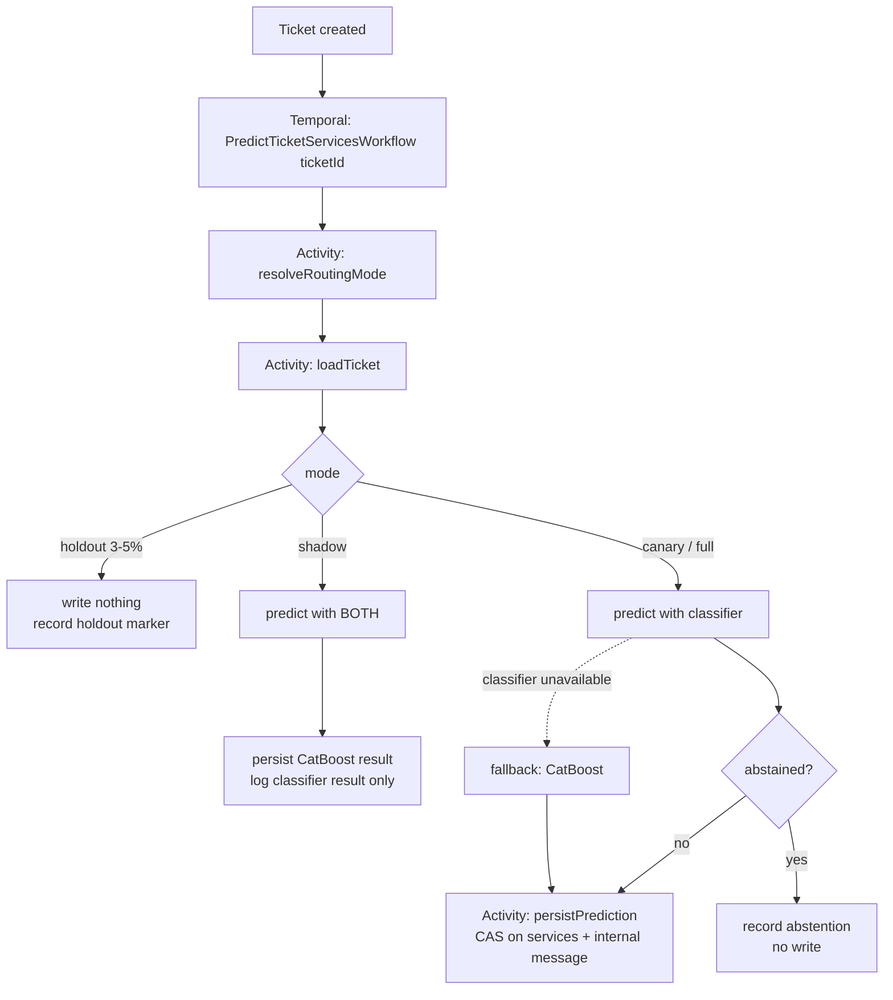

# Proposal: replacing the CatBoost service predictor with a fine-tuned multilingual classifier

Status: proposal, awaiting decisions in §9
Date: 2026-08-15
Companion document: [`docs/specs/ticket-services-classifier.md`](../specs/ticket-services-classifier.md) — the full ML specification (data, training, evaluation, benchmarks, citations). This document is the decision-level summary plus the lifecycle integration design that the spec deliberately leaves open.

---

## 1. Recommendation in one paragraph

Fine-tune a **multilingual transformer encoder** (`xlm-roberta-base` as default, `mdeberta-v3-base` and `multilingual-e5-base` as challengers in the same sweep) with a **20-way sigmoid head**, one output per service. Export it to **INT8 ONNX** and serve it on CPU behind a small stateless HTTP service. Decode with **per-service thresholds tuned to a precision floor**, plus a hard top-4 cap that enforces the `1 ≤ |S| ≤ 4` contract. Keep the Temporal workflow shape exactly as it is today and swap only the activity that produces the prediction — with a routing step that lets us run shadow → canary → full rollout without touching workflow code again.

Measured on a 4-vCPU CPU with AVX-512-VNNI: **42.9 ms p50 per ticket, 279 MB artifact, 503 MB RSS, 26 tickets/s at batch 16.** That is roughly two orders of magnitude more throughput than the platform needs, so the CPU-only constraint is comfortably satisfied and is *not* the binding constraint on this project.

**The binding constraint is label quality, not modelling.** See §3 — it is the reason this proposal reads the way it does.

---

## 2. What we are replacing

Today, on ticket creation, a Temporal workflow takes the ticket ID, runs a CatBoost model over title and description, writes the predicted set into `tickets.services`, and inserts a `ticket_messages` row with `type = 'internal'` containing the list as text.

In ML terms the task is **multi-label classification with a cardinality constraint**: ~20 services, 1–4 active per ticket, bilingual RU/EN input. CatBoost over bag-of-words features is a reasonable 2019-era answer to this and a poor 2026 one, for two specific reasons rather than general "it's old":

- **Russian morphology.** Token-matching features fragment across case and number endings unless you lemmatise. A subword-based multilingual encoder gets this for free.
- **No cross-lingual transfer.** A bag-of-words model treats the Russian and English vocabularies as disjoint, so the English slice learns only from English tickets — and the English slice is the small one. A shared multilingual encoder lets English tickets benefit from the Russian training data.

---

## 3. The part that matters more than the model choice

`tickets.services` currently contains **a mixture of CatBoost output and human corrections, with no way to tell them apart.** Training naively on that column trains the new model to imitate the old one. Quality is then capped at CatBoost's ceiling, and — worse — offline metrics look *best* precisely where the new model reproduces CatBoost's mistakes. This is the classic direct-feedback-loop failure from Sculley et al., *Hidden Technical Debt in Machine Learning Systems* (NeurIPS 2015).

If we skip this, we will produce a model with excellent offline numbers and no real-world improvement, and we will not find out until it is in production.

**There is a lucky break.** The `type='internal'` message we already write is an accidental audit log: it is a timestamped snapshot of what the model predicted, for every ticket. Comparing it against the current `services` value partitions the corpus:

| Case | Condition | Meaning | Use |
|---|---|---|---|
| **A — corrected** | current ≠ predicted | a human demonstrably edited it | **trustworthy label** |
| **B — unchanged** | current = predicted | agent agreed, *or* nobody ever looked | unknown, not trustworthy |
| **C — no prediction row** | pre-rollout ticket | human-authored | **trustworthy, and the cleanest source** |

**First thing to check, before anything else is built: can we parse those internal messages back to the CatBoost rollout date?** If yes, we have a usable dataset today. If the format has drifted or the messages are not reliably parseable, there is no retroactive fix — we would need to add write-provenance capture and then *wait months* for data to accumulate. That single question is the difference between a ~6-week project and a ~4-month one.

Two consequences that are non-negotiable in the plan either way:

1. **A blind-annotated gold set (~3,000 tickets, ~70 person-hours).** Annotators must not see the stored value — showing it anchors them onto the old model's answer and inflates measured agreement. This is needed even in the happy path, because Case A is biased toward tickets the old model got wrong and therefore cannot be the test set.
2. **A permanent 3–5% traffic holdout** where we write no prediction at all. Those tickets get pure human labels and become the only uncontaminated evaluation stream for every future model version. Without it we rebuild the exact same trap for whoever replaces *this* model.

---

## 4. Strategy comparison

Every option below was assessed against the same four constraints: bilingual RU/EN, CPU-only serving, precision-over-recall, and a taxonomy that will change over time.

| # | Strategy | Expected quality | CPU serving | Training cost | Data needed | Verdict |
|---|---|---|---|---|---|---|
| 1 | **Retuned CatBoost** (native text features, embedding features) | baseline → small gain | excellent, ms-scale | minutes, CPU | low | **Required as the baseline.** Cheap; if it closes most of the gap, that changes the answer |
| 2 | **Frozen multilingual embeddings + logistic regression** | moderate gain | same encoder cost as #3; head is free | minutes | works from ~500 labels | **Required as a baseline and the cold-start fallback.** Very attractive property: re-fit the head in minutes when a service is added |
| 3 | **Fine-tuned multilingual encoder** | highest of the CPU-feasible options | **43 ms p50, measured** | 15–70 min GPU | ~5k+ labels for a clear win | **Recommended** |
| 4 | **LLM zero/few-shot prompting** | plausible on head services, weak on org-specific taxonomy | self-hosted: not CPU-feasible. Hosted: blocked by data residency | none | none | Baseline only |
| 5 | **LoRA-tuned small generative LLM** | ≈ #3, not better, on a closed 20-class task | poor — autoregressive decode, 0.6–1.7B params vs a 279 MB encoder | higher than #3 | similar to #3 | Rejected |
| 6 | **kNN retrieval over embeddings** | moderate | encoder cost + index lookup | none | tens of examples/service | **Kept for one job:** day-0 support for newly added services |

### Why the fine-tuned encoder wins

**The decisive argument is thresholds, not accuracy.** The product constraint is that a wrong service shown to an agent costs more than a missing one. Enforcing that requires a *calibratable score per service* that we can threshold to hit a precision floor. A discriminative encoder produces exactly that. Generative approaches (#4, #5) produce **text**, and text does not have a threshold — you cannot tune an LLM's prose output to "90% precision" without bolting a calibration layer on top, at which point you have built #3 the hard way and are paying autoregressive decode costs on CPU.

Secondary reasons: shared multilingual representation gives the small English slice the benefit of Russian training data (§2); and the CPU constraint is satisfied with ~5× headroom on latency and ~100× on throughput (§6).

**We are not discarding the alternatives.** #1 and #2 are mandatory baselines — a fine-tuned transformer that cannot beat TF-IDF plus a linear model is a finding worth learning in week 3 rather than week 6. #6 stays in the design as the new-service mechanism. And if the usable label count comes in under ~1,000, the honest recommendation flips to #2 and the money goes into annotation instead of GPUs.

### Model size tier

| Checkpoint | Params | INT8 artifact | p50 @256 tok, 4 threads | Note |
|---|---|---|---|---|
| `multilingual-e5-small` | 117M | **118 MB** | **25.6 ms** | frugal tier / fallback |
| `xlm-roberta-base` | 278M | **279 MB** | **42.9 ms** | **default** |
| `mdeberta-v3-base` | 278M | ~279 MB | ~43 ms | best expected quality (XNLI ru 80.8 vs XLM-R 78.1), but fp16/export risk |
| `ru-en-RoSBERTa` | 404M | ~404 MB | ~3.5× base | only if the base tier misses the precision floor |

All MIT or Apache-2.0. Pick on validation metrics, not on the prior above.

One finding worth flagging: **vocabulary trimming is not worth doing in phase 1.** The embedding matrix is 69–92% of parameters in every multilingual checkpoint, so trimming 250k→40k tokens takes the base model from 278M to 116M params — but the embedding layer is a *gather*, not a matmul, so this buys artifact size and RAM and essentially **no latency**. Since measured RSS is already only 503 MB, it is not a binding constraint. Skip it; revisit only if memory per replica becomes tight.

---

## 5. Integration into the ticket lifecycle

**Design principle: the workflow shape does not change.** Ticket created → workflow started with ticket ID → services predicted → `tickets.services` written → internal `ticket_messages` row inserted. We replace what happens inside, and add the routing and provenance machinery the ML side needs.



### 5.1 Activities and their contracts

| Activity | Does | Retry policy | Timeout |
|---|---|---|---|
| `resolveRoutingMode(ticketId)` | reads rollout config, computes stable bucket from `hash(ticketId)` → `holdout \| shadow \| canary \| full` | 3 attempts | 5 s |
| `loadTicket(ticketId)` | reads title, description, priority, created_at, current services | 5 attempts, exponential | 10 s |
| `predictServices(payload)` | HTTP call to the classifier service | 5 attempts, 1s→30s backoff; **non-retryable on 4xx/validation** | 10 s per attempt, 2 min schedule-to-close |
| `predictServicesLegacy(payload)` | existing CatBoost path | as today | as today |
| `persistPrediction(...)` | transactional write of `services` + `ticket_messages` + `service_predictions` | 5 attempts | 15 s |

Config reads and hashing happen **inside an activity**, not in workflow code — the result is then recorded in Temporal history, so replays stay deterministic even after we change the rollout percentage. Workflow code changes get guarded with `patched()` / `getVersion()` so in-flight executions do not break on deploy.

### 5.2 Three correctness issues to get right

**Idempotency.** Temporal guarantees *at-least-once* activity execution. If `persistPrediction` succeeds and then the worker dies before recording completion, it re-runs and we get a duplicate internal message. Fix: a unique constraint on `(ticket_id, prediction_run_id)` where `prediction_run_id` is the Temporal workflow run ID, and an upsert rather than an insert.

**Never clobber a human edit.** An agent can edit `services` between ticket creation and workflow completion. Today's blind `UPDATE` would silently overwrite them. Fix: compare-and-set — write only if `services` still equals the value read in `loadTicket` (in practice, still empty). On mismatch, skip the write, record that the human won, and emit a metric. That metric is also a useful signal in its own right: it tells us how often prediction is too slow to be useful.

**Abstention is a normal outcome.** The precision floor means the model will sometimes clear no threshold and return `[]`. The workflow must handle this without writing an empty services array or posting an empty internal message. Whether an empty result should instead show a low-confidence suggestion is a product decision (§9).

### 5.3 The classifier service

A small stateless Python service (FastAPI + `onnxruntime`), separate from the Node worker.

- `POST /v1/predict` — batch-capable; returns per-service scores, the decoded set, abstention flag, and `model_version` / `label_set_version` / `threshold_version`.
- `GET /health`, `GET /ready`, `GET /v1/model`.

Why a separate service rather than in-process in the worker: **all preprocessing must run inside the model service** — PII redaction, text normalisation, the input template, tokenisation. Training and inference must share one code path or we get train/serve skew, which is invisible offline and fatal in production. That code path is Python.

Two rules for the caller: **do not re-threshold** (thresholds ship with the model, scores are for display and logging only), and **reject on `label_set_version` mismatch** rather than mapping services by array position.

### 5.4 Schema additions

Two additions, both of which pay for themselves immediately:

**`service_predictions`** — every prediction, from every model, in every mode:
```
ticket_id, workflow_run_id, model_kind ('catboost'|'transformer'),
model_version, label_set_version, threshold_version,
predicted_services text[], scores jsonb, abstained bool,
mode ('shadow'|'canary'|'full'|'holdout'), latency_ms, created_at
```

**`ticket_services_audit`** — append-only capture of every write to `tickets.services`:
```
ticket_id, old_value, new_value,
actor_type ('model'|'agent'|'api'|'migration'), actor_id, changed_at
```

These are the permanent fix for §3. Once they exist, label provenance is exact rather than reconstructed by parsing prose, and every future model generation gets a clean dataset for free. **This is the highest-value engineering change in the proposal and it is independent of which model we pick** — it is worth doing even if we decide to keep CatBoost.

Related low-cost improvement: give the internal `ticket_messages` row a structured metadata payload alongside the human-readable text, so the historical-parsing fragility described in §3 never recurs.

### 5.5 Failure behaviour

Classifier unavailable after retries → fall back to CatBoost, which we keep deployed for one release cycle after full rollout. Both unavailable → complete the workflow with no prediction and emit a metric. **A prediction failure must never fail ticket creation**; the prediction is an assistive suggestion, and the workflow is already asynchronous relative to the user.

### 5.6 Where an LLM does belong

Rejecting an LLM on the main path (§4) does not rule it out on the paths the classifier structurally cannot serve — a newly added service with no training data, abstentions, the near-threshold band, and out-of-distribution input. The CPU-throughput objection that decides the main path does not transfer, because fallback traffic is roughly two orders of magnitude smaller. Trigger conditions, the constrained-adjudication mode, the contamination rules, and per-case ship criteria are specified in [`docs/specs/llm-fallback-policy.md`](../specs/llm-fallback-policy.md).

---

## 6. Resource requirements

### 6.1 Training (GPU)

| Dataset | Model | T4 (16 GB) | A10G | A100-40G |
|---|---|---|---|---|
| 5,000 tickets | base | 6.7 min | 3.5 min | 1.4 min |
| 20,000 | base | 27 min | 14 min | 5.6 min |
| 50,000 | base | **67 min** | 35 min | 14 min |
| 200,000 | base | 268 min | 139 min | 56 min |

Derived from the standard `C ≈ 6·N·T` rule at 25% MFU, with embeddings frozen. **Apply a 1.5–2× fudge** for dataloading and evaluation passes.

- **VRAM: 4–6 GB** (batch 32 × 256 tokens, mixed precision, embeddings frozen). Fits a T4 comfortably; an 8 GB card works at batch 16.
- **A single T4 or any ≥16 GB GPU is sufficient.** No multi-GPU, no distributed training, no cluster.
- **Full 24-trial hyperparameter sweep at 50k tickets: ~1.5–2 GPU-days on a T4**, or about half a day on an A100. That is the entire compute budget of the project. On spot/preemptible pricing this is a **low-tens-of-dollars** line item [estimate] — GPU cost is not a meaningful factor in this decision.
- Retraining cadence: quarterly, or when a new service crosses ~200 labelled positives. Same job, same cost.

### 6.2 Inference (CPU, production)

Measured, INT8, 256 tokens, AVX-512-VNNI:

| | Base model (recommended) | Small model (fallback) |
|---|---|---|
| p50, batch 1, 4 threads | 42.9 ms | 25.6 ms |
| Throughput, batch 16 | 26 tickets/s | 61 tickets/s |
| Artifact on disk | 279 MB | 118 MB |
| Peak RSS | 503 MB | 258 MB |

**Recommended production allocation: 2 replicas × 2–4 vCPU × 1 GB RAM.**

The sizing arithmetic is worth spelling out, because the answer is unintuitive. At 20,000 tickets/month the average rate is **0.008 tickets/s**. A single replica sustains ~23 tickets/s single-stream — roughly **3,000× the average load**. Even at a million tickets a month we would be at 0.4 tickets/s. Two replicas are for availability, not capacity. Burst tolerance comes free: prediction is asynchronous, so an incident spike simply queues on the Temporal task queue and drains.

Three caveats that do affect sizing:

- **AVX-512-VNNI is load-bearing.** INT8 gives 1.4–2.5× on a VNNI-capable CPU, but on CPUs without it INT8 can be *slower* than fp32. **We need to confirm the production CPU model before committing** — if there is no VNNI, the recommendation shifts to the small model in fp32.
- **Set `intra_op_num_threads` explicitly** to the allocated core count and `inter_op_num_threads = 1`. Letting onnxruntime auto-detect inside a CPU-limited container causes thread oversubscription and unstable latency.
- Below 2 cores per replica the base model stops being attractive: 4→2 threads costs ~1.7× latency, 4→1 costs ~3×.

**Requested SLO: p95 ≤ 250 ms for the model call** — about 5× headroom over measured, deliberately generous because the prediction is asynchronous and latency headroom can be traded for cheaper hardware.

### 6.3 Human effort

**~70 person-hours of experienced support-agent time** for the gold set: 3,000 single annotations plus 300 double-annotated for agreement, at ~60 s each, plus guideline authoring and adjudication. This is the real cost of the project and the one most likely to be under-resourced. Without it there is no trustworthy evaluation and the project cannot conclude anything.

---

## 7. Rollout

| Stage | What happens | Gate to advance |
|---|---|---|
| **0 — Shadow** (≥2 weeks, ≥2,000 tickets) | model scores every ticket; output logged only; nothing written, nothing visible to agents; CatBoost stays live | shadow precision (vs the human-final service set observed ≥7 days later) within **3pp** of offline test precision. A larger gap means the offline evaluation is wrong — stop and diagnose |
| **1 — Canary** | small traffic share writes real predictions | agent correction rate not worse than CatBoost's, over ≥1,000 tickets |
| **2 — Full** | all traffic; CatBoost retained as runtime fallback for one release cycle | — |
| **Permanent** | 3–5% holdout writes no prediction at all | never removed |

The shadow gate is the one that matters. It is the only check that catches leakage, train/serve skew, and preprocessing mismatch before agents see the output.

**Ship criterion (all must hold):** ≥5pp absolute gain in recall-at-90%-precision over *re-measured* CatBoost with a paired-bootstrap 95% CI strictly above zero; precision floor holds on test; no service (n≥30) below 0.75 precision; both RU and EN slices ≥0.85 precision; seed spread ≤3pp; INT8-vs-fp32 delta ≤1pp; ops budget met on the real production CPU.

That bar is deliberately harsh. A positive-but-smaller gain is a **"keep CatBoost, revisit with more labels"** finding, not a ship — adding a transformer to the ops surface for a lateral move is a bad trade, and saying so up front is what stops the project from rationalising one later.

---

## 8. Timeline

| Week | Work |
|---|---|
| **1** | Answer the blocking questions (§9). Run the provenance reconstruction query. Report Case A/B/C counts, class balance, cardinality histogram, RU:EN ratio, token-length distribution. **This report alone determines whether this is a 6-week or a 4-month project** |
| **1–2** | Annotation guideline + gold set. In parallel: trivial and TF-IDF baselines, re-measure CatBoost |
| **3** | Frozen-embedding baseline — sets the bar the fine-tuned model must clear |
| **3–4** | Fine-tuning sweep, learning curve, INT8 export, threshold tuning |
| **5** | Evaluation, error analysis, single test-set scoring, ship decision |
| **6+** | Shadow mode |

The provenance and audit schema work (§5.4) should start in week 1 regardless of the outcome, since it is valuable independent of which model ships.

---

## 9. Decisions and answers we need

**Blocking the start:**

1. **Is there any record of who or what last wrote `tickets.services`?** Audit table, event log, trigger history — or failing that, are the `type='internal'` prediction messages parseable back to the CatBoost rollout date? *(backend/DBA — this is the schedule risk)*
2. **Ticket volume/month, historical span, RU:EN ratio, human-correction rate, cardinality distribution.** *(a week-1 query)*
3. **Operating point:** what precision floor is acceptable (proposed: 90%)? What coverage floor (proposed: 80% of tickets get ≥1 suggestion)? **Is an empty/abstained suggestion acceptable, or must we always show something?** These must be fixed *before* test evaluation, or we are choosing the target after seeing the results. *(product owner)*
4. **Can 2–3 experienced agents be allocated ~70 hours for annotation?** *(support lead)*

**Blocking the ship decision:**

5. Are `labels` and `flags` populated **at ticket creation**, and is their creation-time value recoverable historically? Default is to exclude them — if they are filled in later during triage, training on them is target leakage. *(product + backend)*
6. Current CatBoost artifact, its feature pipeline, and its training data — we must re-measure it on the clean test set, giving it its best shot. *(whoever owns it)*
7. Is the service taxonomy stable? Who adds services, how often, any pending renames or merges? *(product owner)*
8. Legal: does 152-FZ localisation apply; may ticket text be used for training; may pseudonymised text leave the production perimeter? This also determines whether the hosted-LLM baseline is even runnable. *(legal/DPO)*
9. **Production CPU model and per-replica core/RAM allocation** — specifically whether AVX-512-VNNI is available. *(infra)*

---

## 10. Principal risks

| Risk | Why it is dangerous | Detection |
|---|---|---|
| **Old-model distillation** | great offline numbers, zero real-world gain, discovered only after launch | provenance slices; agreement rate with CatBoost on the gold set (suspiciously high = distillation); the shadow gate |
| **Post-launch feedback loop** | metrics improve every retrain while agent correction rate does not | the permanent 3–5% holdout is the ground truth; alarm when holdout and non-holdout precision diverge |
| **Target leakage from `labels`/`flags`** | excellent offline, collapses in shadow | measure populated-rate *as of creation time*, not from the current row; feature-ablation runs |
| **Taxonomy ambiguity** | ceiling far below 100%; confusable service pairs the model cannot separate because humans cannot either | inter-annotator agreement (gate: Krippendorff α ≥ 0.67 — below that, fix the taxonomy, not the model) |
| **English slice silently breaks** | Russian dominates the aggregate, so English degradation is invisible in headline metrics | RU/EN slice with a hard gate in the ship criterion |
| **Degenerate solution** | model predicts only the 2–3 head services; micro metrics look fine | macro metrics, per-service prediction counts, cardinality histogram vs truth |
| **No VNNI in production** | INT8 turns out slower than fp32 | confirm CPU flags before committing; benchmark on the real host |

---

## 11. Reading order

- This document — decision-level summary and integration design.
- [`docs/specs/ticket-services-classifier.md`](../specs/ticket-services-classifier.md) — the full ML specification: dataset construction, the provenance partition in detail, baselines, checkpoint analysis, training hyperparameters with sources, the complete evaluation and slicing plan, threshold selection, benchmark methodology, and all citations.
- [`docs/specs/dataset-construction-runbook.md`](../specs/dataset-construction-runbook.md) — the executable week-1 procedure: provenance-partition SQL, gold-set sampling rules and volumes, deduplication, and sizing in both directions.
- [`docs/specs/llm-fallback-policy.md`](../specs/llm-fallback-policy.md) — where an LLM is used and where it is not: trigger conditions, constrained adjudication, contamination rules, per-case ship criteria.
