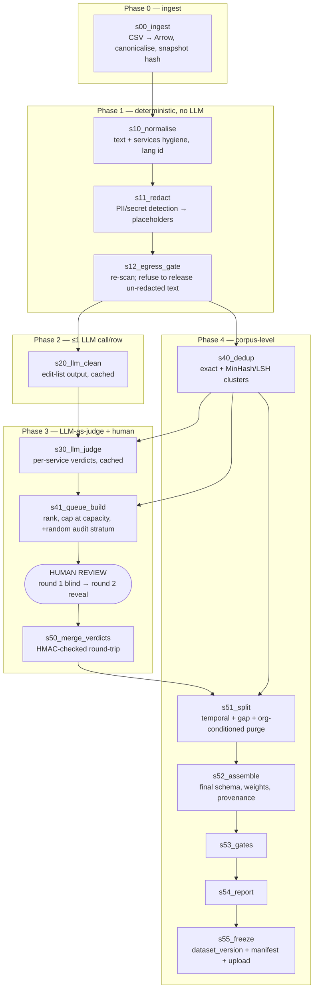
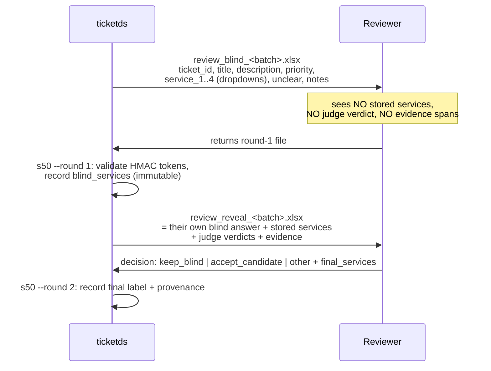

# Dataset pipeline architecture — from `tickets_export.csv` to a frozen training corpus

Status: architecture specification (not implemented)
Author: system-architect
Date: 2026-08-16
Owns: **runtime**. Stage decomposition, schemas at every boundary, reproducibility and freezing,
the LLM call layer, the human-supervision loop, orchestration, repo layout, the train/serve
skew seam, and operational posture.

Does **not** own: what counts as PII or a secret, which detectors/NLP libraries run inside a
stage, prompt wording, verdict semantics, quality-gate thresholds, or the ML validation
protocol. Those belong to `docs/specs/dataset-pipeline-cleaning.md` (`ml-researcher`), which
**does not exist yet** — every reference to it below is a forward reference and a dependency.
See §11 D-1.

Companions, in reading order:

| Document | What this design takes from it as **given** |
|---|---|
| [`dataset-construction-runbook.md`](./dataset-construction-runbook.md) | §7 order of operations; §6 splits (temporal, grouped, ≥1-week gap); §4.1 blindness; §4.3 dedup-before-sampling; "freeze with a content hash, never train against a live query" |
| [`ticket-services-classifier.md`](./ticket-services-classifier.md) | §2.6 splits; §4.6 input template and the requirement that preprocessing is shared with inference; §9.5 reproducibility; §9.1 artifact list |
| [`llm-fallback-policy.md`](./llm-fallback-policy.md) | §5 contamination rule; §4.3 prompt-cache layout; §7 residency and price tiers |
| [`../proposals/ticket-services-classifier.md`](../proposals/ticket-services-classifier.md) | §5 Temporal shape, activity contracts, idempotency/CAS; §5.3 the Python model service; §5.4 `service_predictions` / `ticket_services_audit` |
| [`../../data/raw/README.md`](../../data/raw/README.md) | the fixture's real shape and its deliberate dirt |

---

## 1. Context and constraints

### 1.1 What exists in this repo today

Read before designing, per the rule. The answer is short: **almost nothing, and that is a
finding, not a blocker.**

| Path | What it is |
|---|---|
| `data/raw/tickets_export.csv` | 5,013 rows, 2.47 MB, 10 columns, **100% synthetic** [`data/raw/README.md`] |
| `data/raw/README.md` | the fixture's provenance, shape and deliberate dirt |
| `docs/specs/*.md`, `docs/proposals/*.md` | the four documents above |
| `.claude/agents/*.md` | agent definitions |
| `README.md` | a stub |

There is **no TypeScript application, no `package.json`, no migrations, no Objection models,
no Temporal worker, no Python package, no `.gitignore`.** The Temporal/Objection/Gravity-UI
stack described in `.claude/agents/typescript-developer.md` is the *intended* stack of the
application this classifier will eventually serve; none of it is in this repository. So the
"coexist with the TypeScript application" requirement is **forward-looking**: I am reserving
namespace and stating the rule, not integrating with code that exists.

This is therefore a **greenfield design constrained by four written specs**, not a
modification of a running system. I am not proposing a rewrite because there is nothing to
rewrite.

### 1.2 The one hard fact about the fixture that shapes everything

`data/raw/tickets_export.csv` has **no `ticket_messages` companion**. Provenance Cases
A/B/C/D (runbook §2, spec §2.1.1) — the entire basis on which a label may be called
"human" — **cannot be computed from this file**. The fixture's `services` column is
author-assigned, blind to nothing, and agreed by no one.

Architectural consequence, and it is not optional: **a corpus built from this input must be
structurally incapable of being mistaken for a provenance-partitioned corpus.** The pipeline
carries a `provenance_complete: bool` flag in its manifest, sets it `false` when the
provenance join stage has no `ticket_messages` input, and the assemble stage then refuses to
emit `split ∈ {val, test}` unless the config explicitly sets
`allow_unpartitioned_eval: true`. See §3.6 and §7 F-11.

### 1.3 Constraints taken as given

| # | Constraint | Source | Consequence here |
|---|---|---|---|
| C1 | Three phases, in order: deterministic clean → ≤1 LLM call/row → LLM-as-judge on labels → human queue | user brief | the row-level spine of the DAG (§2.2). I add a fourth, corpus-level phase — see §1.4 |
| C2 | Freeze with a content hash; never train against a live query | runbook §7.8, spec §9.5 | §4 in full |
| C3 | Temporal split, grouped by `organization_id`, ≥1-week gap | runbook §6, spec §2.6 | **partially infeasible as written — measured, see §3.5** |
| C4 | Dedup before sampling, not after | runbook §4.3 | `s40_dedup` runs before the review queue is drawn (§2.2) |
| C5 | Annotators must not see the stored value or the model's answer | runbook §4.1, spec §2.2 | two-pass blind protocol, blindness enforced by *absence of data in the file* (§5.4) |
| C6 | Phase-1 normalisation + redaction must be the **same code** that runs at inference | spec §4.6, §9.2; proposal §5.3 | `ticketprep`, one installable package, fingerprint-checked at model-service startup (§6.5) |
| C7 | Every LLM-produced label is model provenance and is excluded from supervised training on the same terms as CatBoost output | fallback policy §5 | mechanically enforced in `s51_split` + `s53_gates`, not by convention (§3.6) |
| C8 | 152-FZ localisation may forbid sending ticket text to a foreign API | spec §2.9, fallback §7 | provider seam + fail-closed residency gate (§6.3), and the egress gate at `s12` (§8.2) |
| C9 | Un-redacted production ticket text contains real secrets before Phase 1 completes | user brief | zone model, retention rule, log denylist (§8) |

### 1.4 Where I disagree with the brief

Four places. Each is stated here rather than quietly designed around.

**(a) Three phases are not enough — a fourth, corpus-level phase is mandatory.**
Dedup, split assignment, class-balance reporting and quality gates are whole-corpus
operations. They cannot live in a per-row map and they are not optional (runbook §4.3, §6;
spec §2.8). I am not redesigning the three phases you fixed; I am naming the thing that has
to exist after them. Phase 4 = `s40`–`s55` in §2.2.

**(b) "Grouped by `organization_id`" and "temporal split" are mutually exclusive on this
corpus.** Measured on the fixture, not assumed — see §3.5. **100% of test rows belong to an
organisation that also appears in train; a strict org purge leaves zero test rows.** I
replace the rule with a measured, weaker one that preserves its actual purpose, and I report
the residual overlap as a diagnostic.

**(c) "At most one LLM call per row" needs a tie-break for schema-validation failures.**
I read the budget as **one *accepted* response per row per phase**, and cap total attempts at
3 per row with a hard per-run attempt budget of `1.05 × row_count`. A run that exceeds it
fails rather than silently spending. If you meant one *attempt*, say so (§11 D-4) — the
consequence is that ~0.2–0.5% [estimate] of rows terminate as `response_invalid` and route to
the human queue instead of retrying.

**(d) Repo layout: `py/` rather than `pipeline/`.** `packages/` means npm workspaces to every
TypeScript developer who will ever open this repo, and Python distributions want a home too.
Putting all Python under `py/` (one `uv` workspace, one lockfile, three distributions) keeps
the root free for `apps/` + `packages/` when the TS application lands. Minor, but the cost of
getting it wrong is a rename across every import path later. §2.4.

### 1.5 Scale, budget, wall-clock

| Quantity | Value | Basis |
|---|---|---|
| Rows | 5,013 (4,622 with a non-empty `services`, 391 empty) | [measured] on the fixture |
| Text volume | 1.21 M chars of `title` + `description`; mean 241, median 231, p90 325, max 849 | [measured] |
| Per-row prompt payload | ~180 tokens variable [estimate] (RU ≈ 2.5–3 chars/token, EN ≈ 4) | [estimate] |
| LLM calls, full build | ≤ 5,013 (Phase 2) + ≤ 5,013 (Phase 3) = **≤ 10,026** | C1 |
| LLM cost, full build | **$16 (Haiku 4.5) / $46 (Sonnet 5) / $77 (Opus 5)**, batch pricing, no cache hits; **$60** for the recommended mixed tier | §6.2 |
| LLM cost, rebuild after a code-only change | **$0** — every response is served from the replay cache | §6.4 |
| Machine wall-clock | ~15 min CPU; **2–4 h elapsed**, dominated by batch turnaround | §6.2 |
| Human wall-clock | 600 rows × ~75 s ≈ **12.5 person-hours**, 2–3 calendar days | §5.4 |
| Hardware | 1 host, 4 vCPU, 8 GB RAM, 10 GB disk. **No GPU.** | [estimate] |

**Cost is not a decision variable here.** A full build costs less than an hour of an
engineer's time. Every trade-off below is decided on operational simplicity, reproducibility
and blast radius — never on saving $30.

---

## 2. Component overview

### 2.1 The shape in one sentence

A **single-process-per-stage Python CLI**, driven by `make`, writing **Parquet checkpoints**
to content-addressed directories, with a **row-level LLM replay cache** that makes phases 2
and 3 free to re-run, and a **manifest** that makes the output a content-addressed artifact
rather than "whatever the last run produced".

### 2.2 Stage DAG



Two ordering decisions that earn their place:

- **`s40_dedup` reads Phase-1 text, not Phase-2 text, and does not depend on the LLM.**
  Dedup clusters must be stable across prompt changes; if they were computed on
  LLM-rewritten text, changing the Phase-2 prompt would silently reshuffle the split
  boundary and every metric with it. As a bonus, `s40` runs concurrently with `s20`.
- **`s40_dedup` precedes `s41_queue_build`** (C4, runbook §4.3): the review queue is a sample,
  and sampling before dedup means paying reviewers to adjudicate forty copies of the same
  auto-generated alert. `s30_llm_judge` also judges **one representative per exact-duplicate
  cluster** and fans the verdict out, which costs nothing on this fixture (0 duplicate
  title+description pairs) but matters on the real export.

### 2.3 Execution substrate — decision

**Chosen: GNU `make` + a `ticketds` Python CLI (Typer, MIT), Parquet checkpoints, stage
manifests written by the stage itself.** Licence of everything added: MIT / Apache-2.0.

The honest framing: this is a **20-minute, single-host, one-shot batch job that gets iterated
on**, blocked once in the middle by a human. The scarce resources are *reproducibility* and
*iteration speed*, not scheduling, not concurrency, not fault tolerance across days.

| Candidate | Licence | Why it lost |
|---|---|---|
| **`make` + CLI + Parquet** ← chosen | GPL-3 (tool, not a dependency) / MIT | Zero infrastructure. Every stage is a process you can run alone with a debugger. `make -n` shows the plan; `make s30` reruns one stage. The reproducibility machinery (§4) is *ours* and legible, not a framework's cache semantics |
| **Temporal** | MIT | See §5.5 — argued in full, rejected |
| **Dagster** | Apache-2.0 | Real asset lineage and a good UI, but it wants a daemon, a Postgres instance, and a code-location deployment for a job that runs from a terminal. The asset-materialisation model would also fight the human pause: a 2-day wait inside an asset graph is a sensor, and sensors need the daemon running for 2 days |
| **Prefect** | Apache-2.0 | Same objection with a weaker lineage story. `@flow`/`@task` gives retries we get for free from `make` re-invocation, and its caching keys on Python arguments, which is exactly the wrong granularity for our LLM cache |
| **Metaflow** | Apache-2.0 | Built for the cloud-scale-out case we do not have; its metadata service and S3 datastore are a hard dependency for the versioning we are doing ourselves |
| **DVC pipelines (`dvc repro`)** | Apache-2.0 | **The strongest rival.** `dvc.lock` is literally a manifest of content hashes per stage, for free. Rejected for three reasons: (1) its cache is a hardlink farm in the working tree, which would put un-redacted raw text in a second place we then have to remember to shred (§8.3); (2) `dvc.lock` merge conflicts are miserable and this file is edited by every run; (3) stage granularity is whole-file, so it cannot express "the Phase-2 prompt changed, re-issue 5,013 calls but reuse 4,900 cached responses" — the row-level cache does that, and once you have it DVC's value drops to artifact storage, which §4.7 solves more simply. **Revisit if** the DAG passes ~15 stages or more than two people iterate concurrently |
| **Snakemake** | MIT | Excellent for file-pattern DAGs; the wildcard/rule DSL is a second language to learn for a linear 12-node graph |
| **Kedro** | Apache-2.0 | Its catalogue is a good idea we are reimplementing more narrowly. Rejected on ceremony: node/pipeline/catalogue registration for 12 stages |
| **Airflow** | Apache-2.0 | Scheduler-first. We have no schedule. Wrong tool by a wide margin |

The `Makefile` is thin — it exists to express the DAG and to give `make corpus` as the one
command a newcomer runs. All logic lives in `ticketds`; `make` never contains a pipe or a
`python -c`.

### 2.4 Repo layout

```
py/                              # uv workspace root: pyproject.toml + uv.lock (one lockfile)
  ticketprep/                    # SHARED. The train/serve skew seam (§6.5). Zero heavy deps
    src/ticketprep/{normalise,redact,template,fingerprint,version}.py
    tests/golden/normalisation_cases.jsonl      # ~300 frozen input→output pairs, in git
  ticketds/                      # the dataset pipeline. Depends on ticketprep
    src/ticketds/cli.py
    src/ticketds/stages/{s00_ingest,s10_normalise,...,s55_freeze}.py
    src/ticketds/llm/{provider,anthropic_batch,openai_compat,cache,executor,schemas}.py
    src/ticketds/corpus/{dedup,split,assemble,gates}.py
    src/ticketds/review/{workbook,merge}.py
    src/ticketds/{config,hashing,manifest,io,logging}.py
    tests/
  model_service/                 # FastAPI + onnxruntime (proposal §5.3). Depends on ticketprep
configs/
  pipeline.default.yaml  pipeline.fixture.yaml  taxonomy.v1.yaml
prompts/
  phase2_clean/v3/{system.md,schema.json,bundle.yaml}
  phase3_judge/v2/{system.md,schema.json,bundle.yaml}
data/                            # gitignored except the two exceptions below
  raw/  interim/  processed/  review/
artifacts/                       # gitignored, entirely
  runs/  llm_cache/  corpus/
docs/  Makefile
apps/  packages/                 # TypeScript (npm workspaces) — reserved, empty today
```

**`.gitignore` — the load-bearing lines.** This repo currently has no `.gitignore`, and the
first commit that adds real data without one is an incident.

```gitignore
data/**
!data/raw/README.md
!data/raw/tickets_export.csv       # SYNTHETIC fixture. The ONLY data file ever tracked.
artifacts/**
.env
*.xlsx
```

Real production exports go to `data/raw/prod/`, which the `data/**` rule already excludes and
which lives on the encrypted volume (§8.1). A pre-commit hook (`ticketds guard precommit`)
rejects any staged file under `data/` other than the two exceptions, and rejects any staged
file whose content matches the redaction detectors. **Nothing derived from a production
export ever enters git — not a sample, not a "just for the ticket" snippet, not a test
fixture.**

### 2.5 Coexistence with the TypeScript application

There is none today (§1.1). The rule for when there is:

| Concern | Rule |
|---|---|
| Language boundary | The pipeline is **Python end to end**. The reason is C6: preprocessing must be one implementation shared with the Python model service. A TS reimplementation of redaction is the single most likely source of silent skew and is forbidden |
| Does the Node app call the pipeline? | **No.** The pipeline is offline and operator-driven. There is no HTTP surface, no queue consumer, no Temporal worker |
| Shared runtime state | **None.** The pipeline reads a CSV export (or, later, a read replica) and writes files. It never writes to the application database |
| Shared build | `make corpus` (Python) and the TS `npm run build` are independent. CI runs them as separate jobs with separate caches |
| The one real coupling | `packages/ticketprep`'s **fingerprint** must match the deployed model's `preprocess.json`. That check runs in the model service, not in the Node app (§6.5) |

---

## 3. Data model — schemas at every boundary

Arrow field lists. Every stage boundary is a Parquet dataset whose schema is declared in
`ticketds/stages/schemas.py` and **enforced on both write and read** (`pa.Table.cast` against
the declared schema, `strict=True`); a stage that produces a mismatched schema fails before
writing. Non-nullable is written `!`.

Physical layout: `data/interim/<stage>/<build_id>/part-0000.parquet` + `_SUCCESS` (§5.2).
Compression zstd level 3. Row order canonical: `ticket_id` ascending, always.

### 3.1 `s00_ingest` → `raw`

| Field | Arrow type | Notes |
|---|---|---|
| `ticket_id` ! | `string` | primary key, `TICKET-\d+` |
| `organization_id` ! | `string` | grouping key for §3.5 |
| `title_raw` ! | `string` | verbatim, including leading/trailing whitespace |
| `description_raw` ! | `string` | verbatim, including embedded newlines and `"` |
| `priority_raw` | `string` | nullable; not yet validated against the enum |
| `services_raw` | `string` | the dirty comma-joined string; **not parsed here** |
| `labels_raw` | `string` | `;`-separated, open vocabulary |
| `flags_raw` | `string` | `;`-separated |
| `created_at` ! | `timestamp[us, tz=UTC]` | normalised to UTC |
| `created_at_offset_min` ! | `int16` | the original offset, preserved — 11 distinct offsets exist and local-time-of-day is a real feature |
| `updated_at` | `timestamp[us, tz=UTC]` | |
| `source_row_index` ! | `int32` | position in the source file, for error messages |
| `raw_row_sha256` ! | `binary(32)` | hash of the canonical field tuple; detects a changed export |

Ingest is **schema-strict and drop-free**: a malformed row fails the stage. There is no
"skip bad rows" mode. A raw export that will not parse is a fact about the export.

### 3.2 `s10_normalise` → `normalised` (adds)

All of this is `ticketprep` (C6). Semantics — which normalisations, which language detector —
belong to `dataset-pipeline-cleaning.md`; the *contract* is here.

| Field | Arrow type | Notes |
|---|---|---|
| `title_norm` ! | `string` | whitespace, quote, dash, `ё`, NFC normalisation |
| `description_norm` ! | `string` | same; embedded newlines preserved as `\n` |
| `priority` | `string` | validated against `{low,normal,high,urgent}`; unknown → null + flag |
| `services_norm` ! | `list<string>` | dedup + lowercase + trim + **sorted**; the `norm_services()` of runbook §2 |
| `services_unknown` ! | `list<string>` | values not in `taxonomy.v1.yaml` — never silently dropped |
| `lang` ! | `string` | `ru \| en \| mixed \| unknown` |
| `lang_conf` ! | `float32` | the fixture's README warns a script-ratio rule misclassifies 228 of 237 code-switched rows; whatever detector is chosen, this column exists |
| `char_len` ! | `int32` | |
| `norm_flags` ! | `list<string>` | e.g. `all_caps_title`, `empty_description`, `services_empty` |
| `ticketprep_version` ! | `string` | semver of the package that produced the row |

### 3.3 `s11_redact` → `redacted` (adds)

| Field | Arrow type | Notes |
|---|---|---|
| `title_red` ! | `string` | placeholders substituted |
| `description_red` ! | `string` | |
| `redactions` ! | `list<struct<field:string, kind:string, start:int32, end:int32, placeholder:string, detector:string>>` | spans, **offsets into `*_norm`**, never the replaced text |
| `redaction_counts` ! | `map<string,int32>` | `{email:2, phone:1, token:1, …}` — the row-level observability signal |
| `redaction_rules_version` ! | `string` | |

**The replaced text is never persisted anywhere.** The span record is enough to audit
coverage and to compute a re-detection rate; it is not enough to reconstruct a secret. This
is deliberate and is the difference between an auditable pipeline and a second copy of the
credentials.

### 3.4 `s20_llm_clean` and `s30_llm_judge` (add)

`s20` (adds):

| Field | Arrow type | Notes |
|---|---|---|
| `title_clean` !, `description_clean` ! | `string` | Phase-1 text with the edit list applied. **Falls back to the Phase-1 text on any Phase-2 failure** |
| `p2_edits` ! | `list<struct<field:string, start:int32, end:int32, replacement:string, reason:string>>` | the response is an **edit list, not a rewritten document** — §6.2 shows why |
| `p2_status` ! | `string` | `applied \| noop \| response_invalid \| provider_error \| skipped_budget` |
| `p2_flags` ! | `list<string>` | model-raised observations that route to Phase 3 or the queue |
| `p2_cache_key` ! | `string` | 64-hex; the join key to the replay cache and the whole audit trail |
| `p2_model_id` !, `p2_prompt_version` ! | `string` | |
| `p2_usage` ! | `struct<in:int32, out:int32, cache_read:int32, attempts:int8>` | |

`s30` (adds):

| Field | Arrow type | Notes |
|---|---|---|
| `judge_verdicts` ! | `list<struct<service:string, accept:bool, evidence:string, note:string>>` | `service` is enum-constrained (fallback §4.1) |
| `judge_services` ! | `list<string>` | the judge's implied set = accepted verdicts, sorted |
| `judge_delta` ! | `struct<added:list<string>, removed:list<string>, kept:list<string>>` | vs `services_norm` |
| `judge_agreement` ! | `string` | `exact \| subset \| superset \| conflict \| empty_proposal` |
| `j_status` !, `j_cache_key` !, `j_model_id` !, `j_prompt_version` !, `j_usage` ! | as above | |

### 3.5 `s40_dedup` and `s51_split` — the corpus-level mechanics

**`s40_dedup` → `dedup_clusters`**

| Field | Arrow type | Notes |
|---|---|---|
| `ticket_id` ! | `string` | |
| `exact_hash` ! | `binary(32)` | sha256 of `title_norm \| "\n" \| description_norm` |
| `cluster_id` ! | `string` | min `ticket_id` in the MinHash/LSH cluster |
| `cluster_size` ! | `int32` | |
| `is_representative` ! | `bool` | the earliest `created_at` in the cluster wins; ties by `ticket_id` |
| `max_jaccard` ! | `float32` | to the representative |

MinHash on char-5-gram shingles of `title_norm + " " + description_norm`, 128 permutations,
LSH band threshold 0.80 (spec §2.6). **Permutation seeds are derived from `seed_root`
(§4.5), never from `random()` or an unseeded `default_rng()`** — MinHash with random
permutations is the classic place a pipeline stops being reproducible without anyone
noticing.

Known and accepted limitation, stated because the fixture is explicit about it: MinHash at
J≥0.8 **misses semantic-but-not-lexical clusters** (`data/raw/README.md`: the Postgres
connection-pool cluster scores 0.2–0.5). We do not chase those with embeddings in v1; we
report `cluster_size` distribution and let §3.5's split diagnostic catch the damage.

---

**`s51_split` — and the measured reason C3 cannot be implemented as written.**

Runbook §6 asks for three things at once: temporal ordering, a ≥1-week gap, and grouping by
`organization_id`. I ran all three against the fixture (4,622 labelled rows, 70/15/15 by
`created_at`, boundaries 2026-04-06 and 2026-06-04):

| Result | Value |
|---|---|
| Rows lost to the two 1-week gaps | 138 / 4,622 = **3.0%** — cheap, keep it |
| Split sizes after gaps | train 3,235 / val 623 / test 626 |
| Organisations appearing in both train and test | **176 of 210** |
| Test rows whose org also appears in train | **626 / 626 = 100.0%** |
| Test rows surviving a strict whole-org purge | **0** |

[measured, this repo, fixture as committed]

This is not a fixture artefact. It is arithmetic: 210 organisations, Zipf-distributed
(org_0001 = 7.2% of the corpus alone), each active across the full 15 months. Any temporal
cut puts essentially every org on both sides. **Strict org-grouping and a temporal split
cannot both hold.** The runbook does not acknowledge the conflict, so I am resolving it and
flagging it (§11 D-2).

**Resolution — keep the purpose, drop the mechanism.** The stated purpose of org-grouping
(runbook §4.3, spec §2.6) is *"a single customer's tickets are near-duplicates of each
other"* — i.e. it is a **leakage** rule, not a fairness rule. So enforce leakage directly:

1. Temporal split is primary. Sort by `created_at`; boundaries at the 70th and 85th
   percentiles of the *labelled* rows; drop everything within `gap_days = 7` after each
   boundary.
2. **Cluster grouping is hard**: a MinHash cluster never straddles a boundary. The later
   copies are dropped from the later split (spec §2.6: "drop the later copy from test").
3. **Org-conditioned near-duplicate purge**, at a *lower* threshold than the corpus-wide one:
   for each val/test row, if any train row **from the same organisation** has char-5-gram
   Jaccard ≥ `org_purge_jaccard = 0.50`, drop the val/test row.
4. Report `org_overlap_rate` (here: 1.00) in the run report as a permanent, visible
   diagnostic, and report the primary metric **split by whether the test row's org was seen
   in train** — if that gap is large, org leakage is real and the split parameters get
   escalated to the ML owner.

Measured cost of step 3 on the fixture:

| `org_purge_jaccard` | val rows dropped | test rows dropped |
|---|---|---|
| 0.80 | 8 (1.3%) | 0 (0.0%) |
| **0.50** ← default | **15 (2.4%)** | **9 (1.4%)** |
| 0.35 | 24 (3.9%) | 21 (3.4%) |

[measured]. So the rule that preserves the runbook's intent costs **1.4% of test**, against
**100%** for the rule as literally written. Step 4's diagnostic is what keeps us honest about
the residual.

**`splits` output**

| Field | Arrow type | Notes |
|---|---|---|
| `ticket_id` ! | `string` | |
| `split` ! | `string` | `train \| val \| test \| dropped` |
| `drop_reason` | `string` | `gap \| dup_later_copy \| org_near_dup \| no_label \| llm_provenance \| review_rejected` — **every dropped row keeps a reason**; a row that vanishes without one is a bug |
| `split_rank` ! | `float64` | the seeded uniform used for any tie-break, recorded so the draw is auditable |

### 3.6 `s52_assemble` → the final training artifact

`data/processed/corpus/<dataset_version>/corpus.parquet`. **This is the file the trainer
reads and the only one it is allowed to read.**

| Field | Arrow type | Notes |
|---|---|---|
| `ticket_id` ! | `string` | |
| `organization_id` ! | `string` | needed for grouped CV and for the §3.5 diagnostic |
| `model_input_text` ! | `string` | **the exact string the model consumes**: `"[priority: {p}] {title}\n{description}"` after redaction (spec §4.6), produced by `ticketprep.build_input()` |
| `title_clean` !, `description_clean` !, `priority` | `string` | the inputs to the template, so it can be re-derived and diffed |
| `services` ! | `list<string>` | the final label set, sorted, taxonomy-validated |
| `label_provenance` ! | `string` | see the enum below |
| `label_source_detail` | `string` | reviewer id (pseudonymous), or judge cache key |
| `sample_weight` ! | `float32` | spec §2.3: 1.0 Case A/C/gold, ~0.3 B-strong, 0.0 never enters training |
| `split` ! | `string` | `train \| val \| test` — dropped rows are **not in this file** |
| `lang` !, `char_len` !, `token_len_est` ! | | slice keys for spec §6.3 |
| `created_at` ! | `timestamp[us, tz=UTC]` | temporal slice |
| `dedup_cluster_id` ! | `string` | |
| `is_gold` ! | `bool` | blind-annotated, adjudicated |
| `review_round` | `int8` | which human round produced this label |
| `ticketprep_version` !, `taxonomy_version` !, `dataset_version` ! | `string` | every row carries its own provenance; a corpus file cannot be split and lose it |

`label_provenance` enum, and the **training-eligibility matrix that C7 makes mechanical**:

| Value | Meaning | May train? | May be val/test? |
|---|---|---|---|
| `human_blind_review` | reviewer round-1 answer, saw nothing else | yes, w=1.0 | **yes** |
| `human_reveal_confirmed` | reviewer saw the candidates and kept their blind answer | yes, w=1.0 | **yes** |
| `human_reveal_overridden` | reviewer changed their answer after reveal | yes, w=1.0 | **yes, flagged** — the anchoring measurement (spec §7 risk 8) lives on this slice |
| `case_a_corrected` | provenance reconstruction, human edited | yes, w=1.0 | no |
| `case_c_pre_model` | pre-rollout, human-authored | yes, w=1.0 | no |
| `case_b_strong` | engagement-conditioned weak label | yes, w=0.3 | **never** |
| `llm_judge_accepted` | the judge's set, no human looked | **never** (C7) | **never** |
| `export_asis` | the raw column, unverified — what the fixture yields | **only with `allow_unpartitioned_eval`** | **only with `allow_unpartitioned_eval`** |

`s53_gates` asserts the matrix. Not a lint, not a convention — an assertion that fails the
build. The fallback policy §5 says *"the training query filters on provenance, not on model
name, so a new model kind is excluded by default rather than by remembering to add it"*; this
table is that rule, moved one layer earlier into the data.

### 3.7 Side artifacts emitted alongside the corpus

| File | Contents |
|---|---|
| `labels.json` | ordered service list + `label_set_version`; **append-only indices** (spec §4.8) |
| `preprocess.json` | `{ticketprep_version, fingerprint, template, max_len, truncation, e5_prefix, redaction_rules_version}` — **emitted by `ticketprep`, never hand-written** (§6.5) |
| `manifest.json` | §4.2 |
| `run_report.json` + `run_report.md` | §7.1 |
| `splits.parquet` | including `dropped` rows and their reasons |
| `review_verdicts.parquet` | the human record, kept separately so it survives a corpus rebuild |

### 3.8 Which invariants live where

There is no database in this pipeline. The equivalent question is: enforced by the schema, by
a gate, or not at all?

| Invariant | Enforced by | Why there |
|---|---|---|
| Every row has a `ticket_id`, unique | Arrow non-null + an explicit uniqueness assert in `s00` | cheap, and a duplicate id silently double-weights a row |
| `services ⊆ taxonomy` | `s10` writes `services_unknown`; `s53` gate fails if non-empty and `strict_taxonomy` | a taxonomy change is a human decision, not a drop |
| `1 ≤ len(services) ≤ 4` on training rows | `s53` gate | the fixture has 4,622 rows in [1,4] and 391 empty; empty rows are excluded by `drop_reason=no_label`, not clamped |
| No `llm_judge_accepted` row in val/test | `s53` gate, hard fail | C7 |
| No dedup cluster straddles a split | `s51` by construction + `s53` re-assert | belt and braces; this is the leakage failure that is invisible in metrics |
| Redaction coverage ≥ threshold | `s12` egress gate, hard fail | §8.2 — must be *before* text leaves the perimeter, not at the end |
| `dataset_version` matches the corpus content | `s55` recomputes and compares | §4.1 |

---

## 4. Reproducibility and freezing

This is the highest-value part of the design, so it is specified to the byte.

### 4.1 Two identifiers, and why they are not the same

A common mistake is to define the dataset version as a hash of the *inputs*. Then a comment
edit, a `black` reformat or a rebuilt lockfile produces a "new dataset" that is bit-identical
to the old one, the experiment log fills with phantom versions, and people stop trusting it.

| Identifier | Definition | Property |
|---|---|---|
| **`dataset_version`** | `"ds_" + blake2b(canonical_ndjson(corpus), digest_size=16).hexdigest()` | **identity of the data.** Same bytes ⇒ same id, regardless of how it was built |
| **`build_id`** | `"bld_" + ULID` | identity of *this run*. Never reused |
| **`build_inputs_hash`** | `blake2b(canonical_json(build_inputs))` | identity of the *recipe*. Recorded, and used only for cache/skip decisions |

`canonical_ndjson` is precisely: rows sorted by `ticket_id`; keys sorted lexicographically;
UTF-8, `ensure_ascii=false`, NFC; floats formatted with `repr()` shortest round-trip;
timestamps as RFC 3339 UTC with microseconds; lists in their declared sort order; **no
build-time fields** (`built_at`, `build_id`, `hostname` are excluded from the hash and live
only in the manifest).

> **Trap worth naming.** Do **not** hash `corpus.parquet` bytes. PyArrow writes its own
> version into the file's `created_by` metadata, so upgrading pyarrow changes the file hash
> without changing a single value. The Parquet file's sha256 *is* recorded in the manifest —
> as an integrity check on the copy you downloaded, not as the dataset identity.

**The reproducibility test is one line**: rebuild from the manifest and assert
`dataset_version` is unchanged. `ticketds verify --manifest <path>` does exactly that and is a
required CI job (§10 step 8).

### 4.2 The manifest

`data/processed/corpus/<dataset_version>/manifest.json`. Written by `s55_freeze`, immutable
thereafter (written `0444`, and the object-storage copy is written with a
write-once/object-lock policy where the backend supports it).

```jsonc
{
  "schema_version": "1",
  "dataset_version": "ds_9f3c…",              // §4.1
  "build_id": "bld_01K2…",
  "built_at": "2026-08-16T11:04:22Z",
  "frozen": true,                              // false if --allow-dirty was used
  "provenance_complete": false,                // §1.2 — no ticket_messages input
  "allow_unpartitioned_eval": true,            // must be explicit when the above is false

  "input": {
    "kind": "csv_export",
    "path": "data/raw/tickets_export.csv",
    "sha256": "…",                             // the snapshot hash. Non-negotiable
    "rows": 5013,
    "bytes": 2465991,
    "data_classification": "synthetic",        // synthetic | production
    "exported_at": null,
    "export_query_sha256": null                // set when the input is a DB export, not a file
  },

  "code": {
    "git_sha": "6287be1…",
    "git_dirty": false,
    "ticketds_version": "0.4.1",
    "ticketprep": { "version": "1.2.0", "fingerprint": "tp_4a91…" },
    "python": "3.11.15",
    "uv_lock_sha256": "…",                     // the whole dependency closure, in one hash
    "key_packages": { "pyarrow": "…", "datasketch": "…", "anthropic": "…" }
  },

  "config": {
    "path": "configs/pipeline.fixture.yaml",
    "resolved_sha256": "…",                    // hash of the FULLY RESOLVED config, defaults included
    "resolved": { /* the entire resolved config, inlined */ }
  },

  "prompts": {
    "phase2_clean": { "version": "v3", "bundle_sha256": "…", "schema_sha256": "…" },
    "phase3_judge": { "version": "v2", "bundle_sha256": "…", "schema_sha256": "…" }
  },

  "models": {
    "phase2": { "provider": "anthropic", "model_id": "claude-sonnet-5-20260317",
                "execution": "batch", "params": {"max_tokens": 512} },
    "phase3": { "provider": "anthropic", "model_id": "claude-opus-5-20260514",
                "execution": "batch", "params": {"max_tokens": 640} }
  },

  "seed_root": 20260816,
  "taxonomy": { "version": "v1", "sha256": "…", "n_services": 20 },
  "review": { "rounds": [ { "round": 1, "batch_id": "rv_001",
                            "issued": 600, "returned": 600,
                            "verdicts_sha256": "…", "reviewers": ["rev_a","rev_b"] } ] },

  "outputs": {
    "corpus_parquet_sha256": "…", "rows": 4451,
    "splits": { "train": 3118, "val": 604, "test": 617, "dropped": 562 },
    "labels_json_sha256": "…", "preprocess_json_sha256": "…"
  },
  "gates": { "all_passed": true, "results": [ /* §7.1 */ ] },
  "llm_cache": { "phase2_hit_rate": 1.0, "phase3_hit_rate": 0.83,
                 "calls_issued": 852, "usd_spent_this_build": 7.41 }
}
```

Everything in `build_inputs_hash` is: `input.sha256`, `code.*` minus `git_sha`, `config
.resolved_sha256`, `prompts.*`, `models.*`, `seed_root`, `taxonomy.sha256`,
`review.rounds[*].verdicts_sha256`.

### 4.3 Re-deriving a claimed number six months later

The procedure, in the order a reviewer executes it. If any step needs a Slack message to a
human, the design has failed.

1. `git checkout <manifest.code.git_sha>` — the pipeline, `ticketprep`, prompts, configs and
   `uv.lock` all move together because they are all in this repo.
2. `uv sync --locked` — the dependency closure is pinned; `uv_lock_sha256` verifies it.
3. Fetch the input snapshot: `ticketds fetch-input --sha256 <manifest.input.sha256>`. It
   resolves from object storage by content hash (§4.7). **If it is a production export past
   its retention date (§8.3), this step legitimately fails** — and the manifest says so, which
   is a better outcome than silently rebuilding from a different export.
4. Fetch the LLM replay cache: `ticketds cache pull --manifest <path>` pulls exactly the
   response objects the run consumed (they are listed by key in
   `artifacts/runs/<build_id>/llm_index.parquet`). **This is what makes step 5 cost $0 and
   removes the model provider from the reproduction path entirely** — a deprecated model
   version does not break reproduction.
5. `ticketds build --manifest <path> --replay-only` — `--replay-only` makes any cache miss a
   hard error rather than a new API call. A miss means the recipe drifted, and you want to
   know that loudly.
6. Assert `dataset_version` matches. Then re-run the metric.

Steps 4–5 are the design's answer to "LLM pipelines are not reproducible". They are, if you
treat the model as an **oracle whose answers you archive**, rather than as a function you
re-invoke.

### 4.4 The LLM replay cache — keyed on exactly what

```python
cache_key = sha256(canonical_json({
    "cache_schema": 2,
    "phase": "p2_clean",                    # or "p3_judge"
    "provider_family": "anthropic",         # NOT the base URL — a proxy change must not miss
    "model_id": "claude-sonnet-5-20260317", # pinned snapshot id, never a floating alias
    "prompt_bundle_sha256": "…",            # system prompt + few-shots + assembly template
    "schema_sha256": "…",                   # the structured-output JSON schema
    "decode": {"max_tokens": 512, "top_p": null, "stop": null},
    "input_payload_sha256": "…",            # sha256 of the EXACT rendered user content
    "attempt_variant": 0,                   # 0 = first ask; 1,2 = repair prompts (§6.6)
})).hexdigest()
```

Five deliberate choices:

| Choice | Reason |
|---|---|
| **`ticket_id` is *not* in the key** | reordering or re-exporting the corpus must hit the cache. Identical text ⇒ identical answer ⇒ one call. On the fixture this saves nothing (0 duplicate title+description pairs); on a real support corpus with template tickets it saves double digits of percent |
| **the rendered payload, not the source fields** | the key must change if and only if the model's *input* changes. A `ticketprep` change that alters redaction changes the payload, correctly invalidating everything |
| **`attempt_variant` in the key** | a repair retry sends a *different* prompt. Keying it separately keeps replays exact and lets us count repair rate |
| **pinned model snapshot id** | a floating alias silently changes the oracle. `models.*.model_id` in the config must match `^claude-[a-z0-9-]+-\d{8}$` or the equivalent for a self-hosted tag; a bare alias is rejected at config-load time |
| **`provider_family`, not the endpoint** | moving from a direct endpoint to a gateway must not invalidate 5,013 responses. Moving from Anthropic to a self-hosted model must (different oracle) |

Storage: `artifacts/llm_cache/<phase>/<key[0:2]>/<key>.json`, containing the full request
envelope (minus credentials), the full response, `usage`, provider `request_id`,
`received_at`, and the parsed+validated object. Content-addressed, append-only, never mutated.
Synced to object storage; ~10,000 objects × ~4 KB ≈ **40 MB** per full build [estimate].

**Retention rule that matters:** the cache contains *redacted* ticket text (it is downstream
of `s11`), so it lives in Zone I, not Zone R (§8.1). It is still ticket text — it is not
public, and it is not in git.

### 4.5 Seeded sampling — no `random()` anywhere

One root, derived everywhere:

```python
def derive(seed_root: int, purpose: str, key: str = "") -> int:
    return int.from_bytes(blake2b(f"{seed_root}:{purpose}:{key}".encode(),
                                  digest_size=8).digest(), "big")

def unit(seed_root: int, purpose: str, key: str) -> float:   # deterministic U[0,1)
    return derive(seed_root, purpose, key) / 2**64
```

| Decision | `purpose` | Note |
|---|---|---|
| MinHash permutations | `dedup.minhash` | `MinHash(num_perm=128, seed=derive(...))` |
| Review-queue tie-breaks | `queue.tiebreak` | keyed on `ticket_id` |
| Random audit stratum (§5.4) | `queue.audit` | keyed on `ticket_id` |
| Candidate-order shuffle in the judge prompt | `judge.candidate_order` | keyed on `ticket_id` — a *fixed* shuffle, so the prompt is stable across runs and the cache hits |
| Any split tie-break | `split.tiebreak` | |

Banned by lint rule (`ruff` custom + a CI grep): bare `random.`, `numpy.random.` module-level
functions, `np.random.seed`, `pandas.DataFrame.sample` without `random_state`,
`datasketch.MinHash()` without `seed`, and `uuid4()` anywhere that its value reaches an
output column. `build_id` is the single sanctioned source of non-determinism and it is
excluded from the dataset hash (§4.1).

### 4.6 Stage skip logic

Each stage's `_SUCCESS` file holds `{stage, stage_input_hash, output_sha256, rows_in,
rows_out, started_at, duration_s, ticketds_version}`. `stage_input_hash` covers: the upstream
stages' `output_sha256`, the slice of resolved config the stage declares it reads (declared
explicitly — a stage that reads config it did not declare fails a unit test), the prompt
bundle hash if any, and `ticketprep.fingerprint()` if the stage calls it.

`make` compares timestamps; `ticketds` compares hashes and is authoritative. A stage whose
inputs are unchanged prints `SKIP s20_llm_clean (input 4a91… unchanged)` and exits 0.

### 4.7 Data and artifact versioning — what is stored where

| Artifact | Where | Why not git |
|---|---|---|
| Pipeline code, configs, prompts, taxonomy, golden test file, **manifests** | **git** | small, diffable, reviewable. The manifest in git is what makes the corpus citable from a PR |
| Raw production export | encrypted volume in Zone R + **in-country object storage**, key = `raw/<sha256>` | PII; irreversible if leaked; git history cannot be scrubbed |
| Interim Parquet | local only, regenerable | regenerable in 15 min of CPU |
| **LLM replay cache** | object storage, key = the cache key | 40 MB/build, append-only, and it is the reproducibility asset (§4.3 step 4) |
| Frozen corpus + `labels.json` + `preprocess.json` + `run_report` | object storage, prefix `corpus/<dataset_version>/`, object-lock where available | 3–15 MB; addressed by hash so the manifest is a complete citation |

**Rejected: DVC** — §2.3, plus its cache would hold a second copy of raw text in the working
tree. **Rejected: git-lfs** — LFS objects are painful to delete after a PII incident (they
persist in the LFS store independent of git history rewriting), and adding LFS to this repo
taxes every future TypeScript clone with a 2.5 MB+ download and an lfs install step. **Chosen:
plain S3-compatible object storage + hashes in a git-tracked manifest**, which is what DVC's
`.dvc` files are, minus the tool.

> Residency note: the bucket must be **in-country** (C8, spec §2.9). This is not just about
> the LLM API — a snapshot of Russian citizens' ticket text sitting in a foreign region is the
> same problem with a slower failure mode.

---

## 5. Workflow design — orchestration, the human pause, and why not Temporal

### 5.1 Stage execution protocol

Every stage, without exception:

```
ticketds run <stage> --build <build_id> [--config …]
```

1. Resolve config; compute `stage_input_hash`; if `_SUCCESS` matches → skip.
2. Read upstream Parquet, `cast` to the declared schema (fails on mismatch).
3. Compute. Row-level stages are pure functions of `(row, config)`; corpus-level stages are
   pure functions of `(table, config, seed_root)`.
4. Write to `data/interim/<stage>/<build_id>/_tmp-<uuid>/`, `fsync`, then **atomic
   `os.replace` of the directory**, then write `_SUCCESS`.
5. Append the stage's counters to `artifacts/runs/<build_id>/stages.jsonl`.

**A stage never half-writes.** Readers refuse a directory without `_SUCCESS`. A crash leaves
a `_tmp-*` directory which the next run garbage-collects. This is the whole of the "must never
half-write" requirement, and it is four lines of code rather than a transaction manager.

### 5.2 Idempotency, precisely

| Stage | Idempotent? | On what basis |
|---|---|---|
| `s00`–`s12`, `s40`, `s51`–`s54` | **yes, bit-for-bit** | pure functions of content-addressed inputs + `seed_root` |
| `s20`, `s30` | **yes, given a warm cache**; **yes modulo the oracle**, cold | the cache makes a re-run free and identical. Cold, with a non-deterministic provider, a re-run may differ — which is exactly why the cache is the reproducibility artifact and not a cost optimisation |
| `s41_queue_build` | yes, but **issuing a batch to humans is not** | re-running `s41` after a batch is out would reissue work. Guarded: `s41` refuses to overwrite a batch whose state is `issued` unless `--supersede` is passed, which records the supersession in the manifest |
| `s50_merge_verdicts` | yes | a pure function of `(judge output, verdict files)`; verdict files are append-only and content-hashed |
| `s55_freeze` | yes, and **write-once** | refuses to overwrite an existing `dataset_version` directory whose content hash differs — that would mean two different corpora claiming one id, which is the one unrecoverable failure in this design |

### 5.3 Resume and partial-failure semantics

| Situation | Behaviour |
|---|---|
| Crash mid-stage | `_tmp-*` discarded; `make` re-runs that stage from its upstream checkpoint |
| Crash mid-`s20` after 3,000 of 5,013 calls | the 3,000 responses are already in the cache (written per-response, fsynced). The re-run issues 2,013 calls. **No response is ever paid for twice** |
| Provider 5xx on some rows | retried per §6.6; rows that exhaust attempts get `p2_status='provider_error'` and pass through with **Phase-1 text** (fail-open — Phase 2 is cosmetic) |
| Provider errors on many rows | if `failed / total > max_row_failure_rate` (default **0.02**), the **stage fails and writes nothing**. A corpus where 30% of rows quietly skipped Phase 2 is worse than no corpus |
| Judge fails on a row | `j_status='provider_error'` → the row is **routed to the human queue** (fail-closed — Phase 3 touches labels) |
| Gate fails in `s53` | build stops, `run_report` is still written with the failing gate highlighted. `--force` is available and stamps `frozen: false` in the manifest |

The asymmetry is the point: **fail-open on cosmetics, fail-closed on labels.**

### 5.4 The human-supervision loop

**Volume.** `s41_queue_build` is **capacity-bounded, not threshold-bounded**. The judge's
flag rate is unknown and could be 5% or 45%; a threshold-bounded queue makes the project's
schedule a function of a prompt. So: `review.capacity` (default **600 rows**, ≈12% of the
corpus, ≈12.5 person-hours at 75 s/row), filled by:

| Stratum | Share of capacity | Purpose |
|---|---|---|
| `judge_conflict` — judge and stored set disagree in both directions | up to 55% | the highest-value rows |
| `judge_added` / `judge_removed` — one-directional disagreement | up to 25% | ranked by the judge's evidence quality signal (semantics: ml-researcher) |
| `pipeline_flagged` — `services_empty`, `services_unknown`, `response_invalid`, `provider_error`, heavy truncation | up to 10% | rows the machine could not process at all |
| **`random_audit` — uniform random over rows the judge did *not* flag** | **10%, floor of 60 rows** | **without this, the judge's false-negative rate is unmeasurable, forever** |

The random audit stratum is an architectural requirement, not an ML nicety: it is the only
mechanism that produces an estimate of what the queue *missed*, and it costs 60 rows.

Selection within a stratum is by priority score descending, ties broken by
`unit(seed_root, "queue.tiebreak", ticket_id)` — deterministic, so re-running `s41` issues
the same batch.

**The two-pass blind protocol.** C5 says reviewers must not see the stored value or the
model's answer. Phase 3's whole purpose, however, is to adjudicate a candidate set — which
requires seeing one. These are two different tasks and conflating them is precisely the
anchoring failure the runbook §4.1 warns about. So run them as two passes:



**Blindness is enforced by absence, not by UI discipline.** The round-1 file does not
*contain* the stored services, so there is no hidden column, no protected sheet, no "please
don't scroll right". This is the single most important property of the review design and it
is the reason a spreadsheet is adequate: the guarantee is structural.

The round-2 pass is nearly free (~15 s/row) and yields something we otherwise cannot buy: the
rate at which reviewers change their mind when shown the candidate — a **direct measurement of
the anchoring effect** that spec §7 risk 8 asks for as a deliberate A/B, obtained on every
row instead of on a special 100-ticket study.

**Tool — recommendation: a generated XLSX round-trip. Do not stand up a labelling server.**

| Option | Licence | Verdict |
|---|---|---|
| **Generated XLSX round-trip** (openpyxl, MIT) ← **chosen** | MIT | 600 rows, ≤3 reviewers, one batch, blindness guaranteed structurally. Reviewers already have Excel. Zero infra, zero auth, zero deployment, zero residency question. Cost: ~200 lines of writer/merger + the integrity checks below |
| **Argilla** | Apache-2.0 | The best of the servers: multi-label UI, suggestions/responses model, Python SDK. Rejected **for this build**: needs a deployed server + backend, an SSO story, and a residency review — for 12 person-hours of work. **This is the named upgrade trigger**: adopt it if the queue exceeds ~1,500 rows, or reviewers exceed 3, or review becomes recurring (quarterly retrains, spec §4.8) |
| **Label Studio** (Community) | Apache-2.0 | Server + DB. Multi-label works; the two-pass blind protocol would need two projects and a manual hand-off, which is *worse* than two files. Several review-workflow features sit in the Enterprise tier |
| **Doccano** | MIT | Lightest server, but its sequence/document-classification model does not carry the per-service evidence and two-round provenance we need without extending it |
| **Prodigy** | commercial, per-seat [~$390–500/seat, estimate] | Excellent ergonomics and scriptable recipes. Rejected on: closed source in a residency-sensitive pipeline, per-seat cost for 3 reviewers exceeds the entire LLM budget of the project, and it solves a problem (fast keyboard-driven annotation of 50k items) that we do not have at 600 rows |
| **Google Sheets** | n/a | Rejected on residency and on the impossibility of controlling what a shared sheet's revision history retains |

**Round-trip integrity — the boring things that actually go wrong with spreadsheets:**

| Hazard | Mitigation |
|---|---|
| Reviewer edits a `ticket_id`, or rows get sorted/deleted | each row carries `row_token = HMAC-SHA256(secret, f"{batch_id}\|{ticket_id}")[:16]`. `s50` recomputes; a mismatch rejects the row, and a differing *set* of ticket_ids rejects the whole file |
| Free-text service names ("Billing", "auth ", "acess-control") | four columns `service_1..service_4`, each an Excel **data-validation dropdown over the 20 taxonomy values**. Free text is rejected at merge with the row echoed back |
| **CSV/formula injection** — a description starting with `=`, `+`, `-`, `@` | the writer prefixes such cells with `'` and sets the cell type to text explicitly. This is a real vulnerability, not a cosmetic issue: a crafted ticket description becomes a formula in the reviewer's Excel |
| Excel mangling `+7 900 …`, long digit runs, leading zeros | irrelevant here by construction — reviewers see **redacted** text (`<PHONE>`), because the queue is built from Phase-1 output. A pleasant side effect of putting redaction first |
| Two reviewers, divergent verdicts on the overlap set | the writer issues a configurable `double_annotated_share` (default 10%) to two reviewers; `s50` records both, computes agreement, and routes disagreements to a third-reviewer adjudication file. Krippendorff α computation is ml-researcher's (spec §2.2); the *plumbing* is here |
| A file returned late, or a second round | `review_verdicts.parquet` is append-only and keyed `(batch_id, round, ticket_id, reviewer_id)`. Adding a round changes `review.rounds[*].verdicts_sha256` → invalidates `s50` onward only (§6.4 table) |

**Reviewer identity** is a pseudonymous `reviewer_id` (`rev_a`) mapped in a file that lives
outside the repo and outside object storage. The corpus records who decided, without carrying
staff names into an artifact that gets copied around.

### 5.5 Temporal — the case for and against, decided

The application will run Temporal (proposal §5). Reusing it here is a real option and
deserves a real argument, not a shrug.

**The case for.** (1) The pipeline has a multi-day human pause, which is precisely what
durable execution is for — `condition()` on a signal, no cron, no polling script. (2) The LLM
batch submit → poll → collect loop is a textbook durable-timer pattern. (3) Retry policies,
heartbeats and visibility are built in and we would otherwise hand-roll them. (4) One
orchestration technology across the org is worth something.

**The case against, which wins.**

| Objection | Detail |
|---|---|
| **The unit of work is a corpus, not a row** | Temporal's value is per-entity durability across failure. Our failure recovery is "re-run `make`, skip 11 of 12 stages", which is *simpler* than replay semantics, not a degraded version of it |
| **Payloads** | Temporal payloads default to ~2 MB per activity result with a 50 MB history cap. A 5,013-row table does not pass through workflow history, so every activity would exchange **file paths** — at which point Temporal is orchestrating a filesystem pipeline and contributing nothing that `make` does not |
| **Determinism constraints buy us nothing** | workflow code must be replay-deterministic. Our reproducibility requirement is far stronger and lives in the manifest and the seed derivation. We would inherit the constraint without inheriting a benefit |
| **A second worker fleet** | the app's workers are TypeScript. A Python worker pool, its deployment, and its task queue exist *only* for this job |
| **The human pause is a file, not a signal** | round 1 goes out as an email attachment and comes back days later. A workflow blocked for three days on a signal that a human triggers by uploading a spreadsheet is a worse operator experience than "run `make corpus` again when the file lands" — and it introduces a live workflow that can be terminated, timed out, or continue-as-new'd into confusion |
| **Debuggability** | a stage is a process. You attach a debugger, you `--limit 50`, you print a dataframe. Doing that inside an activity worker is materially harder, and this pipeline will be iterated on daily for weeks |

**Where the answer flips.** If corpus rebuilds become *recurring and unattended* — the
quarterly retrain of spec §4.8, triggered by "a new service crossed 200 positives", with the
review round dispatched to a real annotation tool via API — then the durable human wait, the
schedule and the retry semantics all start paying, and a `CorpusBuildWorkflow` (Python SDK,
activities = the same `ticketds` stage functions) becomes the right call. The stages are
written as plain functions with explicit inputs precisely so that this port is mechanical.
**Not now.**

So: your prior is correct, and I am agreeing with reasons rather than deference.

---

## 6. ML integration — the LLM call layer, and the skew seam

### 6.1 Where inference happens in this pipeline

Two places, both **offline and batch**, both behind one interface:

| Phase | Call | Volume | Latency budget | Failure posture |
|---|---|---|---|---|
| 2 | per-row cleaning | ≤ 5,013 | none (batch, hours) | fail-open to Phase-1 text |
| 3 | per-row label judging | ≤ 5,013 | none | fail-closed to the human queue |

Neither is the production inference path. The production path is the ONNX classifier in
`model_service` (proposal §5.3) and the LLM *fallback* (fallback policy §8) — different
volumes, different SLOs, different code. The only thing they share is `ticketprep` (§6.5),
and that sharing is the point of §6.5.

### 6.2 Batch vs online — decision, with the arithmetic

**Chosen: the Anthropic Message Batches API for full-corpus builds; the same provider
interface in online mode for dev slices (`--limit`, default ≤200 rows).**

Token budget per row [estimate], from the [measured] 241-char mean and RU≈2.7 chars/token:

| | stable prefix (cacheable) | variable | output |
|---|---|---|---|
| Phase 2 | 1,800 | 180 | **≤120** (edit list) |
| Phase 3 | 2,600 (20 definitions + guideline) | 200 | ≤160 (verdicts + short evidence) |

Cost of one full build, 5,013 rows, **batch pricing (50%)**, no cache hits assumed:

| Model | Phase 2 | Phase 3 | Total |
|---|---|---|---|
| Claude Haiku 4.5 ($1 / $5) | $6.47 | $9.03 | **$15.50** |
| Claude Sonnet 5 ($3 / $15) | $19.40 | $27.07 | **$46.47** |
| Claude Opus 5 ($5 / $25) | $32.35 | $45.12 | **$77.47** |
| **Recommended mixed: Sonnet 5 (P2) + Opus 5 (P3)** | $19.40 | $45.12 | **$64.52** |

[estimate], prices from fallback policy §7. **Recommendation: Sonnet 5 for Phase 2, Opus 5
for Phase 3.** Phase 2 is mechanical text surgery at high volume; Phase 3's output feeds
label decisions and a human queue, and the $18 difference between tiers is far below the cost
of a bad queue. This mirrors the fallback policy's own reasoning ("picking the cheap tier to
save $20/month is the wrong trade here").

**Two non-obvious findings that change the design:**

1. **The output tokens dominate, so the response schema must be O(edits), not O(text).** At
   Sonnet 5 batch pricing, a Phase-2 response that returns the *rewritten description* (~250
   output tokens) costs $9.4 versus $4.5 for a ≤120-token edit list — and, more importantly,
   a rewritten document is unauditable and can silently drop content. **Runtime constraint on
   ml-researcher's schema: Phase 2 returns a list of `(field, start, end, replacement,
   reason)` spans against the Phase-1 text, capped at `max_edits` (default 12), with a
   `max_tokens` of 512.** The pipeline applies them; the diff is inspectable; a row whose
   edits do not apply cleanly is `response_invalid`, not silently accepted.
2. **The 50% batch discount and the 90% cache-read discount do not stack reliably.** Prompt
   cache entries have a ~5-minute TTL by default; batch execution timing is not under our
   control, so a large batch may see few cache hits. Do not budget for them. We still put the
   stable prefix first (fallback §4.3) because it costs nothing and it is what makes *online*
   mode cheap — and because the extended-TTL option can be enabled later without a redesign.
   Note also the §4.3 gotcha: at a 1,800-token Phase-2 prefix, **Haiku 4.5 would not cache at
   all** (4,096-token minimum) — its apparent price advantage is partly an illusion in online
   mode.

**Why batch over online for the full build**, given the cost difference is ~$30:

| | Batch | Online |
|---|---|---|
| Rate-limit engineering | **none** — submit and poll | token-bucket, 429 handling, `Retry-After`, concurrency tuning |
| Partial failure | one file of results, per-request status | a stream that can die at row 3,000 |
| Cost | 50% off | full |
| Turnaround | minutes to 24 h (SLA); typically ≪1 h at this size [estimate] | ~40 min at concurrency 8 [estimate: 5,013 × 4 s / 8] |
| Iteration on a 200-row slice | **bad** — a 20-minute wait to see a prompt tweak | **good** — 100 s |

Hence both, behind one interface, chosen by `models.<phase>.execution: batch | online`.
Batch mechanics: `custom_id = f"{phase}-{cache_key[:56]}"` (Anthropic caps `custom_id` at 64
characters), one batch of ≤5,013 requests (limits are 100,000 requests / 256 MB per batch; a
5,013-request Phase-3 batch is ~14 MB [estimate]), results retrieved as JSONL and written
straight into the cache **before** any parsing, so a schema bug never costs a second call.
*Verify the exact limits against current Anthropic docs at implementation time.*

Wall-clock for a full cold build: `s00`–`s12` ~3–6 min (detector/NER-bound) [estimate];
`s40` ~20 s; `s20` and `s30` batches 20–90 min each [estimate]; `s41` seconds; **human 2–3
days**; `s50`–`s55` ~2 min. **Machine total 2–4 h elapsed, ~15 min CPU.**

### 6.3 The provider seam and 152-FZ

Residency (C8) is not a footnote; it may force a self-hosted model. The seam is designed for
that from the start, and it fails **closed**.

```python
class LlmProvider(Protocol):
    family: str                  # "anthropic" | "openai_compat"
    supports_batch: bool
    def render(self, req: LlmRequest) -> dict: ...        # provider-native request body
    def complete_one(self, req: LlmRequest) -> LlmResponse: ...
    def submit_batch(self, reqs: Sequence[LlmRequest]) -> BatchHandle: ...
    def poll_batch(self, h: BatchHandle) -> BatchStatus: ...
    def fetch_batch(self, h: BatchHandle) -> Iterator[LlmResponse]: ...

@dataclass(frozen=True)
class LlmRequest:
    cache_key: str; phase: str; system: str; user: str
    schema: dict; max_tokens: int; model_id: str
    cache_breakpoint_after: int          # index into the system blocks (fallback §4.3)

@dataclass(frozen=True)
class LlmResponse:
    cache_key: str; raw: dict; parsed: dict | None
    usage: Usage; status: Literal["ok","invalid_schema","provider_error","refused"]
    provider_request_id: str | None
```

Two implementations, and the seam sits where the *semantics* are identical and only the
mechanics differ:

| | `AnthropicBatchProvider` | `OpenAICompatProvider` (self-hosted vLLM/TGI, in-country) |
|---|---|---|
| Structured output | tool-use / JSON-schema output with `enum` over service names (fallback §4.1) | guided decoding (xgrammar/outlines) with the **same** JSON Schema file |
| Batch | native Batches API | none — the executor uses a local bounded worker pool |
| Prompt caching | native, breakpoint after the definitions block | prefix KV-cache reuse; free if the prefix is stable and requests are ordered |
| Validation | **the same Pydantic model, applied to both** | ditto |

The schema file is shared verbatim, which is what keeps the two providers honest: if a
self-hosted model cannot satisfy the schema, that surfaces as a validation failure rate, not
as a subtly different output shape.

**Residency gate — fail closed.** `configs/*.yaml` carries
`residency_mode: strict | permissive` and `input.data_classification: synthetic | production`.
The provider registry refuses to construct a non-domestic provider when
`residency_mode == strict`, and `s12_egress_gate` refuses to release any payload to a
non-domestic provider when `data_classification == production` unless
`legal_clearance_ref` is set to a non-empty reference recorded in the manifest. The fixture
ships as `synthetic` + `permissive`; **the default in `pipeline.default.yaml` is
`strict` + `production`**, so the unsafe combination requires a deliberate edit that shows up
in a diff.

### 6.4 What a change costs — the invalidation matrix

This table is why the cache exists, and it should be in the README a developer reads on day
one.

| What you changed | Re-runs | LLM spend | Elapsed |
|---|---|---|---|
| A comment, a test, a docstring | nothing (`stage_input_hash` unchanged) | $0 | seconds |
| Gate thresholds | `s53`→`s55` | $0 | seconds |
| Split ratios, gap days, `org_purge_jaccard`, `seed_root` | `s51`→`s55` | $0 | ~1 min |
| Review verdicts returned / a new round added | `s50`→`s55` | $0 | ~2 min |
| Queue capacity or priority function | `s41`→ human → … | $0 | mins + human |
| Phase-3 prompt or judge model | `s30`→`s55` | **P3 only (~$45)** | ~1 h |
| Phase-2 prompt or cleaner model | `s20`→`s55` | **P2 only (~$19)** | ~1 h |
| **`ticketprep` normalisation or redaction (MAJOR)** | **everything**; all cache keys change because the rendered payload changes | **full (~$65)** | ~2–4 h |
| A new raw export | everything | full | ~2–4 h + human |

The bottom two rows are the expensive ones, and that is correct and desirable: changing what
the model *sees* should invalidate what the model *said*. The middle rows are the ones that
happen daily, and they are free.

### 6.5 The train/serve skew seam — `ticketprep`

Spec §4.6/§9.2 and proposal §5.3 require that the exact Phase-1 normalisation and redaction
running in this pipeline also runs at inference inside the Python model service. This is the
single most likely place the project breaks silently, so it gets four independent defences.

**1. One package, two consumers.** `py/ticketprep` is a standalone distribution with a small
dependency surface (no pandas, no pyarrow, no torch — it must be cheap to install in a
service container). Public API, and it is deliberately tiny:

```python
__version__: str                                  # semver
def fingerprint() -> str: ...                     # "tp_<blake2b-16 hex>"
def normalise(t: RawTicket) -> NormalisedTicket: ...
def redact(t: NormalisedTicket) -> RedactedTicket: ...   # returns text + spans
def build_input(t: RedactedTicket, *, template: str, max_len: int,
                truncation: Literal["head","head_tail"],
                e5_prefix: bool) -> str: ...      # the exact model input string
def preprocess_descriptor() -> dict: ...          # the content of preprocess.json
```

Both `ticketds` (stages `s10`, `s11`, `s52`) and `model_service` depend on it by **exact
pinned version** in the same `uv.lock`. Neither reimplements a rule; neither has a private
"just this once" tweak.

**2. Versioning with a semantic rule.** Semver, where **any change to the output of
`normalise`, `redact` or `build_input` on any input is a MAJOR bump**, regardless of how small
the code change was. MINOR is reserved for new *optional* helpers; PATCH for anything with no
output effect. A MAJOR bump changes `fingerprint()`, which invalidates the LLM cache, the
corpus and the model artifact together — which is exactly right, because they are one unit.

**3. `fingerprint()` is computed, not declared.** It hashes the normalised rule tables, the
regex/detector inventory, the placeholder set, the template string, and the golden-file
outputs — not the source text of the module (so a reformat does not churn it, and a rule table
edit cannot avoid it). `preprocess.json` is *emitted* by `preprocess_descriptor()` and shipped
with the model artifact (spec §9.1). At startup, `model_service` asserts:

```
ticketprep.fingerprint() == artifact.preprocess.fingerprint
```

and **refuses to serve** on mismatch — `/ready` returns 503 with the two fingerprints. A model
trained on differently-preprocessed text does not quietly serve; it does not serve.

**4. The test that fails loudly when the two drift.** Three layers, all required in CI:

| Test | Lives in | Fails when |
|---|---|---|
| **Golden file** — `tests/golden/normalisation_cases.jsonl`, ~300 frozen `(input, normalised, redacted, model_input)` tuples covering every category of the fixture's deliberate dirt (embedded newlines, `""`, ALL-CAPS, `ё`, mixed-case services, the 6 PII classes, a burst template, an empty description) | `ticketprep` | *any* output changes. Updating it requires regenerating the file **and** bumping MAJOR; a PR that edits golden outputs without a MAJOR bump is rejected by CI |
| **Cross-process conformance** — `model_service` CI runs the same golden file through the running service's `POST /internal/preprocess` (bound to localhost, not exposed in prod) and asserts byte equality with the golden `model_input` | `model_service` | the service imports a different version, pins a different transitive dep, or a container image ships a stale wheel |
| **Deployed-fingerprint check** — a scheduled job asserts the deployed service's `GET /v1/model → preprocess_fingerprint` equals the `preprocess.fingerprint` of the manifest of the model in production **and** the `ticketprep.fingerprint` recorded in the corpus manifest that trained it | ops | someone deploys a model built from a different corpus generation. This is the check that catches the real-world version of the failure |

The empirical backstop remains the shadow gate (spec §6.7): a >3pp gap between shadow and
offline precision is, per that spec, *"leakage, skew, or preprocessing mismatch"*. The three
tests above exist so that we never have to diagnose it that way.

**Rejected alternative: define preprocessing declaratively in `preprocess.json` and let each
side interpret it.** It sounds cleaner and it is a trap — the interpreter is code, so you now
have two interpreters and the same skew problem with an extra config format. Rejected also:
running preprocessing as an HTTP call from the pipeline into the model service (couples an
offline batch build to a running service, and inverts the dependency).

### 6.6 Call mechanics: concurrency, retries, validation

| Concern | Policy |
|---|---|
| Concurrency (online mode) | `asyncio.Semaphore(llm.concurrency)`, default **8**; plus a token-bucket over input+output tokens/min set from the account's rate limit, configured not discovered |
| Retryable | 429, 500, 502, 503, 529, connection/read timeouts. Exponential backoff `1s → 2 → 4 → 8 → 16 → 32`, full jitter, honour `Retry-After`, max **6** transport attempts |
| Non-retryable | 400, 401, 403, 404, and any request-shape error — these are bugs and must fail the stage immediately rather than burn the attempt budget |
| Structured-output validation | every response parsed with the phase's Pydantic model; failure → **one** repair attempt with `attempt_variant=1` (the validator error appended), then `attempt_variant=2`, then terminal `invalid_schema`. Expected rate with enum-constrained schemas: **<0.5%** [estimate] |
| The ≤1-call budget | attempts are counted per run against `1.05 × rows`; exceeding it aborts the stage. See §1.4(c) |
| Idempotency | there is no provider-level idempotency key for single messages, so **the cache is the idempotency mechanism**: responses are written and fsynced individually before any aggregation, so a retried row that already succeeded is a cache hit, not a second charge. For batches, `custom_id` (= the cache key) makes re-fetch idempotent |
| Refusals / safety stops | recorded as `status="refused"` with the stop reason; routed like a validation failure (fail-open in P2, to the queue in P3). Never retried with a modified prompt automatically — that is a semantics change and belongs to ml-researcher |
| Timeouts | per-request 120 s (online); batch poll every 30 s with a `batch_max_wait` of 24 h, after which the stage fails with the batch id recorded so it can be resumed |
| N-of-M self-consistency | **out of budget** at corpus scale (fallback §4.2's 2-of-3 = 15,039 calls). The human queue is the tie-break instead. Available behind `judge.self_consistency: 3` for a ≤300-row study |

---

## 7. Failure modes

### 7.1 Observability — the run report

`artifacts/runs/<build_id>/run_report.json` (+ a rendered `.md`, and it is attached to the PR
that freezes a corpus). Contents:

- **Per stage**: `rows_in`, `rows_out`, `duration_s`, `skipped`, and **`dropped_by_reason`**
  as a map. Rows in minus rows out minus drops must equal zero; the report asserts it.
- **Phase 1**: redaction counts by kind, rows with zero detections, `services_unknown`
  frequency, language distribution, `norm_flags` histogram.
- **Phase 2/3**: cache hit rate, calls issued, attempts, `status` histogram, token usage,
  **USD spent this build** and cumulative for this `dataset_version`, p50/p95 provider latency.
- **Corpus**: cluster-size histogram, split sizes, `org_overlap_rate`, per-service positive
  counts, cardinality histogram, RU:EN ratio, token-length distribution (spec §2.8's required
  week-1 report, produced automatically rather than by hand).
- **Gates**: id, threshold, observed, pass/fail, and whether it was `--force`d.
- **Diff vs the previous build**: every count, side by side. *This is the artifact that
  catches a bad prompt change* — a Phase-2 edit that silently starts truncating descriptions
  shows up as a 20% shift in `char_len` p50 before it shows up in a model metric.

Logging: structured JSON to stdout, `ticket_id` + hashes + counts only. See §8.4 — the
denylist filter is a security control, not an observability preference.

### 7.2 Failure table

| # | Failure | Blast radius | Intended behaviour |
|---|---|---|---|
| F-1 | Input CSV malformed / schema drift | build stops at `s00` | hard fail with the `source_row_index` and the offending field. **No skip-bad-rows mode** |
| F-2 | Input file changed since the last build | everything | `input.sha256` mismatch → refuse to reuse checkpoints; new `build_id`. A silently-changed export is the classic "why did the numbers move" |
| F-3 | Redaction misses a secret | **incident** | `s12` re-scans with an independent pass and fails the build if `residual_hits > 0`. If a miss reaches the provider, §8.5 is the response |
| F-4 | LLM provider outage | `s20`/`s30` | retries; then the stage fails and writes nothing. **Checkpoints and cache survive**, so recovery is `make` again |
| F-5 | Provider returns valid JSON with wrong content (hallucinated span offsets) | Phase-2 rows | edits that do not apply cleanly → `response_invalid` → Phase-1 text used. Counted and reported; a spike in this counter is a prompt regression signal |
| F-6 | Batch results delivered twice / partially | none | `custom_id` = cache key, cache is content-addressed and append-only ⇒ duplicate delivery is a no-op |
| F-7 | Crash mid-stage | one stage | `_tmp-*` discarded, `_SUCCESS` absent, re-run. **Never a half-written checkpoint** (§5.1) |
| F-8 | Disk full mid-write | one stage | same as F-7; `fsync` before rename means a partial file is never promoted |
| F-9 | Reviewer returns a corrupted/edited workbook | one batch | HMAC token + id-set check reject it with a per-row report; nothing merges |
| F-10 | Two reviewers disagree | those rows | recorded, α computed, disagreements routed to adjudication; unresolved rows are **excluded** with `drop_reason=review_unresolved`, never averaged |
| F-11 | **No `ticket_messages` input** (today's reality) | the whole corpus's trustworthiness | `provenance_complete=false`; val/test require `allow_unpartitioned_eval: true`; the run report banners it; the model card inherits it. **The corpus is still buildable — it is just honestly labelled as unfit for evaluation** |
| F-12 | Gate fails (α below floor, a service under 50 positives, precision-floor infeasible) | freeze | build stops; report written. `--force` stamps `frozen: false`, and `s55` refuses to publish an unfrozen corpus to object storage |
| F-13 | Two builds produce the same `dataset_version` with different content | **unrecoverable if allowed** | `s55` is write-once and compares content hashes before publishing; a collision aborts loudly |
| F-14 | `ticketprep` drift between pipeline and service | **silent quality loss in production** | three-layer test (§6.5) + startup fingerprint assert + shadow gate |
| F-15 | Object storage unavailable | freeze/publish only | local artifacts are complete and valid; publish is a separate idempotent command (`ticketds publish --dataset-version …`) |
| F-16 | Someone trains against `data/interim/` | **the exact failure C2 forbids** | interim schemas deliberately lack `split`, `sample_weight` and `label_provenance`; the trainer takes `--corpus <dir>` and asserts `manifest.frozen == true`. Training against a live query is impossible because there is no query |

---

## 8. Security and access control

The pipeline handles un-redacted production ticket text — with, per the fixture's own
inventory, e-mail addresses, phone numbers, card-like digit runs, INNs, personal names and
**URLs carrying tokens and keys** — for the duration of stages `s00`–`s11`. That window is
the entire security problem.

### 8.1 Zones

| Zone | Contents | Location | Who reads it |
|---|---|---|---|
| **R — raw** | the production export, `s00`/`s10` outputs (normalised but **not** redacted) | encrypted volume on an in-country host, directory mode `0700`, dedicated OS user `dsbuild` | **2 named engineers**, by name in a file in the infra repo. Not a group, not a role that grows |
| **I — interim** | `s11` onward: redacted text, LLM cache, review workbooks | same host, mode `0750`; object storage bucket `interim/` with in-country region | the ML team |
| **P — processed** | frozen corpus, manifests, run reports | object storage `corpus/`, object-lock | ML team + anyone reading a metrics claim |
| **X — external** | the LLM provider | outside the perimeter | governed by §6.3 and §8.2 |

The redaction boundary and the access boundary are **the same line**, deliberately. "Who can
read un-redacted text" has the same answer as "which stages run before `s12`".

### 8.2 The egress gate (`s12`) is a security control, not a quality check

Nothing crosses the Zone I → Zone X boundary until `s12` passes. It asserts, in order:

1. `redaction_coverage`: the independent second-pass detector finds **zero** residual hits on
   `title_red`/`description_red`. Not "below a threshold" — zero. Semantics of "a hit" belong
   to ml-researcher; the *policy* is here.
2. High-entropy scan: base64/hex runs above a length threshold that survived redaction are
   flagged; any flag fails the build.
3. Every row has a non-empty `redaction_rules_version` and a `ticketprep_version` matching the
   configured pin.
4. Residency: §6.3's fail-closed check.

On failure the gate writes **counts and rule ids only** — never the matched text. A gate that
prints the secret it found to help you debug is the incident it was built to prevent.

### 8.3 Retention

| Data | Retention | Reason |
|---|---|---|
| Raw production export in Zone R | **30 days after the corpus is frozen**, then `shred` + object-storage delete; the sha256 stays in the manifest forever | the manifest keeps the *claim* verifiable-in-principle; the text does not need to persist to make the corpus usable |
| Interim un-redacted checkpoints (`s00`–`s10`) | **deleted on successful `s12`**, automatically, as part of the stage | they are regenerable from the raw export, so keeping them is pure risk |
| Redacted interim, LLM cache | with the dataset version; reviewed annually | needed for §4.3 replay |
| Review workbooks (contain redacted text) | deleted 90 days after merge; `review_verdicts.parquet` is permanent | the verdicts are the asset; the spreadsheets are transport |
| Frozen corpus | permanent | it is the citation |

**Accepted trade-off, stated plainly:** after 30 days, a full re-derivation from raw is no
longer possible; re-derivation from the frozen corpus + LLM cache + manifest still is. If
legal or ML require raw re-derivability beyond 30 days, that is a decision with a cost
(§11 D-6), not something to leave ambiguous.

### 8.4 What gets logged

**A naive debug log of an un-redacted row is an incident.** Three mechanisms, because one is
not enough:

1. A `logging.Filter` installed at the root logger that drops any record whose `extra` or
   formatted message contains a key from the denylist (`title`, `description`, `title_raw`,
   `description_raw`, `title_norm`, `description_norm`, `body`, `pred_text`) — and, on a hit,
   emits a `logging_denylist_violation` counter instead of the record. Fails closed.
2. A lint rule + CI grep banning `print(`, f-strings interpolating those field names, and
   `df.head()` / `.to_string()` on a Zone-R table anywhere under `py/ticketds/stages/s0*` and
   `s1[01]*`.
3. `--unsafe-dump-raw` exists (debugging a redaction rule genuinely requires seeing the text),
   and it: requires `data_classification=synthetic` **or** an interactive confirmation, writes
   only into Zone R with mode `0600`, logs the invocation with the OS user and a reason
   string, and is refused entirely in CI (`CI=true` → hard error).

Exception traces are a leak path people forget: the pipeline installs a `sys.excepthook` that
truncates repr'd Arrow/pandas values in tracebacks for Zone-R frames. Pydantic validation
errors echo input by default — the LLM response validator is configured to redact the input
from its error message and log only the JSON pointer of the failing field.

### 8.5 Secrets, and the response to a leak

- The API key lives in the environment (`ANTHROPIC_API_KEY`), sourced from the host's secret
  manager, never in `configs/`, never in the manifest. The manifest records `model_id` and
  `provider_family` only.
- `configs/*.yaml` are checked into git and must contain no credentials; a pre-commit
  detect-secrets scan enforces it.
- **If un-redacted text reaches the provider**: treat every token/key in the affected rows as
  compromised and rotate; record the incident with the affected `ticket_id` list and cache
  keys (which is exactly why the cache records `provider_request_id`); delete the affected
  cache objects; and file the gap as a detector test case in the golden file so the same class
  cannot recur. The `redactions` span record makes "which rows and which kinds" answerable in
  one query — that is what it is for.

---

## 9. Alternatives considered

Collected; the reasoning is in the section named.

| Decision | Chosen | Rejected, and why |
|---|---|---|
| Orchestrator (§2.3) | `make` + `ticketds` CLI + Parquet | Temporal (§5.5), Dagster/Prefect (server for a terminal job), DVC repro (cache is a second copy of raw text; lock-file conflicts; wrong granularity), Metaflow, Snakemake, Kedro, Airflow |
| Dataset identity (§4.1) | hash of the **output** corpus content | hash of the inputs — churns on comment edits and makes the experiment log untrustworthy; hash of the Parquet bytes — changes when pyarrow upgrades |
| LLM execution (§6.2) | Batch for full builds, online for ≤200-row slices | online-only (rate-limit engineering, mid-stream failure, 2× cost); batch-only (20-minute iteration loop, which is how prompt work actually dies) |
| Phase-2 output shape (§6.2) | edit list | full rewritten text — 2× the output cost, unauditable, silently drops content |
| Cache key (§4.4) | rendered payload + prompt bundle + schema + model snapshot | keyed on `ticket_id` (misses identical text, breaks on re-export); keyed on source fields (misses `ticketprep` changes — the dangerous direction) |
| Split rule (§3.5) | temporal + gap + cluster grouping + org-conditioned near-dup purge | strict org grouping — **measured to leave 0 test rows**; org-assigned-by-median-date — destroys "test is the most recent period", which is the entire reason for a temporal split |
| Dedup input (§2.2) | Phase-1 normalised text | Phase-2 cleaned text — makes split boundaries a function of the prompt |
| Review tool (§5.4) | generated XLSX round-trip | Argilla (right answer at ≥1,500 rows or recurring builds; overkill now), Label Studio, Doccano, Prodigy (closed source + per-seat), Google Sheets (residency, revision history) |
| Blindness mechanism (§5.4) | two files; round-1 file does not contain the answer | hidden/protected columns in one file — a UI convention, not a guarantee |
| Queue sizing (§5.4) | capacity-bounded + a mandatory random audit stratum | threshold-bounded — makes the schedule a function of a prompt, and never measures what the judge missed |
| Artifact storage (§4.7) | object storage + hashes in a git manifest | DVC (see above), git-lfs (undeletable after a PII incident; taxes every TS clone) |
| Preprocessing sharing (§6.5) | one installable Python package, fingerprint-asserted | declarative config interpreted twice (two interpreters, same skew); HTTP call into the model service (inverts the dependency, couples an offline build to a live service); a TS reimplementation (forbidden outright) |
| Dataframe engine | **unconstrained inside a stage**; the *contract* is the Arrow schema | mandating pandas or Polars — at 5,013 rows it is a taste argument, and the schema is what actually needs enforcing |

---

## 10. Implementation plan

Each step is independently shippable and leaves the repo working. There is no existing
behaviour to migrate — the rollout path is "the first corpus is built with `--force` and
marked `frozen: false` until the gates are real".

| # | Step | Deliverable | Depends on |
|---|---|---|---|
| **1** | `.gitignore`, `py/` uv workspace, `Makefile` skeleton, `configs/pipeline.fixture.yaml`, the pre-commit data guard | `make help` works; a stray data file cannot be committed | — |
| **2** | `s00_ingest` + the schema module + the stage protocol (§5.1) + `run_report` skeleton | `make s00` produces `raw` Parquet + `_SUCCESS` from the fixture, with row counts | 1 |
| **3** | `ticketprep` v0.1: `normalise` + `build_input` + `fingerprint` + the golden file (~120 cases initially) | `s10_normalise`; the corpus's dirt inventory from `data/raw/README.md` is covered by tests | 2, and ml-researcher's normalisation semantics |
| **4** | `ticketprep` v0.2: `redact`; `s11_redact` + `s12_egress_gate` | **the security boundary exists before any text can leave** | 3, and ml-researcher's detector inventory (D-1) |
| **5** | `s40_dedup` + `s51_split` + `s52_assemble` + `s53_gates` + `s54_report`, wired straight from `s12` (skipping phases 2–3) | **a complete, frozen, `provenance_complete: false` corpus with no LLM involved at all** — this is the first genuinely useful artifact, and the ML team can start baselines on it | 4 |
| **6** | The LLM layer: provider seam, cache, executor, online mode; `s20_llm_clean` behind `--limit 200` | prompt iteration is possible; costs pennies | 5, and the Phase-2 prompt + schema (D-1) |
| **7** | Batch execution path; full-corpus `s20` | Phase 2 complete on 5,013 rows; cache warm | 6 |
| **8** | `s55_freeze` + `ticketds verify` + the CI job that rebuilds and asserts `dataset_version` stability | **reproducibility is now testable, not claimed** | 5 |
| **9** | `s30_llm_judge` + `s41_queue_build` | the queue exists, with the random-audit stratum | 7, and the judge prompt + verdict schema (D-1) |
| **10** | `review/workbook.py` + `review/merge.py` (HMAC tokens, dropdowns, injection guard, two rounds) | round 1 issued to 2 reviewers | 9 |
| **11** | Human review round 1 + 2; `s50_merge_verdicts`; rebuild | **a corpus with human provenance on the reviewed slice** | 10 + reviewer availability (D-5) |
| **12** | `model_service` skeleton with the startup fingerprint assert + `POST /internal/preprocess` + the cross-process conformance CI job | **the skew seam is closed before any model ships**, not after | 4, 8 |
| **13** | `OpenAICompatProvider` + a self-hosted model benchmark | the residency contingency is real rather than aspirational | 6, and legal's answer (D-3) |

Steps 1–5 have **no LLM dependency and no ml-researcher dependency beyond normalisation
semantics**, and they produce a usable artifact. If the cleaning spec slips, the project does
not.

**Rollout note for when this stops being a fixture.** The first production build must run
steps 1–5 against a real export with `data_classification: production`, `residency_mode:
strict`, and phases 2–3 **disabled**, to validate the egress gate on real dirt before any
text is eligible to leave the perimeter. Enable Phase 2 only after `s12` has passed on a full
production export and the residual-hit count has been zero across at least two runs.

---

## 11. Decisions required

| # | Decision | Owner | My recommendation |
|---|---|---|---|
| **D-1** | **`docs/specs/dataset-pipeline-cleaning.md` does not exist.** Detector inventory, normalisation rules, the Phase-2 and Phase-3 prompts and schemas, quality-gate thresholds, and the review-flag criteria are all referenced by this design and all unwritten | ml-researcher | Write it against the interfaces in §3.2–3.4 and §6.2. **The O(edits) constraint on the Phase-2 schema and the ≤120/≤160 output-token budgets are runtime constraints from §6.2, not preferences** — a full-rewrite schema doubles cost and removes auditability |
| **D-2** | **Runbook §6's "group by `organization_id`" is not implementable with a temporal split** — measured: 100% of test rows share an org with train; a strict purge leaves 0 test rows (§3.5) | ml-researcher + product | Adopt §3.5's replacement (cluster grouping + org-conditioned near-dup purge at J≥0.50, costing 1.4% of test) and **amend runbook §6** so the next reader is not misled. Report `org_overlap_rate` and the seen-org/unseen-org metric split permanently |
| **D-3** | **152-FZ: may redacted ticket text go to a hosted LLM API?** (spec §8 Q7, fallback §7) | Legal / DPO | Blocks step 7 of §10 for production data, not for the synthetic fixture. Default the config to `strict` and build step 13 in parallel so a "no" costs a week, not a redesign. **Do not start Phase 2 on a production export before this lands** |
| **D-4** | **"At most one LLM call per row" — one *attempt* or one *accepted response*?** (§1.4c) | user | One accepted response, 3 attempts max, `1.05 × rows` budget per run. One-attempt-only sends ~0.2–0.5% of rows [estimate] to the human queue for a formatting reason, which wastes reviewer time on a machine problem |
| **D-5** | **Reviewer capacity.** 600 rows ≈ 12.5 person-hours across 2–3 reviewers. Is that available, and when? | Support lead | Confirm before step 9. This is the only step whose duration is not under engineering's control. If capacity is <300 rows, drop the `judge_added`/`judge_removed` strata first and **keep the random-audit stratum** |
| **D-6** | **Raw-export retention: 30 days post-freeze** (§8.3) | Legal + ML | 30 days. Longer means a larger standing exposure of real secrets; if full raw re-derivability is required indefinitely, that is a different security posture and needs an explicit sign-off |
| **D-7** | **Model tier: Sonnet 5 (P2) + Opus 5 (P3), ~$65/build** (§6.2) | ML + whoever owns the budget | As proposed. Revisit only if the judge's measured accept-precision on the audit stratum shows no Opus/Sonnet gap — at which point drop to Sonnet for both and save $18/build, which is not a reason to delay anything |
| **D-8** | **`allow_unpartitioned_eval` for the fixture.** The fixture has no `ticket_messages`, so no label in it is verifiably human (§1.2) | ML | `true` for the fixture only, with `provenance_complete: false` banner-printed in every report. **Never** for a production build — that flag existing at all is a risk, and it should be `false` in `pipeline.default.yaml` |
| **D-9** | Does the eventual real input arrive as a CSV export or a read-replica query? | Backend / DBA | Either works; a query needs `export_query_sha256` populated and the query text archived. **A live query with no snapshot is the one thing C2 forbids** |
| **D-10** | Repo layout `py/` vs the brief's `pipeline/` (§1.4d) | user | `py/`. Cheap to change now, expensive after 200 imports exist |
