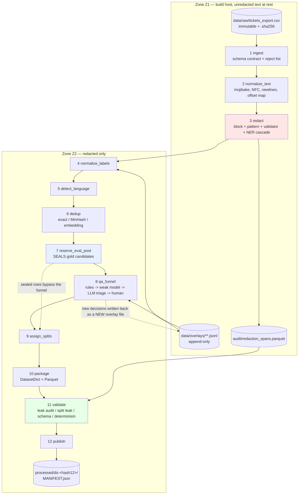

# Dataset construction pipeline — architecture

Status: design (not implemented). No source code exists for any of this; the only artifacts in the repo today are
`data/raw/tickets_export.csv` and the four documents linked below.
Author: system-architect
Date: 2026-08-18
Owns: the *software* that turns a raw ticket export into a versioned, reproducible, training-ready dataset, and the
preprocessing unit shared with training and inference.
Does not own: model choice, training recipe, evaluation protocol, annotation volumes — those belong to
[`ticket-services-classifier.md`](./ticket-services-classifier.md) and
[`dataset-construction-runbook.md`](./dataset-construction-runbook.md) and are treated here as fixed requirements.

Companions:
[classifier spec](./ticket-services-classifier.md) (§2 data, §4.6 input construction, §9 artifacts/contract/reproducibility) ·
[runbook](./dataset-construction-runbook.md) (Cases A/B/C/D, gold set, splits, order of operations) ·
[proposal](../proposals/ticket-services-classifier.md) (§5.3 one preprocessing code path, §5.4 schema additions) ·
[LLM fallback policy](./llm-fallback-policy.md) (§5 contamination rules, §9 "not as a training-label source").

Measurements tagged **[measured]** were run against `data/raw/tickets_export.csv` on this machine and are reproducible
from the one-liners quoted inline. **[estimate]** is arithmetic with the working shown.

---

## 0. Summary of the decisions that matter

| # | Decision | Rejected alternative |
|---|---|---|
| **D1** | **Two Python packages, not one.** `ticketprep` = pure, dependency-light, importable by the dataset build *and* training *and* the inference service. `ticketpipe` = the dataset build, depends on `ticketprep`. The inference container installs `ticketprep` only. | A single `dataset` package that the serving image also installs (drags pandas/pyarrow/NER into a 279 MB-model container and invites `if training:` branches) |
| **D2** | **`preprocess_version` is a hash of the resolved config, not a hand-maintained semver**, and CI computes the blast radius of every change by diffing `build_input` output over all 5,013 rows. A changed row count > 0 forces a MAJOR bump. Version bumps stop being a judgement call. | Hand-maintained semver with a review checklist |
| **D3** | **Orchestration: a typed Python CLI (`tpipe`) with `MANIFEST.json` as the single source of truth; DVC used as content-addressed blob storage only, never as the pipeline engine; no scheduler; Temporal deferred to the production DB `extract` stage only.** | Dagster (strongest alternative — see §7), DVC pipelines, Temporal for the whole DAG |
| **D4** | **The eval pool is sealed before the QA funnel runs**, and "sealed" is enforced by a newtype the LLM client requires, an anti-join, and a publication gate — not by a rule in a document. | Ordering the funnel before splitting and relying on reviewers to skip gold rows |
| **D5** | **The LLM in the QA funnel is a triage/prioritisation signal only. It may never commit a label.** This is a deliberate narrowing of the brief — see §8.4 for why the alternative contradicts [`llm-fallback-policy.md`](./llm-fallback-policy.md) §9. | LLM auto-applies high-confidence label fixes to training rows |
| **D6** | **`redaction_spans.parquet` stores offsets, category, detector, action and a salted digest — never the matched plaintext for `critical`/`high` categories.** The audit trail is a pointer into the immutable raw file, not a second copy of the secrets. | Storing the matched text for every span (the literal reading of the brief; it would create an unredacted artifact that travels with the snapshot) |

---

## 1. Context and constraints

### 1.1 What exists

`git log` shows nine commits: four documents and a synthetic fixture. There is **no Python code, no `pyproject.toml`,
no lockfile, no notebooks, no CI**. This is a greenfield build, and I am designing it as one. The only real constraints
are the ones the four documents impose, plus the shape of the fixture itself.

That is worth stating plainly because it removes a whole class of design pressure: there is no legacy preprocessing
script to keep bug-compatible, no existing dataset format to migrate, no in-flight training runs to avoid breaking.
The expensive constraints arrive later, from production (§11).

### 1.2 The fixture, measured

| Property | Value | Source |
|---|---|---|
| Rows / columns | 5,013 / 10 | **[measured]** `csv.DictReader` |
| File size | 3.0 MB | **[measured]** |
| CSV parse time, single core | **0.056 s** | **[measured]** |
| Total `title+description` text | 1,812,901 chars (mean 362/row) | **[measured]** |
| Rows with empty `services` | 391 | **[measured]**, matches `data/raw/README.md` |
| Rows with U+FFFD (unrecoverable mojibake) | **0** | **[measured]** — all mojibake in this corpus is *recoverable* |
| Rows with cp1251-as-latin1 mojibake | 2 detectable by the `[ÐÑ]` signature (README states 9 total) | **[measured]** |
| Rows containing customer self-redaction (`***`/`REDACTED`) | 168 | **[measured]** |
| 14-regex detector sweep over all text | **0.779 s ⇒ 6,435 rows/s single core** | **[measured]** |

Two of those numbers are load-bearing later. The mojibake finding is in §3.3; the 6,435 rows/s figure is what makes
the runtime table in §3.2 and the belt-and-braces egress check in §9.3 affordable.

### 1.3 Constraints taken as given

| Source | Constraint | Consequence for this design |
|---|---|---|
| proposal §5.3 | "All preprocessing runs inside the model service … training and inference must share one code path" | §5, the entire shared-package design. Non-negotiable. |
| spec §9.5 | Immutable dataset snapshot with a content hash; never train against a live query; pinned versions; seeds recorded | §4, §6 |
| spec §9.1 | `preprocess.json` ships **with the model** (redaction rules, normalisation, template, `max_len`, truncation, E5 prefix) | The rule pack is package data, copied into both the snapshot and the model artifact (§5.3) |
| spec §2.9 / §8 Q7 | 152-FZ: recording, storage, extraction of RU personal data must occur in RU; pseudonymise *before* the corpus leaves the production DB | §9 trust zones; `redact` is upstream of every egress edge |
| spec §2.6, runbook §6 | Temporal split 70/15/15, ≥1 week gaps, group by `organization_id`, near-duplicate removal across the boundary | §3 `assign_splits`, §4.4 |
| runbook §0, §4.1 | Training and evaluation have **opposite** selection rules; gold is blind, stratified, seeded-hash sampled | §8.2, D4 |
| llm-fallback §5, §9 | Every LLM output is model provenance; the LLM must never touch the gold set, not even to pre-filter | §8.4, D5 |
| runbook §5.2 | Real corpus is 50k–300k raw tickets | §3.2 runtime column at 500k; §7 migration trigger |
| spec §4.6 | Input template `"[priority: {p}] {title}\n{description}"`, head+tail truncation, optional `query: ` prefix, placeholder normalisation of high-entropy spans | `ticketprep.build_input` is the only implementation of this |
| proposal §5.4 | `service_predictions`, `ticket_services_audit` | §11.2; I request one column addition (§13 Q5) |

### 1.4 Scale and cadence

This pipeline runs **rarely** — order 10 full builds per quarter, plus per-stage debug runs. It has no SLA, no
concurrency, no multi-tenancy. Its product is an audit trail and a hash. Every architectural choice below follows from
that: optimise for *explainability of a past build* and *cheap exact rebuild*, not for throughput or scheduling.

### 1.5 What must not break

1. `data/raw/**` is **append-only and byte-immutable**. Nothing in the pipeline opens it for writing, ever (§4.5).
2. Once `publish` writes a snapshot directory, that directory is immutable. Corrections produce a *new* snapshot.
3. No unredacted text crosses a zone boundary (§9).
4. A gold/eval-pool ticket is never seen by an automated label-changing process (§8.2).
5. Training and serving produce byte-identical model input for the same ticket, or CI is red (§5.4).

---

## 2. Principles

These are the five rules the rest of the document is derived from. If a later section appears to contradict one of
these, the principle wins and the section is a bug.

| P | Principle | Mechanism |
|---|---|---|
| **P1** | The raw file is immutable; corrections are overlays | §4.5 |
| **P2** | One preprocessing implementation, used by three consumers | §5 |
| **P3** | Nothing is dropped silently — every exclusion is a row in an audit artifact with a reason code | §4.3 |
| **P4** | Redaction is upstream of every egress edge, structurally | §9.3 |
| **P5** | The snapshot's *name* is a pure function of its inputs | §6.2 |

---

## 3. Stage graph

### 3.1 The DAG



The three coloured nodes are the ones that carry the design: `redact` is the zone boundary, `reserve_eval_pool` is the
contamination boundary, `validate` is the publication gate.

### 3.2 Stage contracts

`P` = pure/deterministic given (inputs, resolved config, pinned model revisions). `C` = cacheable on the content hash of
its inputs plus the stage's config slice.

| # | Stage | Input | Output | P | C | 5k **[measured]** / **[estimate]** | 500k **[estimate]** |
|---|---|---|---|---|---|---|---|
| 1 | `ingest` | raw CSV (or `pg_extract`, §11.3) | `01_ingest/tickets.parquet`, `rejects.parquet`, `schema_report.json` | yes | yes | 0.06 s parse **[m]**, ~1 s total | ~20 s (300 MB) |
| 2 | `normalize_text` | 01 | `02_normalized/{tickets,offset_maps}.parquet` | yes | yes | ~3 s | ~5 min |
| 3 | `redact` | 02 | `03_redacted/tickets.parquet`, `audit/redaction_spans.parquet`, `token_budget_report.json` | yes¹ | yes | regex tier 0.8 s **[m]** → ~8 s full pack; +NER ~25 s | ~15 min regex 1 core / ~2 min on 8; NER 25–45 min on 8 |
| 4 | `normalize_labels` | 03 + label overlays + `labels.json` | `04_labels/tickets.parquet`, `audit/label_fixes.parquet`, `quarantine.parquet` | yes | yes | < 1 s | ~30 s |
| 5 | `detect_language` | 04 (+ block tags from 03) | `05_lang/tickets.parquet` | yes¹ | yes | ~2 s | ~4 min |
| 6 | `dedup` | 05 | `06_dedup/{clusters,pairs}.parquet`, `audit/dedup_dropped.parquet` | yes¹ | yes | exact < 1 s; MinHash ~5 s; embedding tier **82 s** ² | MinHash ~10 min; embedding **2.3 h CPU** / ~5 min on a T4 |
| 7 | `reserve_eval_pool` | 06 | `07_pool/eval_reservation.parquet` | yes | yes | < 1 s | ~10 s |
| 8 | `qa_funnel` | 06, 07, QA overlays | `08_qa/{qa_findings,llm_adjudications,review_queue}.parquet` | **no**³ | no | rules ~10 s; weak model ~60 s; LLM & human = out-of-band | rules ~5 min; funnel is sampled, not exhaustive |
| 9 | `assign_splits` | 06, 07, 08 | `09_split/…`, `audit/split_assignment.parquet` | yes | yes | ~2 s | ~2 min |
| 10 | `package` | 09 | `dataset/{train,validation,test,gold_*,holdout}/*.parquet` | yes | yes | ~5 s | ~5 min |
| 11 | `validate` | 10 + all audit artifacts | `reports/gates.json`, exit code | yes | no | ~15 s (leak audit dominates) | ~10 min |
| 12 | `publish` | 10, 11 | `processed/ds-<hash12>/`, `MANIFEST.json` | yes | no | ~2 s | ~3 min (upload) |

¹ Deterministic **only** with pinned model revisions (NER, fastText langid, embedding checkpoint) — those revisions are
inputs to the config hash (§6.1). Without pinning these stages are not reproducible and the snapshot hash is a lie.
² From the classifier spec's **[measured]** 61 tickets/s for `multilingual-e5-small` INT8 at batch 16 on 4 vCPU:
5,013 / 61 ≈ 82 s; 500,000 / 61 ≈ 2.3 h.
³ The **only** impure stage. Its impurity is quarantined by recording every oracle response as an immutable artifact;
re-runs consume the record, never the oracle (§8.5).

**Total phase-1 cold build at 5k: under two minutes.** That number is the reason §7 rejects a scheduler.

### 3.3 Why the order is what it is

Three orderings are non-obvious and each is justified by something in the corpus:

**`normalize_text` before `redact`.** Row `TICKET-16991` **[measured]** contains
`ÈÍÍ 6470590803, ÊÏÏ 630001001 / ÎÃÐÍ 1878489400362` — cp1251 bytes decoded as latin-1. The digits survive mojibake,
but every *keyword anchor* a company-identifier detector relies on (`ИНН`, `КПП`, `ОГРН`) does not. Redacting first
misses the entire class. The fix round-trips exactly:
`s.encode('cp1252', errors='replace').decode('cp1251')` → `ИНН 6470590803, КПП 630001001` **[measured]**. Nine such
rows are 0.18% of this fixture and would be 900 rows at 500k, every one of them a leak.

Corollary: **offsets in `redaction_spans.parquet` are in the *normalised* frame, not the raw frame.** `normalize_text`
therefore emits an offset map (raw↔normalised) so any span can be traced back to raw bytes. Skipping the offset map
makes the audit trail unverifiable against the source of truth.

**`redact` before `dedup`.** `data/raw/README.md` records that the payload pass *reduced* char-5-gram Jaccard ≥ 0.60
collisions from 136 pairs to 71, "because every pasted block is unique". Unique ids, timestamps and hostnames are exactly
what redaction collapses to placeholders. Deduplicating raw text measures the entropy of the ids; deduplicating redacted
text measures the entropy of the *prose*, which is what actually leaks across a split boundary. Same argument applies to
the 173 partially self-redacted rows: normalising `sk_test_51H***REDACTED***` and `sk_test_51Habcdef…` to the same
`<API_KEY>` makes two copies of one ticket look like two copies of one ticket.

**`detect_language` after `redact`.** README: a Cyrillic-ratio heuristic classifies only **9 of 237** code-switched rows
as mixed. The reason is that the English content sits in pasted logs, and the log block dominates the ratio. `redact`
already tags block spans (`<LOG:…>`, `<CODE:…>`, `<HTTP_DUMP>`), so `detect_language` can run langid over *prose only*
and define `is_code_switched = (prose_lang == 'ru') AND (has_latin_error_tokens_outside_blocks)`. This is a rule that is
only expressible downstream of block detection. Building the §6.3 language slice with a naive script ratio would
mis-slice 96% of the code-switched population.

### 3.4 Stage function signature (fixed, for the Temporal migration path)

Every stage is a module exporting exactly this shape. The uniformity is not aesthetic — it is what makes §7's migration
to Temporal activities a wrapper rather than a rewrite.

```python
class StageResult(TypedDict):
    outputs: dict[str, Path]        # logical name -> written file
    content_hashes: dict[str, str]  # logical name -> canonical content hash
    stats: dict[str, int | float]   # goes into reports/
    warnings: list[StageWarning]

def run(inputs: Mapping[str, Path], cfg: ResolvedConfig, out_dir: Path) -> StageResult: ...
```

No stage reads global state, environment variables, or the clock. `datetime.now()` appears exactly once in the codebase,
in `publish`, and its value is written to the manifest but is **not** an input to any hash.

---

## 4. Artifact and data contracts

### 4.1 On-disk layout

```
data/
  raw/                                   # ZONE Z1. immutable. git-tracked at 5k; object store at 500k
    tickets_export.csv
    tickets_export.csv.sha256
  extract/<extract_id>/                  # phase 3: pg_extract output, same contract as raw/
    tickets.parquet  messages.parquet  provenance.parquet  EXTRACT.json
  overlays/                              # append-only, git-tracked, small, human-readable
    label_corrections/2026-08-20T14-02-11Z__qa-batch-003__alice.jsonl
    gold_annotations/2026-09-02T09-00-00Z__gold-v1__labelstudio-export.jsonl
    quarantine_resolutions/…
    OVERLAYS.sha256                      # digest of the sorted overlay file list + per-file hashes
  interim/<config_hash12>/               # ZONE Z1. disposable cache, .gitignored, 30-day retention
    01_ingest/ … 09_split/
  processed/ds-<config_hash12>/          # ZONE Z2. immutable snapshot
    MANIFEST.json
    config.resolved.json                 # the exact canonicalised config that produced this
    dataset/
      train/*.parquet  validation/*.parquet  test/*.parquet
      gold_val/  gold_test/  gold_drift/  holdout/
      dataset_dict.json                  # HF DatasetDict loadable via load_from_disk
    audit/
      redaction_spans.parquet
      dedup_clusters.parquet  dedup_dropped.parquet
      label_fixes.parquet
      split_assignment.parquet
      quarantine.parquet
      qa_findings.parquet  llm_adjudications.parquet  review_decisions.parquet
    preprocess/
      rules/                             # frozen copy of the ticketprep rule pack
      preprocess.json                    # the spec §9.1 artifact, byte-identical to the one shipped with the model
    reports/
      week1_provenance.md  class_balance.json  cardinality.json  language.json
      token_budget.json  dedup.json  gates.json  leak_audit.json
    labels.json  label_map.json
```

**Formats.** Parquet + zstd(3) everywhere for tabular artifacts; JSONL for overlays (human-diffable, git-friendly,
append-only by nature); JSON for manifests and reports. The packaged dataset is Parquet shards plus a
`dataset_dict.json` so `datasets.load_from_disk` works without a loading script — no custom loader, no `trust_remote_code`.

**Why Parquet over Arrow IPC:** columnar predicate pushdown for the audit tables (which are queried far more than the
dataset itself: "show me every `critical` span in org_0002"), stable cross-version file format, and DuckDB can query the
audit directory directly with zero setup. Arrow IPC is faster to write and can't be queried by anything the team will
have installed.

### 4.2 Core record schema

`dataset/*/`. One row per ticket. Columns marked **†** exist in phase 1 with constant values, purely so the production
extraction in §11.3 is a data change rather than a schema migration.

| Column | Type | Notes |
|---|---|---|
| `ticket_id` | string, PK | from `id` |
| `organization_id` | string | grouping key for splits; pseudonymised via keyed hash in phase 3 |
| `created_at` | timestamp[us, tz] | split ordering key |
| `model_input_text` | string | **the output of `ticketprep.build_input`** — training consumes this directly and never re-templates |
| `input_fingerprint` | string | sha256 of `model_input_text`; the join key for the skew test |
| `title_redacted`, `description_redacted` | string | kept for error analysis and reviewer display |
| `priority` | dictionary<string> | `low\|normal\|high\|urgent` |
| `services` | list<string> | normalised, sorted, deduplicated |
| `services_raw` | string | verbatim source value, for auditing `label_fixes` |
| `label_set_version` | string | |
| `provenance_case` **†** | dictionary<string> | `A\|B\|B_strong\|C\|D\|fixture` — `fixture` for the 5k CSV |
| `label_source` **†** | dictionary<string> | `human\|model\|mixed\|unknown\|fixture` |
| `sample_weight` **†** | float32 | from config `weights:` table (spec §2.3: A/C/gold = 1.0, B-strong = 0.3) |
| `eligibility` | dictionary<string> | `train_only\|eval_pool\|holdout\|excluded` — set by `reserve_eval_pool` |
| `split` | dictionary<string> | `train\|validation\|test\|gold_val\|gold_test\|gold_drift\|holdout\|dropped` |
| `lang`, `lang_conf`, `is_code_switched` | string, float32, bool | §3.3 |
| `dedup_cluster_id`, `is_cluster_representative` | string, bool | |
| `n_tokens` | int32 | tokenised under the pinned tokenizer; drives `max_len` selection (spec §4.6) |
| `truncated` | bool | head+tail truncation fired |
| `redaction_counts` | map<string,int32> | per-category span counts; a feature for QA triage and a slice for evaluation |
| `preprocess_version` | string | stamped on every row |
| `snapshot_id` | string | self-identifying rows survive being copied out of the directory |

### 4.3 Audit artifacts (never destroyed)

These four are the reason the pipeline exists in this shape. They are written to the snapshot, they are inputs to
`validate`, and `publish` refuses to run if any is missing or empty when the corresponding stage reported work.

**`redaction_spans.parquet`** — the leak-audit trail.

| Column | Type | Notes |
|---|---|---|
| `ticket_id` | string | |
| `field` | dictionary<string> | `title\|description` |
| `frame` | string | `normalized@<normalize_rules_version>` — offsets are meaningless without it (§3.3) |
| `start`, `end` | int32 | char offsets, half-open |
| `raw_start`, `raw_end` | int32 | resolved through the offset map, for verification against the immutable raw file |
| `category` | dictionary<string> | `email\|phone\|pan\|iban\|rs_ks_bik\|passport\|snils\|inn\|ogrn\|kpp\|person_name\|org_name\|address\|url\|url_token\|api_key\|jwt\|pem\|ssh_key\|conn_string\|basic_auth\|ip\|cidr\|hostname\|k8s_name\|uuid\|trace_id\|idempotency_key\|timestamp\|log_block\|code_block\|http_dump\|stack_frame` |
| `severity` | dictionary<string> | `critical\|high\|medium\|low` — drives the §9.4 gate |
| `detector` | string | e.g. `pattern:pan.luhn@3`, `ner:slovnet-ner@<sha8>`, `block:python-traceback@2` |
| `detector_confidence` | float32 | NER only; null for deterministic detectors |
| `action` | dictionary<string> | `mask\|hash\|collapse\|keep\|flag_only` |
| `placeholder` | string | e.g. `<EMAIL>`, `<LOG:python-traceback lines=203>` |
| `span_len` | int32 | |
| `span_digest` | string | `blake2b(pepper ‖ category ‖ span_text)[:16]` — lets you count distinct secrets, correlate reuse across tickets, and prove a span was found, without storing it |
| `span_text` | string, **nullable** | populated **only** for `severity ∈ {medium, low}`. Null for `critical`/`high`. See D6. |
| `overlapped_by` | string, nullable | id of the winning span when detectors overlap |

> **D6 rationale.** The brief asks for "every span found … the leak-audit trail". Storing the matched plaintext for a
> PEM block or a live PAN would make `redaction_spans.parquet` the single most dangerous file in the repository — an
> unredacted extract of exactly the material we redacted, travelling inside the snapshot into Z2. It is also
> unnecessary: `raw_start`/`raw_end` plus the immutable raw file reconstruct the span exactly, inside Z1, for anyone with
> the authorisation to be in Z1. The digest gives cardinality and reuse analysis without the payload. If an auditor needs
> the plaintext they run `tpipe span show --ticket … --span …` on the build host, and that command is logged.

**`dedup_dropped.parquet`** — `ticket_id`, `cluster_id`, `kept_ticket_id`, `method` (`exact|minhash|embedding`),
`similarity` float32, `dropped_at_stage` (`split` — never `dedup`, see below), `reason_code`, `policy_version`.

> **Dedup annotates; it never deletes.** Stage 6 assigns `dedup_cluster_id` and `is_cluster_representative` to every
> row and drops nothing. The actual exclusion happens in `assign_splits`, where the policy is "drop the *later* copy from
> the *later* split" (runbook §6) — a policy that is meaningless without knowing the split. Separating detection from
> policy means changing the dedup threshold does not require re-embedding 500k rows, and the same cluster table serves
> both the split policy and the "how duplicated is this corpus" report. The 5,008 Jaccard ≥ 0.60 pairs and the 25-row
> intentional alert clique in this fixture are exactly the population you want to look at before choosing a threshold.

**`label_fixes.parquet`** — `ticket_id`, `field`, `before` (string), `after` (string), `rule`
(`whitespace|case|internal_dup|label_map|overlay|quarantine_release`), `rule_version`, `source`
(`deterministic|overlay`), `overlay_file`, `overlay_line`, `author`, `authored_at`, `reason_code`.
At 5k this table has ≥ 127 deterministic rows before any human touches it (49 spacing + 38 case + 40 internal-dup,
per `data/raw/README.md`).

**`split_assignment.parquet`** — `ticket_id`, `split`, `assigned_by` (`temporal|gold_reservation|holdout|dedup_drop|
group_constraint|quarantine`), `reason_code`, `boundary_ts_lower`, `boundary_ts_upper`, `group_key`, `seed`,
`policy_version`. Every row in the corpus appears here exactly once including `dropped` rows. `validate` asserts
`count(split_assignment) == count(ingest) - count(rejects)`; a row that vanished between ingest and packaging without a
split-assignment row is a hard failure. That single assertion is P3 made executable.

### 4.4 Intermediate table schemas (abbreviated)

| Stage output | Key columns beyond `ticket_id` |
|---|---|
| `01_ingest/tickets.parquet` | all 10 source columns verbatim + `source_row_no`, `source_digest` (sha256 of the raw record bytes), `ingested_from` |
| `01_ingest/rejects.parquet` | `source_row_no`, `raw_line` (bounded to 4 KB), `violation` (`missing_column\|bad_timestamp\|duplicate_id\|bad_priority\|unparseable`), `contract_version` |
| `02_normalized/offset_maps.parquet` | `field`, `ops` (list<struct{raw_start,raw_end,norm_start,norm_end,op}>) — only rows where an op fired |
| `03_redacted/tickets.parquet` | `title_redacted`, `description_redacted`, `block_spans`, `redaction_counts`, `chars_saved` |
| `06_dedup/pairs.parquet` | `a`, `b`, `method`, `similarity` — retained; it is the evidence behind the cluster table |
| `07_pool/eval_reservation.parquet` | `eligibility`, `stratum` (month × language × cardinality × provenance_case), `draw_rank`, `seed`, `sealed_at_config_hash` |
| `08_qa/qa_findings.parquet` | `finding_type`, `severity`, `priority_score`, `detector`, `evidence`, `eligibility_at_detection` |
| `08_qa/llm_adjudications.parquet` | `model`, `model_snapshot_date`, `prompt_hash`, `verdicts` (list<struct{service,accept,evidence}>), `agreement_k_of_n`, `eligibility` (**must be `train_only`**), `request_id`, `responded_at` |

### 4.5 The never-mutate rule, and overlays

The raw file is opened `'rb'` and hashed at the start of every build; `MANIFEST.json` records the digest. There is no
code path in `ticketpipe` that writes to `data/raw/` — enforced by a unit test that walks the AST of the package for
writes to paths under the configured raw root, and by filesystem permissions on the build host.

Corrections — a wrong label, a missed redaction, a bad timestamp — are applied as **overlays**:

```jsonc
// data/overlays/label_corrections/2026-08-20T14-02-11Z__qa-batch-003__alice.jsonl
{"schema":"overlay/1","ticket_id":"TICKET-16991","field":"services",
 "op":"set","value":["billing","subscriptions"],
 "author":"alice","author_role":"support-senior","authored_at":"2026-08-20T14:02:11Z",
 "reason_code":"missing_service","reason":"invoice + seat count both discussed",
 "source":"human","queue_id":"qa-batch-003","payload_sha256":"…","evidence_span":[412,468]}
```

Rules:

1. Overlay files are **append-only and immutable once committed**. A mistake in an overlay is corrected by a *later*
   overlay, never by editing the file. This keeps the git history a true decision log.
2. Application order is fully deterministic: sort by `(ticket_id, field, authored_at, overlay_file, line_no)`. Ties are
   impossible because `line_no` breaks them. Last writer wins per `(ticket_id, field)`; the full chain lands in
   `label_fixes.parquet`.
3. `op ∈ {set, add, remove, quarantine, release}`. `set` is total; `add`/`remove` are set operations on multi-label
   fields and commute badly, so `validate` warns when a ticket has both `set` and `add`/`remove` ops in one build.
4. The digest of the overlay *set* (`OVERLAYS.sha256`) is an input to the config hash (§6.1). Adding one correction
   produces a new snapshot id. That is the intended behaviour: the dataset changed.
5. Overlays touching `eligibility = eval_pool` rows must have `source = "human"` and an `annotator_id` in the roster
   file; the loader raises on anything else (§8.4).

**Rejected alternative — a `corrections.csv` merged by hand, or worse, fixing the raw export.** Both destroy the ability
to answer "what did the corpus look like on 2026-09-01 and who changed it since". The overlay design costs one join.

---

## 5. `ticketprep` — the shared preprocessing package

This is the single most consequential decision in the document, because it is the one that is expensive to reverse. The
proposal (§5.3) states the requirement; this section specifies the unit.

### 5.1 Boundaries

| Package | Depends on | Installed in | Contains |
|---|---|---|---|
| **`ticketprep`** | `regex`, `pyyaml`, optional `[ner]` extra | dataset build, training job, **inference container** | normalisation, redaction, language detection, input templating, versioning, the rule pack |
| `ticketpipe` | `ticketprep`, `pyarrow`, `pandas`, `datasketch`, `duckdb`, `typer` | build host only | stages, CLI, manifests, gates, overlays, QA funnel |
| `tickettrain` | `ticketprep`, `torch`, `transformers`, `datasets` | training host | training, sweep, export, threshold tuning |
| `ticketserve` | `ticketprep`, `fastapi`, `onnxruntime` | production | HTTP service |

`ticketprep` **must not** import pandas, pyarrow, torch or transformers. The serving image is ~500 MB RSS budget
(spec §9.4); dragging the dataset stack into it is both a size problem and an invitation to write dataset-shaped code in
the serving path. CI enforces the import boundary with a dependency test that imports `ticketprep` in a bare venv and
asserts `sys.modules` contains none of the forbidden names.

The `[ner]` extra is the one wrinkle: NER-based name detection is needed at build time and is too slow for the online
path (spec §9.3 budget is 250 ms p95 total). Resolution: **NER runs only in the dataset build; the online path uses the
deterministic tiers only, and the difference is declared in the config** as
`redaction.tiers.online = [block, pattern, validator]` vs `redaction.tiers.batch = [block, pattern, validator, ner]`.
This is a *real* train/serve divergence and it must be visible, not hidden. Two consequences: (a) the corpus-diff test
(§5.4) runs both tier sets and reports how many rows differ — at 5k this is the ~"several hundred invented personal
names" population from the README; (b) if that delta is material to model quality, the answer is to move name detection
into a deterministic tier (gazetteer + morphology) or accept NER latency, not to leave the divergence undocumented. This
is called out as **Q1** in §13.

### 5.2 Public API

Conceptual signatures; not an implementation.

```python
# ticketprep/types.py
@dataclass(frozen=True, slots=True)
class Span:
    start: int; end: int
    category: str; severity: str
    detector: str; action: str
    placeholder: str | None
    confidence: float | None

@dataclass(frozen=True, slots=True)
class NormalizedText:
    text: str
    ops: tuple[NormOp, ...]                 # raw <-> normalised offset map
    mojibake_fixed: bool

@dataclass(frozen=True, slots=True)
class RedactionResult:
    text: str
    spans: tuple[Span, ...]
    counts: Mapping[str, int]
    chars_saved: int

@dataclass(frozen=True, slots=True)
class PreparedInput:
    text: str                                # exactly what the tokenizer receives
    fingerprint: str                         # sha256(text)
    title_redacted: str
    description_redacted: str
    spans: tuple[Span, ...]
    language: str; language_confidence: float; is_code_switched: bool
    n_chars: int
    preprocess_version: str

# ticketprep/__init__.py  -- the entire supported surface
def load_config(source: Path | Mapping | None = None) -> PreprocessConfig: ...
def preprocess_version(cfg: PreprocessConfig) -> str: ...

def normalize_text(s: str, cfg: PreprocessConfig) -> NormalizedText: ...
def redact(text: str, cfg: PreprocessConfig, *, tiers: TierSet, pepper: bytes | None = None) -> RedactionResult: ...
def detect_language(prose: str, blocks: Sequence[Span], cfg: PreprocessConfig) -> LanguageResult: ...

def build_input(
    *, title: str | None, description: str | None, priority: str | None,
    cfg: PreprocessConfig, tiers: TierSet = TierSet.ONLINE, pepper: bytes | None = None,
) -> PreparedInput: ...
```

**`build_input` is the contract.** It is the only function the dataset build, the training job and the inference service
all call, and it is the only place the spec §4.6 template
(`"[priority: {p}] {title}\n{description}"`, optional `query: ` prefix, head+tail truncation) exists.

Three rules that keep it one code path rather than two that look alike:

1. **No `if training:` anywhere in `ticketprep`.** The only permitted variation is data in `PreprocessConfig`, and every
   config field is part of `preprocess_version`. `TierSet` is an argument rather than a branch precisely so it shows up
   in the version and in the parity report.
2. **The dataset build does not get a richer function; it just reads more of the same result.** `PreparedInput.spans`
   is populated for both callers; the serving path ignores it. The alternative — a fast path that skips span collection —
   would be a second implementation with a different bug surface. Span collection costs microseconds against a 43 ms
   encoder forward pass.
3. **Truncation lives here, not in the collator.** Head+tail truncation is measured in tokens, so `ticketprep` owns the
   tokenizer handle (loaded from a pinned local path, `HF_HUB_OFFLINE=1`) rather than the training loop. Otherwise the
   serving path truncates differently from the training path and the divergence is invisible until shadow mode.

### 5.3 Versioning

```
preprocess_version = "pp-{MAJOR}.{MINOR}.{PATCH}+{cfg12}"      e.g.  pp-1.4.0+9f3ac21b04de
```

`cfg12` = first 12 hex chars of `blake2b-256` over the canonicalised resolved preprocessing config, which includes:

- every field of `PreprocessConfig` (canonical JSON: sorted keys, UTF-8, integers and decimal strings, no floats)
- the sha256 of every file in the rule pack
- the pinned revision (git sha / model sha256) of every NER, langid and tokenizer artifact
- `TierSet` definitions
- **`unicodedata.unidata_version`** — NFC normalisation is Unicode-version dependent, so a CPython upgrade can silently
  change `build_input` output. Folding the Unicode data version into the hash turns that into a loud version bump.
- the `pepper_id` (never the pepper itself)

**Bump rules, decided by CI rather than by the author:**

| Change | Bump | How CI knows |
|---|---|---|
| `build_input` output differs for ≥1 row of the reference corpus | **MAJOR** | corpus-diff test (§5.4 test 2) reports `changed_rows > 0` |
| Output provably byte-identical on all 5,013 rows; new stats, new metadata, faster implementation | MINOR | `changed_rows == 0` and the public API grew |
| Docs, typing, tests | PATCH | neither of the above |

Any MAJOR bump requires either a retrain or an explicit, recorded re-validation of the deployed model against the new
preprocessing. The corpus-diff test prints the changed-row count and a sample diff in the PR, so the blast radius of a
"harmless regex tweak" is visible *before* merge. This is the mechanism that stops the most likely real-world failure:
someone adds a detector on a Tuesday and production quietly starts seeing inputs the model was never trained on.

### 5.4 Interaction with the other version axes

| Version | Owns | Changes when | Who must react |
|---|---|---|---|
| `preprocess_version` | the exact string the tokenizer sees | rules, template, truncation, normalisation, pinned NER/tokenizer, Unicode data | training (retrain or revalidate), serving (must match exactly) |
| `model_version` | encoder + head weights, ONNX artifact | retrain, re-export, re-quantise | serving; thresholds must be re-tuned |
| `label_set_version` | ordered service list, index mapping (append-only, spec §4.8) | service added/renamed/merged | dataset (`label_map`), model head width, every consumer |
| `threshold_version` | per-service τ, decode variant, precision floor | re-tuning on validation, INT8 re-export | serving only |

**The dependency is a chain, and it must be declared in artifacts, not in a wiki.**

```
label_set_version ──▶ preprocess_version? NO   (independent)
preprocess_version ──▶ model_version              (a model is trained under exactly one preprocess_version)
model_version + preprocess_version ──▶ threshold_version
label_set_version ──▶ model_version               (head width and index order)
```

Concretely:

- `MANIFEST.json` of a snapshot records `preprocess_version` and `label_set_version`.
- The model artifact records `requires_preprocess_version` (exact string match, including `cfg12`),
  `label_set_version`, and `trained_on_snapshot_id`.
- `thresholds.json` records the `model_version` and `preprocess_version` it was tuned under.
- **`ticketserve` refuses to start** if `ticketprep.preprocess_version(cfg) != model.requires_preprocess_version`. Not a
  warning. A crash-on-boot beats a quiet 3pp precision loss that nobody attributes for six weeks.
- Every row of `service_predictions` carries `preprocess_version` — this is a **requested addition** to proposal §5.4
  (§13 Q5). Without it, a shadow-mode discrepancy cannot be attributed between "the model changed" and "the input
  changed".

### 5.5 The train/serve skew test

Five layers, in increasing order of what they can catch. Layers 1–3 gate CI; 4–5 are runtime.

**1. Golden vectors.** `packages/ticketprep/tests/golden/vectors.jsonl` — 400 hand-curated inputs with expected
`PreparedInput.text` and `fingerprint`, stratified to cover: all eight payload categories from `data/raw/README.md`, both
detectable mojibake rows, the 173-row self-redaction population, `>`-quoted mail blocks, truncated-mid-line pastes,
soft-wrapped lines, empty description, empty title, RU / EN / code-switched, exactly-at-`max_len`, and a row over
`3 × max_len` (the llm-fallback §2 OOD trigger). Committed. Any diff fails the build. Cheap, fast, and the thing a
developer actually reads when they break something.

**2. Corpus diff.** Run `build_input` over all 5,013 rows under both `TierSet.ONLINE` and `TierSet.BATCH`; compare
`fingerprint` per `ticket_id` against `tests/golden/corpus_fingerprints.parquet`. Output: `changed_rows`,
`changed_by_category`, and 10 sample diffs. Drives the version bump rule (§5.3). Runtime ≈ 30 s **[estimate]** from the
**[measured]** 6,435 rows/s regex sweep plus NER.

**3. Cross-process parity — the test that would actually catch skew.** In-process tests cannot catch the failure that
matters, which is *two different environments computing different strings*. So: CI builds the `ticketserve` image, starts
it, POSTs the 400 golden inputs to `POST /v1/debug/prepared` (returns `{text, fingerprint, preprocess_version}`; enabled
only when `ENV != production`, and behind service auth regardless), and asserts byte-equality against fingerprints
computed by the training-side import in the CI job's own venv. This catches: divergent installed `ticketprep` versions,
different Python/ICU/`unicodedata` versions between images, locale-dependent casing, `regex` vs `re` module differences,
and a stale wheel in the serving image. **A green in-process test with a red parity test is the normal way this fails.**

**4. Runtime assertion.** `ticketserve` exports `preprocess_version` as a metric label and includes it in
`GET /v1/model`. A scheduled check compares it against the deployed model's `requires_preprocess_version` and the
current snapshot's; mismatch pages. Belt for the boot-time brace.

**5. Shadow-mode fingerprint sampling.** During shadow (proposal §7), 1% of predictions log `input_fingerprint`. Joining
those against the snapshot's `input_fingerprint` for tickets that also appear in the dataset gives a *production*
measurement of skew rather than a CI one. This is the only layer that sees real ticket text.

**Rejected alternative — a shared JSON "preprocessing spec" interpreted by a Python and a TypeScript implementation.**
Considered because the API is Node and it would let the Express layer preview redacted text. Rejected: two
implementations of Unicode normalisation, Russian NER and 80 regexes will diverge, and the divergence is exactly the
failure mode we are defending against. If the Node side needs redacted text, it calls `ticketserve`.

---

## 6. Configuration and reproducibility

### 6.1 One config, one hash

`configs/dataset/v1.yaml` is the only file a build reads. Sections: `source`, `normalize`, `redaction` (rule pack ref,
per-category action/severity, tier sets), `labels` (`label_set_version`, `label_map`), `language`, `dedup` (methods,
thresholds, embedding checkpoint + revision), `weights` (provenance → sample weight), `eval_pool` (strata, quotas,
seed), `qa`, `split` (fractions, gap, group keys, seed), `package`, `gates` (severity → fail/waive/report).

The **resolved config** is that file plus: defaults filled in, pinned artifact revisions resolved to shas, the
`ticketprep` and `ticketpipe` package versions, `uv.lock` hash, `unicodedata.unidata_version`, the raw input digest(s),
and `OVERLAYS.sha256`. Canonicalise (sorted keys, UTF-8, no floats, no nulls-vs-missing ambiguity) → `blake2b-256` →

```
config_hash = <64 hex>          snapshot_id = "ds-" + config_hash[:12]
```

**P5: the name is a pure function of the inputs.** No date in the name, no incrementing counter. Rebuild the same
inputs, get the same name; if you get a different name, something you did not expect changed, and the manifest diff tells
you what. `MANIFEST.json` carries `created_at` and a human `alias` (`"gold-v1-candidate"`) for people, but neither is
hashed.

### 6.2 What "reproducible" means, precisely

There are two claims and they are not the same. Conflating them is how reproducibility stories become false.

| Claim | Guarantee | Scope |
|---|---|---|
| **Content-identical** (the contract) | Every artifact's canonical content hash — computed over the record stream sorted by primary key, serialised canonically, independent of Parquet encoding — matches | Any host, any Parquet version, any core count |
| **Bit-identical** (a bonus check) | The Parquet file bytes match | Only inside the pinned container image, same `uv.lock`, same CPU count |

Bit-identity of Parquet is not portable — pyarrow embeds a `created_by` string and row-group layout depends on write
buffering. Promising it across environments would be a lie. So `MANIFEST.json` records **both**: `content_hash`
(portable, contractual) and `file_sha256` (informational, checked only in the reproducibility CI job which runs in the
pinned image).

### 6.3 Determinism rules

Enforced by lint, test, or both:

1. No `datetime.now()`, `time.time()`, `uuid4()`, `os.urandom` outside `publish`. AST-checked.
2. No builtin `hash()` for anything persisted (`PYTHONHASHSEED`). Use `blake2b`. AST-checked.
3. No iteration over an unsorted `set`/`dict` that affects output. Sort before every write and every hash.
4. No locale-dependent string ops. `str.casefold()` only; no `locale.*`; `LC_ALL=C.UTF-8` pinned in the image.
5. All sampling via seeded stable hashing (`blake2b(seed ‖ ticket_id)`), never a PRNG whose state depends on iteration
   order — this is also what the runbook §4.1 requires for the gold draw.
6. Parquet: zstd level 3, fixed row-group size (128 Ki rows), rows sorted by `ticket_id`, statistics on.
7. Float comparisons that affect a decision (dedup similarity, thresholds) round to 6 dp before comparing; the unrounded
   value is stored.
8. Thread counts are fixed in config, not auto-detected — parallel map must be order-preserving (`imap` with chunked
   index reassembly, or reduce over sorted keys).
9. A test hashes the same resolved config 100× across subprocesses with randomised `PYTHONHASHSEED` and asserts one
   distinct value.

### 6.4 What is pinned

`uv.lock` (all Python deps, exact) · `.python-version` · the container base image by digest · every HF checkpoint by
commit sha, vendored into an internal mirror (`HF_HUB_OFFLINE=1` during builds — a build that reaches the network is a
build that is not reproducible) · the fastText langid model by sha256 · the NER model by sha256 · the rule pack by
content hash · `unicodedata.unidata_version`.

### 6.5 Rebuilding a snapshot

```
tpipe rebuild --snapshot ds-9f3ac21b04de --verify [--strict-bytes]
```

Reads `MANIFEST.json` and `config.resolved.json` from the published snapshot, re-resolves inputs (raw digest, overlay
set digest, pinned revisions), rebuilds every stage from scratch with the cache disabled, and compares content hashes
artifact by artifact. Exits non-zero with a per-artifact diff on any mismatch. `--strict-bytes` additionally compares
`file_sha256` and is only meaningful inside the pinned image.

Two dependencies that must be recorded and are easy to forget: (a) the **pepper** for `span_digest` and organisation
pseudonymisation lives in the secret store and is *required* for an exact rebuild — rotating it invalidates every
snapshot's digests, which is correct and should be a deliberate act; (b) the **overlay set** must be checked out at the
same commit, which is why `OVERLAYS.sha256` is in the hash.

CI runs `tpipe rebuild --verify` on the 5k fixture nightly. At under two minutes (§3.2), there is no excuse not to.

---

## 7. Orchestration

### 7.1 The candidates

| Option | Fit | Cost | Verdict |
|---|---|---|---|
| **Python CLI + Makefile**, `MANIFEST.json` as the source of truth | Excellent: 12 stages, ~2 min at 5k, run ~10×/quarter, zero infra, trivially debuggable, the audit trail is a file we designed | Cache invalidation and DAG wiring are ours to write (~300 lines) | **Recommended executor** |
| **DVC pipelines** (`dvc.yaml` + `dvc repro`) | Good on paper: content-addressed caching, `dvc dag`, remote storage | **Two sources of truth for hashes** — `dvc.lock` and `MANIFEST.json` — and they will disagree. DVC's params-hash granularity is per-stage-file, not per-config-slice, so it over-invalidates. YAML DSL for stages we want typed | **Rejected as the engine; adopted as blob storage** (see below) |
| **Dagster** | The strongest alternative. Software-defined assets map almost exactly onto our stage graph; asset lineage, freshness, and the UI are genuinely good; typed IO managers are a better fit than DVC's | A deployment (daemon + web server + a database), a third orchestrator on the team, and an asset catalogue that duplicates `MANIFEST.json`. For ~10 runs a quarter with no schedules and no sensors, the ops surface exceeds the value | **Rejected — closest call in the document** |
| **Prefect** | Same shape as Dagster with weaker asset semantics; its strengths are retries and scheduling, which we do not need | Same deployment cost, less lineage benefit | Rejected |
| **Temporal** | The team runs it in production, so ops cost is near zero *for the platform*. But Temporal's determinism model constrains *workflow* code, which fights the pipeline's own determinism story; workflow history is an execution log, not a data-lineage record; and there is no long-running, multi-step, retryable production interaction here to justify durable execution | Deterministic-workflow discipline, a worker to deploy, Python SDK in a repo that otherwise runs a CLI, and — the real cost — turning a two-minute local build into a system you cannot run on a laptop | **Rejected for phase 1; adopted for `extract` only in phase 3** |

### 7.2 Recommendation

**Build a typed Python CLI (`tpipe`, Typer) where each stage is a subcommand implementing the §3.4 signature, with a
tiny DAG runner that resolves dependencies and caches on content hashes into `interim/<config_hash12>/`. Use DVC purely
as content-addressed blob storage** (`dvc add data/processed/ds-…`, `dvc push` to an S3-compatible bucket in RU), so
snapshots are versioned in git as small pointer files without a second pipeline engine. No scheduler. `make dataset`
wraps the common invocation.

Why this and not Dagster, stated as the trade rather than as a dismissal: Dagster would give us a better UI and lineage
graph for free. It would also give us a second system that must be running for the dataset to be buildable, a second
place where "what produced this file" is answered, and a deployment to maintain for a job that runs ten times a quarter.
The audit requirements here are *documentary* (a manifest a lawyer or an auditor can read six months later) rather than
*operational* (a dashboard someone watches). A JSON manifest in an immutable directory serves the documentary
requirement better than a service, and it survives the orchestrator being decommissioned.

### 7.3 Migration path

Two triggers, two different answers:

**Trigger A — a stage exceeds ~30 minutes or needs a fleet.** At 500k the embedding dedup tier is 2.3 h on CPU
**[estimate]**. Answer: keep the CLI, add a `--shard i/N` argument to the offending stage and run N processes; the stage
signature is already `(inputs, cfg, out_dir) -> StageResult`, so sharding is a map-reduce over content hashes, not a
redesign. Or run that one stage on a GPU box (~5 min).

**Trigger B — the pipeline runs against the production database.** `pg_extract` (§11.3) is long-running, retryable,
touches production, and must not be run from a laptop. That is Temporal's actual job description. Answer: **wrap only
`extract` as a Temporal workflow** (`DatasetExtractWorkflow`, activities `resolveWindow` → `extractTickets` →
`extractMessages` → `reconstructProvenance` → `writeExtract` → `sealExtract`), producing an immutable
`data/extract/<extract_id>/` directory that the CLI pipeline consumes exactly as it consumes the CSV today. The rest of
the DAG stays a CLI. If the whole DAG later needs durability, each stage becomes an activity and the DAG runner becomes
a workflow — mechanical, because of §3.4.

I would resist that last step until there is a reason. A pipeline you can run end to end on a laptop in two minutes is
worth a great deal during the weeks when the rules are changing daily.

---

## 8. The human-in-the-loop boundary

### 8.1 The funnel

| Tier | What it does | Input | Output | Automated? |
|---|---|---|---|---|
| **F0 — rule findings** | empty `services`; \|S\| > 4; unknown label; label↔text keyword contradiction; dedup cluster with disagreeing labels; Case D quarantine; text < 80 chars; `critical` redaction span with low detector confidence | all non-sealed rows | `qa_findings` | yes, deterministic |
| **F1 — weak-model disagreement** | out-of-fold TF-IDF + linear OvR (spec §3 baseline 3) trained on the current labels; rows where the model is confidently opposite get a high `priority_score` | non-sealed | `qa_findings` | yes, deterministic given seed |
| **F2 — LLM triage** | constrained adjudication per llm-fallback §4.1 (`enum` over service names, required `evidence` quote, 2-of-3 prompt-shuffled agreement) — produces a **suggestion and a priority score**, never a label | non-sealed ∧ `eligibility == train_only` ∧ F0/F1 flagged | `llm_adjudications` | yes, but see §8.4 |
| **F3 — human review** | reviewer accepts/rejects/edits; the only tier that may change a label | queue ordered by `priority_score` | overlay JSONL → `label_fixes` | no |

Only F3 writes labels. F0–F2 write *findings*.

### 8.2 Sealing the eval pool (D4)

The ordering problem: the QA funnel wants to run before splitting (so corrections are in the training data), but the
contamination rules require knowing which rows are evaluation rows *before* any automated process touches them.
Resolution: **`reserve_eval_pool` (stage 7) runs before the funnel (stage 8)** and is independent of the final split.

It draws, using the runbook §4.1 rules — stratified over month × language × predicted-cardinality × provenance case,
seeded stable hash, never stratified on stored service values, dedup-cluster aware — a pool of gold candidates plus the
3–5% permanent holdout, and writes `eval_reservation.parquet` with `eligibility ∈ {eval_pool, holdout, train_only,
excluded}`. Once written for a given `(seed, strata, corpus digest)`, the reservation is **sealed**: it is committed to
the repo and the config hash covers it, so growing the corpus does not silently reshuffle which tickets are gold.

Four structural enforcements, none of which is a convention:

1. **Type-level.** The LLM client's only entry point is `adjudicate(batch: TrainOnlyBatch, ...)`. `TrainOnlyBatch` has
   no public constructor; the sole factory is `anti_join_sealed(rows, reservation) -> TrainOnlyBatch`. You cannot pass a
   list of rows to the LLM without going through the anti-join. This is the same pattern as `RedactedText` in §9.3.
2. **Artifact-level.** `llm_adjudications.parquet` carries `eligibility` per row. `validate` fails if any value is not
   `train_only`, and fails if `|sealed ∩ llm_adjudications.ticket_id| > 0`.
3. **Overlay-level.** Gold annotations arrive only through `data/overlays/gold_annotations/`, whose schema requires
   `source: "human"` (an enum with no `llm` member), an `annotator_id` present in `configs/annotators.yaml`, and an
   `annotation_session_id`. The loader raises on anything else. An LLM cannot produce a valid gold overlay row.
4. **Payload-level.** The gold task payload is built by a function that constructs the reviewer-visible object from a
   whitelist of fields — `title`, `description_redacted`, `priority` — and a test asserts that the serialised payload
   contains no `services`, `services_raw`, `predicted_*` or `label_*` key. Blindness (spec §2.2, runbook §4.1) becomes
   a property of the serialiser rather than a rule reviewers are asked to honour.

### 8.3 Reviewer surfaces — phase 1 choice

Two surfaces, deliberately different, because they have different requirements.

**QA queue (F3): CSV/JSONL round-trip.** Volume is low hundreds per revision; reviewers are engineers and one senior
support agent; the task is "look at a flagged row and decide". Mechanism: `tpipe qa export --queue qa-batch-003` writes
a CSV (opens in Excel/LibreOffice, which is what reviewers actually have) with one row per finding, the ticket text, the
current labels, the finding, the LLM suggestion and its evidence quote, plus hidden `row_uid` and `payload_sha256`
columns. `tpipe qa import <file>` validates and converts to an immutable overlay JSONL. The importer:

- rejects unknown `row_uid`s;
- rejects rows whose `payload_sha256` no longer matches the regenerated payload (i.e. the reviewer edited the ticket
  text, or the snapshot moved under them);
- requires `decision ∈ {accept, reject, edit, defer}` and a `reason_code` from a closed vocabulary;
- rejects any row whose `eligibility != train_only`;
- writes `overlays/label_corrections/<ts>__<queue_id>__<reviewer>.jsonl` and stages it for commit. No in-place edits.

**Gold set (3,300 blind annotations, 2–3 agents, double-annotation, adjudication, Krippendorff α): use Label Studio,
self-hosted.** Blindness, double annotation, adjudication workflow, per-item timing and annotator management are exactly
what it does, and re-implementing them is weeks we do not have. Self-hosted keeps the data inside the perimeter
(152-FZ). Its export is converted to `overlays/gold_annotations/*.jsonl` by an adapter; the adapter is the only place
its schema is known.

**Rejected: notebook widgets.** State lives in a kernel, there is no audit trail, no multi-user story, no way to
guarantee blindness, and "the reviewer restarted the kernel" loses work. Fine for exploration, not for decisions that
become training labels.

**Rejected for phase 1: a bespoke React/Gravity-UI review app.** It is the right long-term answer if reviewing becomes
continuous (and it will, once shadow mode produces a stream of disagreements). But it is weeks of work — auth, hosting,
persistence, a Node service — for a task that runs twice in phase 1, and every hour spent on it is an hour not spent on
the redaction rule pack, which is the actual risk. Revisit when review volume exceeds ~200 items/month or when a
non-engineer needs to review without a spreadsheet.

### 8.4 The LLM boundary — and where I disagree with the brief (D5)

The brief describes "an LLM adjudication step in the dataset QA funnel". [`llm-fallback-policy.md`](./llm-fallback-policy.md)
§5 says every LLM prediction is model provenance and is excluded from supervised training "on the same terms" as
CatBoost; §9 says explicitly **"not as a training-label source — distilling an LLM has the same feedback-loop failure as
distilling CatBoost, and adds a third provenance class to untangle later."**

Those two statements cannot both hold if the LLM commits labels into the training set. And note the shape of the trap:
if we *did* auto-apply LLM verdicts, the resulting rows would have `label_source = 'llm'`, and the provenance filter
would exclude them from supervised training — making the exercise pointless — or someone would quietly mark them
`human` and we would have built the exact contamination the whole project exists to escape.

**So: the LLM's output is a finding with a priority score and an evidence quote. It never becomes a label.** A human
accepting an LLM suggestion produces an overlay with `source: "human"`, `assisted_by: "llm"`, `llm_request_id: …`.
Metrics can then be sliced on `assisted_by` to measure automation bias — if reviewers accept 98% of LLM suggestions, the
LLM is annotating and the human is rubber-stamping, and that shows up as a number rather than as a suspicion.

Where the LLM genuinely earns its cost in this funnel is **ordering the human queue**, which is a real and unglamorous
win: at 500k rows with a 10% correction rate, the difference between reviewing a well-ordered queue and a random one is
most of the annotation budget.

Additional guardrails: LLM calls happen only on redacted text (§9.3); the prompt hash, model id, model snapshot date and
`request_id` are recorded per row so a later "which model version produced this suggestion" is answerable; and F2 is
behind a config flag that is **off** in phase 1 (§10).

### 8.5 Keeping the impure stage replayable

`qa_funnel` is the only non-deterministic stage. It is quarantined:

- every LLM response is written to `llm_adjudications.parquet` with its request hash, and every human decision to an
  overlay file;
- a re-run of `qa_funnel` in `--replay` mode (the default for any published build) reads those artifacts and makes zero
  external calls. It is then a pure function like every other stage;
- `--live` mode is required to make new calls, is never used in a rebuild, and appends to the artifacts rather than
  rewriting them;
- `tpipe rebuild --verify` runs in `--replay`, so a published snapshot is exactly reproducible even though the oracle is
  not.

---

## 9. Secrets, compliance, and the egress boundary

### 9.1 Trust zones

| Zone | Contents | Location | May contain unredacted text? |
|---|---|---|---|
| **Z0** | production Postgres | RU region | yes (source of truth) |
| **Z1** | build host: `data/raw`, `data/extract`, `data/interim`, offset maps, the pepper | RU region, restricted access | **yes — the only such zone outside Z0** |
| **Z2** | snapshot store, training host, model artifacts, reports | RU region | **no** |
| **Z3** | anything external: LLM API, HF Hub, W&B, error trackers, annotation SaaS | outside perimeter | **no, and only if legal clears the path at all** |

152-FZ (spec §2.9, §8 Q7) constrains Z0/Z1/Z2 to RU and makes Z3 a legal question, not an engineering one. Default
posture: **Z3 is empty.** HF checkpoints are vendored into an internal mirror; the dataset is never pushed to a hub;
`HF_HUB_OFFLINE=1` in build and training images; the annotation tool is self-hosted; the LLM tier is off in phase 1 and,
when enabled, is evaluated as self-hosted-first per llm-fallback §7.

### 9.2 Redaction sits upstream of every egress edge

The only edges out of Z1 are: `redact` → Z2 (the pipeline), and the F2 LLM client. Both are downstream of `redact` by
construction of the DAG. `interim/` lives on a separate volume that is not mounted into the training image, is
`.gitignored`, and carries a `.no-egress` marker file that the sync tooling refuses to cross.

### 9.3 Structural enforcement, not convention

Three mechanisms, in order of strength:

1. **Newtype at the boundary.** Every function that sends text out of Z1 takes `RedactedText`, not `str`:
   ```python
   @dataclass(frozen=True, slots=True)
   class RedactedText:
       value: str
       preprocess_version: str
       max_severity_found: str
       # constructed only by ticketprep.redact(); no public __init__ path from a bare str
   ```
   `llm_client.adjudicate(...)`, `snapshot_writer.write(...)` and `hub_push(...)` accept only this type. Passing a
   `str` is a type error caught by mypy in CI. This is cheap and it removes the single most likely mistake — someone
   adding a debugging call that posts `row.description` somewhere.
2. **Runtime re-scan at the edge.** Before any egress, re-run the deterministic detector tiers over the payload and
   refuse on any `critical` hit. At **[measured]** 6,435 rows/s this costs ~0.16 ms per ticket — free relative to a
   30 s LLM call. Belt and braces because the newtype only proves *a* redaction ran, not that it ran with the current
   rule pack.
3. **The publication gate** (§9.4).

### 9.4 The leak-audit gate

`validate` runs the full detector pack **plus a canary pack** — higher-recall, lower-precision rules that are too noisy
to use as redactors but fine as auditors (e.g. "any 13–19 digit run passing Luhn", "any 20+ char base64 run", "any line
matching `(?i)pass(word)?\s*[:=]`") — over every text field of the packaged dataset and over `reports/`.

| Severity | Examples | Gate |
|---|---|---|
| `critical` | PEM/SSH private key, JWT, API key, DB connection string with password, PAN passing Luhn, basic-auth URL | **Hard fail. No waiver. No publish.** |
| `high` | e-mail, phone, passport, СНИЛС, ИНН/ОГРН with valid check digits, full personal name from NER, р/с+БИК pair | Fail unless a signed waiver file exists naming the finding id, the reviewer and the reason; waivers are per-finding, expire with the snapshot, and are listed in `MANIFEST.json` |
| `medium` | private IP, internal hostname, k8s name, bucket name, internal URL | Report; fails only if the count exceeds a configured budget |
| `low` | UUID, trace id, timestamp | Report |

**The fixture will flatter this gate, and the design must say so.** `data/raw/README.md` is explicit: every secret is an
`EXAMPLE`/`DO-NOT-USE` value, every ИНН/ОГРН/СНИЛС has a deliberately invalid check digit, every IBAN has check digits
`00`, and a Luhn sweep guarantees no digit run other than the published test PANs passes. A detector pack measured only
on this corpus will look excellent and may be badly under-recall on real text.

Mitigation, and it is a required phase-1.5 deliverable: **a red-team injection harness.** `tpipe redteam` takes a copy
of the corpus, injects N synthetic-but-structurally-valid secrets per category (real Luhn-passing PANs from test BINs,
ИНН/СНИЛС with *correct* check digits, realistic-looking key bodies without the `EXAMPLE` marker, RU names from a
gazetteer, real-format р/с+к/с+БИК triples) at randomised positions including inside quoted mail blocks, soft-wrapped
lines and partially self-redacted spans, runs the pack, and reports **per-category recall with a target floor**
(proposed: 0.99 critical, 0.95 high). The injected corpus never leaves Z1 and is regenerated from a seed rather than
stored. This is the only way to get a meaningful redaction number before real data exists, and it is the number I would
report to legal — not the leak-audit result on the fixture.

### 9.5 Secrets handling

The pseudonymisation pepper (used for `span_digest` and for organisation/user id hashing in phase 3) lives in the
platform secret store, is injected as an environment variable at build time, and appears in the config **only as
`pepper_id`**. It is never written to `MANIFEST.json`, `config.resolved.json`, or any report. Rotating it invalidates
every snapshot digest — deliberate, and it means rotation is a scheduled decision rather than an accident.

Access to Z1 is the compliance control that matters: raw + `interim/` + offset maps together reconstruct everything the
redactor removed. Recommended retention on `interim/`: **30 days**, then delete, leaving `raw/` (immutable, access-
controlled) and the snapshot's audit artifacts as the durable record (§13 Q7).

---

## 10. Repo layout and build order

### 10.1 Layout

```
bert-poc/
  pyproject.toml                 # uv workspace
  uv.lock  .python-version  Makefile  .pre-commit-config.yaml
  packages/
    ticketprep/
      src/ticketprep/{__init__,types,config,version,normalize,language,template}.py
      src/ticketprep/redact/{__init__,cascade,blocks,patterns,validators,ner,placeholders}.py
      src/ticketprep/rules/{patterns.yaml,blocks.yaml,categories.yaml,placeholders.yaml}
      tests/{unit,property,golden/{vectors.jsonl,corpus_fingerprints.parquet}}
    ticketpipe/
      src/ticketpipe/{cli,dag,config,manifest,hashing,overlays,io}.py
      src/ticketpipe/stages/{ingest,normalize_text,redact,normalize_labels,detect_language,
                             dedup,reserve_eval_pool,qa_funnel,assign_splits,package,validate,publish}.py
      src/ticketpipe/qa/{rules,weak_model,llm_client,queue,importer}.py
      src/ticketpipe/gates/{leak_audit,split_leak,schema,determinism,redteam}.py
      tests/
    tickettrain/                 # phase 2
    ticketserve/                 # phase 3 (proposal §5.3)
  configs/
    dataset/v1.yaml  labels/labels.json  labels/label_map.json  annotators.yaml
  data/                          # §4.1; interim/ and processed/ gitignored, DVC pointers committed
  notebooks/                     # exploration only
  docs/{specs,proposals,architecture}/
  .github/workflows/{ci.yml,repro.yml}
```

Two rules with teeth:

- **`notebooks/` may import `ticketpipe`/`ticketprep`; nothing may import `notebooks/`.** No stage, test or config
  references a notebook. `nbstripout` in pre-commit; notebooks excluded from coverage; a CI check greps the source tree
  for `notebooks` references. Notebooks are for looking at data, and their outputs are reports, not artifacts.
- **`packages/ticketprep/rules/` has a CODEOWNERS entry requiring a security reviewer.** Rule-pack changes are the
  highest-consequence diffs in the repo — they change what leaks and they change `preprocess_version`.

### 10.2 Build order

| Phase | Contents | Rough size |
|---|---|---|
| **1 — the spine** (build first) | `ticketprep`: normalise (incl. mojibake), pattern + validator + block redaction (no NER), template, config hash, `preprocess_version`, golden + corpus-diff tests. `ticketpipe`: ingest, normalize_text, redact, normalize_labels, detect_language, dedup (exact + MinHash), reserve_eval_pool, assign_splits, package, validate (schema + leak + split-leak), publish, MANIFEST, CLI, `tpipe rebuild --verify`. Reports: the runbook §7 step-4 week-1 numbers (class balance, cardinality, RU:EN, token length) | ~2 weeks, 1 dev |
| **1.5 — the parts that make phase 1 trustworthy** | NER tier + `TierSet` divergence report; embedding dedup tier; red-team injection harness; F0/F1 QA findings + CSV round-trip; nightly repro job | ~1 week |
| **2 — after the model exists** | Cross-process parity test (needs `ticketserve`); F2 LLM triage; Label Studio gold flow + adapter; gold/drift/holdout splits populated; learning-curve subset materialisation | ~1–2 weeks |
| **3 — production data** | `pg_extract` as a Temporal workflow; Cases A/B/C/D provenance reconstruction; internal-message parser + the ≥95%/month parse gate; org/user pseudonymisation with the pepper; incremental snapshots | ~2–3 weeks |

**Explicitly deferred:** any web review UI; incremental/streaming builds; a feature store; automated retrain triggers; a
dataset registry service. None has a named requirement today.

The phase-1 boundary is chosen so that the week-1 deliverable the runbook demands (§7 steps 1–4) is producible from the
5k fixture *with the same code* that will later produce it from the real corpus.

---

## 11. Interfaces to the future

### 11.1 Handoff to training

```python
snap = Snapshot.open("data/processed/ds-9f3ac21b04de")     # reads + verifies MANIFEST
assert snap.preprocess_version == ticketprep.preprocess_version(cfg)   # hard fail, not a warning
ds = snap.dataset()                                        # datasets.DatasetDict
```

The training job consumes `model_input_text` **verbatim** and never calls the template itself; `sample_weight` comes
from the column; `labels.json` and `label_map.json` are read from the snapshot so dataset and model head agree by
construction. `metrics.json` and `model_card.md` (spec §9.1) record `snapshot_id`, `preprocess_version`,
`label_set_version` and the `uv.lock` hash. The learning-curve requirement (spec §2.4) is served by
`snap.subset(fraction=0.1, seed=s)` using seeded stable hashing over `ticket_id` — nested subsets, so the 10% sample is
a subset of the 25% sample, which makes the curve interpretable.

### 11.2 Handoff to serving

`processed/<id>/preprocess/` is copied byte-for-byte into the model artifact directory as the spec §9.1 `preprocess.json`
+ rule pack. The serving image installs the *same wheel* of `ticketprep` recorded in the snapshot manifest. Version
compatibility is checked at boot (§5.4).

Requested schema delta to proposal §5.4: `service_predictions` gains **`preprocess_version text not null`**. One column,
and without it shadow-mode discrepancies are unattributable.

### 11.3 From the 5k CSV to the production database, without a rewrite

The mechanism is that **the provenance columns are first-class in phase 1 even though the fixture cannot populate them**
(§4.2 †). Two source adapters implement one contract:

| | `csv_export` (phase 1) | `pg_extract` (phase 3) |
|---|---|---|
| Emits | `tickets.parquet` | `tickets.parquet`, `messages.parquet`, `provenance.parquet` |
| `provenance_case` | constant `fixture` | `A\|B\|B_strong\|C\|D` from `work_provenance` (runbook §2) or, once proposal §5.4 lands, directly from `ticket_services_audit` |
| `label_source` | constant `fixture` | `human` (A/C), `model` (B), `unknown` |
| `sample_weight` | constant 1.0 | config `weights:` table |
| Extra gates | none | internal-message parse rate ≥ 95% **per month** (runbook §1.2); Case C in-distribution window check (§2.2) |

Everything downstream of `ingest` — all eleven stages — is unchanged. The runbook's Case A/B/C/D logic lives entirely in
the `pg_extract` adapter plus a `provenance` config section. Adding it is a new module and a gate, not a migration.

Two further design provisions for that transition:

- **The internal-message parser is versioned like the rule pack** (`parser_version` in the config hash) and its
  per-month parse-rate report is a `validate` gate, so a format drift that appears mid-corpus fails the build rather
  than silently shrinking a month.
- **`ticket_services_audit` supersedes the parser when it exists.** The adapter prefers the audit table and falls back
  to message parsing, recording which source it used per ticket in `provenance.parquet`. That column is how we will
  eventually retire the parser with evidence.

---

## 12. Risks

| Risk | Why it bites | Mitigation | Residual |
|---|---|---|---|
| **Redaction pack over-fitted to the fixture** | Every secret here says `EXAMPLE`; check digits are deliberately invalid; a grep for `DO-NOT-USE` finds most of it. Recall on real text could be far lower | Red-team injection harness with per-category recall floors (§9.4); report *those* numbers, never the fixture's | High until real data. This is the top risk in the document |
| **NER-tier divergence between batch and online** (§5.1) | A name masked in training and not at inference is textbook skew | Declared in config, measured by the corpus-diff test, reported per build | Medium — needs a product decision (Q1) |
| **MinHash misses semantic near-duplicates** | `data/raw/README.md` says the Postgres connection-pool cluster scores 0.2–0.5 and MinHash *will* miss it — by design | Embedding tier at cosine ≥ 0.92; report both tiers' cluster counts; group by `organization_id` catches much of the rest | Medium; embedding tier is 2.3 h CPU at 500k |
| **`preprocess_version` churn forcing retrains** | Each MAJOR bump invalidates the deployed model's compatibility check | Corpus-diff shows blast radius pre-merge; batch rule changes into scheduled windows aligned with retrains | Low with the process, high without |
| **Overlay conflicts / non-deterministic application** | Two reviewers editing the same ticket in the same batch | Total order on `(ticket_id, field, authored_at, file, line)`; `validate` warns on mixed `set`/`add` ops | Low |
| **Config-hash instability** | Float formatting, dict ordering, a stray `datetime.now()` — the snapshot id stops being reproducible and nobody notices for months | Canonical JSON, AST lints, the 100×-across-processes hash test, nightly `rebuild --verify` | Low |
| **Block collapsing destroys signal** | Collapsing a 203-line traceback to `<LOG:…>` may remove the exception class that carries the label signal | Collapse policy retains first 2 + last 2 lines and exception/status tokens; ablate collapse-vs-keep as a training variant (it is a config field, so it is a config change) | Medium — needs measurement, not argument |
| **Sealed pool drawn too early** | Reserving gold before the corpus is complete means the strata do not match the final distribution | Reservation is per `(seed, strata, corpus digest)`; growing the corpus creates a *second* reservation appended to the first rather than reshuffling | Medium |
| **Z1 access is the real compliance surface** | raw + offset maps reconstruct every redacted span | Access control on Z1; 30-day `interim/` retention; `span_text` null for critical/high (D6) | Medium; a policy question (Q7) |

---

## 13. Open questions, with owner and recommendation

| # | Question | Owner | My recommendation |
|---|---|---|---|
| **Q1** | **NER runs in the batch tier but not the online tier (§5.1). Is that acceptable divergence, or must personal-name detection be deterministic on both paths?** | ml-researcher + system-architect | Measure the delta with the corpus-diff test first. If it changes < 1% of rows, accept and document. If more, move name detection to a gazetteer + morphology tier that runs on both paths — do **not** leave it undeclared |
| **Q2** | Where does the snapshot blob store live (S3-compatible, RU region)? Bucket, retention, access policy | infra | S3-compatible in-RU bucket, versioning on, object-lock on `processed/` prefixes, 5-year retention on snapshots referenced by any shipped model |
| **Q3** | Can Label Studio (or equivalent) be self-hosted inside the perimeter for the gold set? | infra + support lead | Yes, phase 2. If not, the fallback is a CSV round-trip for gold too, which materially weakens blindness and agreement measurement — say so to the product owner before accepting it |
| **Q4** | Is the F2 LLM tier self-hosted or hosted (blocked on spec §8 Q7 / llm-fallback §7)? | legal/DPO + infra | Keep F2 **off** in phase 1. Design assumes it may never be enabled; the funnel works without it |
| **Q5** | Add `preprocess_version` to `service_predictions` (delta to proposal §5.4)? | backend | Yes. One column; without it, shadow-mode discrepancies cannot be attributed between model and input changes |
| **Q6** | Does the 3–5% permanent holdout exist at dataset-build time, or only after rollout? | product + backend | Reserve `eligibility='holdout'` from day one so the split value and the code path exist; it is simply empty until rollout |
| **Q7** | Retention policy for `interim/` (contains unredacted text and offset maps) | legal/DPO + infra | 30 days, then delete. Raw stays (access-controlled), audit artifacts stay |
| **Q8** | Who is the named reviewer for redaction rule-pack changes? | security | A named individual in CODEOWNERS on `packages/ticketprep/rules/`. Without a name this control does not exist |
| **Q9** | Is bit-identical rebuild required by anyone (audit, legal), or is content-identical sufficient? | ml-researcher + legal | Content-identical is the contract; bit-identity is checked only in the pinned image. Promising portable bit-identity for Parquet would be false |
| **Q10** | Is `organization_id` pseudonymisation with a keyed hash acceptable, given splits must group by organisation (spec §2.6)? | legal/DPO | Keyed hash with a stored pepper: grouping survives, re-identification requires the pepper. Dropping the column entirely would break the split requirement |
| **Q11** | Red-team recall floors: 0.99 critical / 0.95 high — agreed? | security + ml-researcher | Yes, and treat them as ship gates for the pipeline in the same way §6.6 gates the model |

---

## 14. Alternatives considered (consolidated)

| Decision | Chosen | Rejected | Why it lost |
|---|---|---|---|
| Package structure | `ticketprep` + `ticketpipe` split | one package | serving image bloat; invites training-only code in the serving path |
| Cross-language preprocessing | Python-only; Node calls `ticketserve` | shared JSON spec, Python + TypeScript implementations | two implementations of Unicode/NER/80 regexes diverge — the exact failure being defended against |
| Orchestration | CLI + manifest; DVC as blob storage | Dagster (closest), Prefect, DVC pipelines, Temporal | ops surface exceeds value at ~10 runs/quarter; second source of hash truth; Temporal's determinism model fights the pipeline's own |
| Dedup semantics | annotate clusters; drop at split time | drop rows at dedup time | threshold changes would force re-embedding; the drop policy depends on the split, which does not exist yet |
| Span audit content | offsets + digest; plaintext only for medium/low | plaintext for every span | creates an unredacted artifact that travels into Z2 |
| Snapshot naming | pure hash of inputs | date + counter | a name that is not a function of the inputs cannot detect an unexpected input change |
| Reproducibility claim | content-identical (portable) + bit-identical (in-image) | bit-identical everywhere | Parquet encoding is not portable; the strong claim would be false |
| Corrections | append-only overlay JSONL | editing raw / a mutable corrections CSV | destroys "what did the corpus look like on date X, and who changed it" |
| LLM in the funnel | triage/priority only | LLM commits label fixes | contradicts llm-fallback §5/§9; creates a third provenance class |
| Gold annotation tool | self-hosted Label Studio | notebook widgets; bespoke web app; CSV | blindness/double-annotation/α are exactly what it does; the others cost weeks or lose the audit trail |
| Version bump policy | CI-computed from corpus diff | hand-maintained semver + checklist | judgement calls about "harmless" regex changes are how skew ships |
