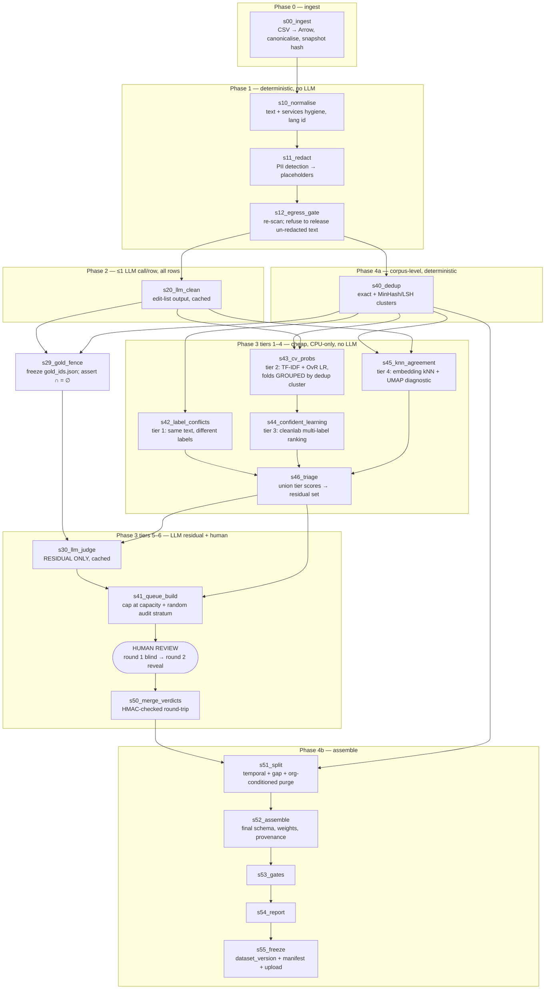
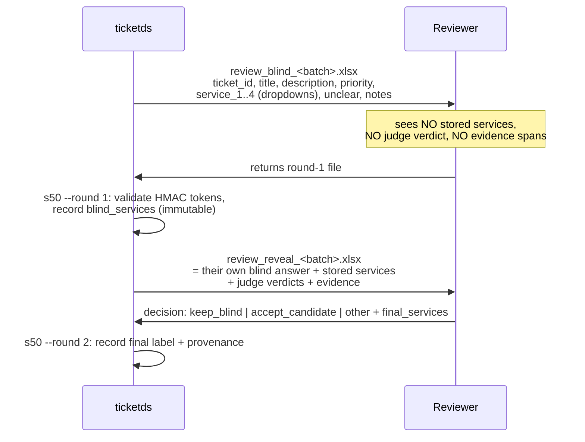

# Dataset pipeline architecture — from `tickets_export.csv` to a frozen training corpus

Status: architecture specification (not implemented)
Author: system-architect
Date: 2026-08-16 · **rev. 2** — two changes from the user, both structural:
**(1)** application-secret detection is removed from the pipeline (there are none in the real
ticket text), so §8 is re-derived against a personal-data threat model;
**(2)** Phase 3 becomes a **cheap-first cascade** — duplicate-label conflicts → grouped-CV
TF-IDF+LR → `cleanlab` → embedding kNN → LLM judge **on the residual** → human — which adds
five stages, a new class of artifact (fitted models, §4.8), and a re-cost.

Owns: **runtime**. Stage decomposition, schemas at every boundary, reproducibility and
freezing, the LLM call layer, the human-supervision loop, orchestration, repo layout, the
train/serve skew seam, and operational posture.

Does **not** own: what counts as PII, which detectors/NLP libraries run inside a stage, the
tier-1–4 criteria and thresholds, prompt wording, verdict semantics, quality-gate thresholds,
or the ML validation protocol. Those belong to
[`dataset-pipeline-cleaning.md`](./dataset-pipeline-cleaning.md) (`ml-researcher`), which now
exists for Phases 1–2 and the judge; its **Phase-3 cascade respecification is in flight**, so
every reference to tier semantics below is a forward reference and a dependency. See §11 D-1.

Companions, in reading order:

| Document | What this design takes from it as **given** |
|---|---|
| [`dataset-construction-runbook.md`](./dataset-construction-runbook.md) | §7 order of operations; §6 splits (temporal, grouped, ≥1-week gap); §4.1 blindness; §4.3 dedup-before-sampling; "freeze with a content hash, never train against a live query" |
| [`ticket-services-classifier.md`](./ticket-services-classifier.md) | §2.6 splits; §4.6 input template and the requirement that preprocessing is shared with inference; §9.5 reproducibility; §9.1 artifact list |
| [`llm-fallback-policy.md`](./llm-fallback-policy.md) | §5 contamination rule; §4.3 prompt-cache layout; §7 deployment options and price tiers |
| [`../proposals/ticket-services-classifier.md`](../proposals/ticket-services-classifier.md) | §5 Temporal shape, activity contracts, idempotency/CAS; §5.3 the Python model service; §5.4 `service_predictions` / `ticket_services_audit` |
| [`../../data/raw/README.md`](../../data/raw/README.md) | the fixture's real shape and its deliberate dirt |

---

## 1. Context and constraints

### 1.1 What exists in this repo today

Read before designing, per the rule. The answer is short: **almost nothing, and that is a
finding, not a blocker.**

| Path | What it is |
|---|---|
| `data/raw/tickets_export.csv` | 5,013 rows, 2.47 MB, 10 columns, **100% synthetic** [`data/raw/README.md`] |
| `data/raw/README.md` | the fixture's provenance, shape and deliberate dirt |
| `docs/specs/*.md`, `docs/proposals/*.md` | the four documents above |
| `.claude/agents/*.md` | agent definitions |
| `README.md` | a stub |

There is **no TypeScript application, no `package.json`, no migrations, no Objection models,
no Temporal worker, no Python package, no `.gitignore`.** The Temporal/Objection/Gravity-UI
stack described in `.claude/agents/typescript-developer.md` is the *intended* stack of the
application this classifier will eventually serve; none of it is in this repository. So the
"coexist with the TypeScript application" requirement is **forward-looking**: I am reserving
namespace and stating the rule, not integrating with code that exists.

This is therefore a **greenfield design constrained by four written specs**, not a
modification of a running system. I am not proposing a rewrite because there is nothing to
rewrite.

### 1.2 The one hard fact about the fixture that shapes everything

`data/raw/tickets_export.csv` has **no `ticket_messages` companion**. Provenance Cases
A/B/C/D (runbook §2, spec §2.1.1) — the entire basis on which a label may be called
"human" — **cannot be computed from this file**. The fixture's `services` column is
author-assigned, blind to nothing, and agreed by no one.

Architectural consequence, and it is not optional: **a corpus built from this input must be
structurally incapable of being mistaken for a provenance-partitioned corpus.** The pipeline
carries a `provenance_complete: bool` flag in its manifest, sets it `false` when the
provenance join stage has no `ticket_messages` input, and the assemble stage then refuses to
emit `split ∈ {val, test}` unless the config explicitly sets
`allow_unpartitioned_eval: true`. See §3.6 and §7 F-11.

### 1.3 Constraints taken as given

| # | Constraint | Source | Consequence here |
|---|---|---|---|
| C1 | Three phases, in order: deterministic clean → ≤1 LLM call/row → label audit → human queue | user brief | the spine of the DAG (§2.2). I add a fourth, corpus-level phase — see §1.4 |
| C1b | **Phase 3 is a cheap-first cascade**: (1) duplicate-label conflicts → (2) grouped-CV TF-IDF+LR probabilities → (3) `cleanlab` confident learning → (4) embedding-kNN agreement + a once-only UMAP diagnostic → (5) LLM judge **on the residual only** → (6) human review | cleaning spec (respecified) | five new corpus-level stages, a fitted-model class of artifact the pipeline did not previously have (§4.8), and a re-cost (§6.2) |
| C2 | Freeze with a content hash; never train against a live query | runbook §7.8, spec §9.5 | §4 in full |
| C3 | Temporal split, grouped by `organization_id`, ≥1-week gap | runbook §6, spec §2.6 | **partially infeasible as written — measured, see §3.5** |
| C4 | Dedup before sampling, not after | runbook §4.3 | `s40_dedup` runs before the review queue is drawn (§2.2) |
| C5 | Annotators must not see the stored value or the model's answer | runbook §4.1, spec §2.2 | two-pass blind protocol, blindness enforced by *absence of data in the file* (§5.4) |
| C6 | Phase-1 normalisation + redaction must be the **same code** that runs at inference | spec §4.6, §9.2; proposal §5.3 | `ticketprep`, one installable package, fingerprint-checked at model-service startup (§6.5) |
| C7 | Every LLM-produced label is model provenance and is excluded from supervised training on the same terms as CatBoost output | fallback policy §5 | mechanically enforced in `s51_split` + `s53_gates`, not by convention (§3.6) |
| C8 | **Whether ticket text may leave the production perimeter to a third-party API is a governance decision owned by legal, and the answer may be "no."** It is not settled today | D-3 | provider seam with a fail-closed egress gate (§6.3), and `s12` before it (§8.2). The design must make either answer a config change, not a rewrite |
| C9 | Un-redacted production ticket text contains **personal data** — e-mail, phone, personal and legal-entity names, ИНН/ОГРН, card-like and bank/transactional digit runs — before Phase 1 completes | user brief (revised), cleaning §2.3 | zone model, retention rule, log denylist (§8) |
| C10 | **There are no application secrets, API keys or program keys in `title`/`description`** in the real production data; the secret-scanning tier is removed from the cleaning spec. URL query strings are still stripped unconditionally, as a plain normalisation rule | user, this round | §8 is re-derived against a personal-data threat model; the entropy/secret gate is deleted, the egress gate survives on different grounds (§8.2) |
| C11 | Phase 3 — **every tier of it, not only the LLM** — must never touch gold val/test rows | fallback §5, cleaning §4.3.8, proposal §7.2 | `s29_gold_fence` + a hard assertion + a build-failing gate (§6.7) |

### 1.4 Where I disagree with the brief

Five places. Each is stated here rather than quietly designed around.

**(a) Three phases are not enough — a fourth, corpus-level phase is mandatory.**
Dedup, split assignment, class-balance reporting and quality gates are whole-corpus
operations. They cannot live in a per-row map and they are not optional (runbook §4.3, §6;
spec §2.8). I am not redesigning the three phases you fixed; I am naming the thing that has
to exist after them. Phase 4 = `s40`–`s55` in §2.2.

**(a2) The Phase-3 cascade (C1b) makes the "row-level map" framing wrong for Phase 3, and
that is an improvement.** Tiers 1–4 are *corpus-level*: a duplicate-label conflict is a
property of a cluster, cross-validated probabilities require folds over the whole corpus, and
confident learning is a ranking across all rows. Only tier 5 (the LLM) is a per-row map. The
consequence I flagged in the previous revision — that `s30` could run concurrently with the
corpus-level phase — **no longer holds**: `s30` is now strictly downstream of `s40`–`s46`, and
its input is a *filtered* row set rather than the whole corpus. That serialises the DAG and
lengthens the critical path by ~2 minutes of CPU. It is worth it, and §6.2 shows why.

**(b) "Grouped by `organization_id`" and "temporal split" are mutually exclusive on this
corpus.** Measured on the fixture, not assumed — see §3.5. **100% of test rows belong to an
organisation that also appears in train; a strict org purge leaves zero test rows.** I
replace the rule with a measured, weaker one that preserves its actual purpose, and I report
the residual overlap as a diagnostic.

**(c) "At most one LLM call per row" needs a tie-break for schema-validation failures.**
I read the budget as **one *accepted* response per row per phase**, and cap total attempts at
3 per row with a hard per-run attempt budget of `1.05 × row_count`. A run that exceeds it
fails rather than silently spending. If you meant one *attempt*, say so (§11 D-4) — the
consequence is that ~0.2–0.5% [estimate] of rows terminate as `response_invalid` and route to
the human queue instead of retrying.

**(d) Repo layout: `py/` rather than `pipeline/`.** `packages/` means npm workspaces to every
TypeScript developer who will ever open this repo, and Python distributions want a home too.
Putting all Python under `py/` (one `uv` workspace, one lockfile, three distributions) keeps
the root free for `apps/` + `packages/` when the TS application lands. Minor, but the cost of
getting it wrong is a rename across every import path later. §2.4.

**(e) Removing secret detection (C10) does not soften §8 as much as it looks like it should.**
The instinct after "there are no API keys in the text" is to relax the zone model. I am not
doing that, and the reason is one line: **§8 protects personal data, and this change removes
nothing from that column.** Every name, phone number, e-mail and company identifier that was
in the text before is still in it. What *does* change is the shape of the risk — from
*instant, exploitable, rotatable* (a leaked key is used within hours and the exposure ends
when you rotate it) to *slow and un-revocable* (a leaked name-plus-phone cannot be re-issued,
and the disclosure is permanent). §8 is re-derived on that basis: **the detection tier
shrinks, the handling controls do not.** One control genuinely goes away (the entropy scan),
one gets weaker (D-6's 30-day retention, which was partly justified by standing credential
exposure), and one gets *stronger* (over-redaction, because with secrets gone the only
remaining false-negative class is personal data and the only false-positive class is label
signal).

### 1.5 Scale, budget, wall-clock

| Quantity | Value | Basis |
|---|---|---|
| Rows | 5,013 (4,622 with a non-empty `services`, 391 empty) | [measured] on the fixture |
| Text volume | 1.21 M chars of `title` + `description`; mean 241, median 231, p90 325, max 849 | [measured] |
| Per-row prompt payload | ~180 tokens variable [estimate] (RU ≈ 2.5–3 chars/token, EN ≈ 4) | [estimate] |
| LLM calls, full build | ≤ 5,013 (Phase 2, all rows) + **~375–600 (Phase 3, over a measured 288-row residual with escalating self-consistency)** ≈ **~5,600**, down from ~10,026 | §6.2 |
| LLM cost, full build | **$7 (Haiku 4.5) / $21 (Sonnet 5) / $35 (Opus 5)** single-vote, batch pricing, no cache hits; **~$22** for the recommended mixed tier, **~$25** with escalating self-consistency. **Phase 2 is 79–88% of it; the judge is ~$5** | §6.2 |
| LLM cost, rebuild after a code-only change | **$0** — every response is served from the replay cache | §6.4 |
| Cheap-tier CPU cost (tiers 1–4) | **~2.5 min** at 5,013 rows; **~12 min** at 50,000 [estimate] — embedding dominates | §6.2 |
| GPU | **not required at 50k rows either** — mE5-small INT8 does 143 tickets/s at 128 tokens [measured, spec §4.5] ⇒ 50k in ~6 min on 4 vCPU | §6.2 |
| Machine wall-clock | ~20 min CPU; **2–4 h elapsed**, dominated by batch turnaround | §6.2 |
| Human wall-clock | **~200 queue rows × 2.5 min ≈ 8 h**, plus the calibration pilot and per-phase validation ⇒ **~25 person-hours** total. On a real contaminated column expect **~400–700 rows ≈ 17–29 h** | §5.4, cleaning §4.3.11 |
| Hardware | 1 host, 4 vCPU, 8 GB RAM, 10 GB disk (+1.5 GB for the embedding checkpoint). **No GPU.** | [estimate] |

**Cost is not a decision variable here.** A full build costs less than an hour of an
engineer's time. Every trade-off below is decided on operational simplicity, reproducibility
and blast radius — never on saving $30. Note that the cascade **is not justified by the $32
it saves** — it is justified because tiers 1–4 produce a label-quality report with no LLM in
it at all (§10), and because a [measured] 288-row LLM residual is a set a human can actually
audit end to end.

---

## 2. Component overview

### 2.1 The shape in one sentence

A **single-process-per-stage Python CLI**, driven by `make`, writing **Parquet checkpoints**
to content-addressed directories, with a **row-level LLM replay cache** that makes the LLM
phases free to re-run, a **cheap-first label-audit cascade** that reduces the LLM to a
residual, and a **manifest** that makes the output a content-addressed artifact rather than
"whatever the last run produced".

### 2.2 Stage DAG



**What changed from the previous revision, and why.** Phase 3 used to be one stage
(`s30_llm_judge`) that ran over every labelled row and could execute concurrently with
`s40_dedup`. It is now six stages, five of which use no LLM, and the LLM stage is last and
smallest. Consequences worth naming:

| Consequence | Detail |
|---|---|
| **`s30` is no longer concurrent with the corpus phase** | it depends on `s46_triage`, which depends on `s40`, `s43`, `s44`, `s45`. The DAG serialises. Cost: ~2.5 min of CPU on the critical path [estimate]. This is the price of only paying an LLM for rows four cheaper instruments could not resolve |
| **`s43` consumes `s40`'s clusters, not just its output** | CV folds are **grouped by `dedup_cluster_id`**. Without that, a row's near-duplicate sits in its own training fold, the LR memorises it, `pred_prob` for that row is inflated, and `cleanlab` under-ranks the very rows tier 1 already told us are suspect. This is the same leakage the split rule guards against (§3.5), one layer earlier |
| **A new artifact class** | tiers 2–4 *fit models*. The pipeline was previously deterministic-plus-cached-oracle; a fitted vectoriser, an LR coefficient matrix and an embedding checkpoint are a different kind of dependency and get their own reproducibility treatment (§4.8) |
| **`s29_gold_fence` is now a stage, not a convention** | it materialises `gold_ids.json` *before* any tier writes a label opinion, and every Phase-3 tier takes the complement (§6.7). Closes proposal §7.2 |

Four ordering decisions that earn their place:

- **`s40_dedup` reads Phase-1 text, not Phase-2 text, and does not depend on the LLM.**
  Dedup clusters must be stable across prompt changes; if they were computed on
  LLM-touched text, changing the Phase-2 prompt would silently reshuffle the split
  boundary, the CV folds and every metric with them. `s40` still runs concurrently with `s20`.
- **`s40_dedup` precedes `s41_queue_build`** (C4, runbook §4.3): the review queue is a sample,
  and sampling before dedup means paying reviewers to adjudicate forty copies of the same
  auto-generated alert. `s30_llm_judge` also judges **one representative per exact-duplicate
  cluster** and fans the verdict out, which costs nothing on this fixture (0 duplicate
  title+description pairs) but matters on the real export.
- **`s42_label_conflicts` runs first among the tiers because it is the only tier whose flags
  are provably correct.** If two rows have effectively the same text and different `services`
  sets, at least one label is wrong — no model, no threshold, no probability. Everything
  after it is an estimate. [measured, this repo] on the fixture: 32 clusters at J≥0.80
  covering 168 rows (3.35%), of which **9 clusters covering 71 rows carry disagreeing label
  sets**. That corroborates cleaning §2.5's 33 clusters / 174 rows within LSH sampling noise.
  71 rows is a small yield and it is *free*, deterministic, and 100% precise.
- **`s43_cv_probs` feeds `s44` and `s45` reads `s20` output**, so tiers 2–4 all consume
  cleaned text. This is deliberate and is the one place the cascade depends on Phase 2: a
  boilerplate-stripped row gives the TF-IDF baseline a better signal-to-noise ratio, and the
  parent spec §3 requires that baseline anyway. If Phase 2 is ablated out (cleaning §5.2 rung
  B1), tiers 2–4 fall back to Phase-1 text — `s43`/`s45` take a `--text-source` parameter
  which is part of their stage input hash, so the two variants cache separately.

### 2.3 Execution substrate — decision

**Chosen: GNU `make` + a `ticketds` Python CLI (Typer, MIT), Parquet checkpoints, stage
manifests written by the stage itself.** Licence of everything added: MIT / Apache-2.0.

The honest framing: this is a **20-minute, single-host, one-shot batch job that gets iterated
on**, blocked once in the middle by a human. The scarce resources are *reproducibility* and
*iteration speed*, not scheduling, not concurrency, not fault tolerance across days.

| Candidate | Licence | Why it lost |
|---|---|---|
| **`make` + CLI + Parquet** ← chosen | GPL-3 (tool, not a dependency) / MIT | Zero infrastructure. Every stage is a process you can run alone with a debugger. `make -n` shows the plan; `make s30` reruns one stage. The reproducibility machinery (§4) is *ours* and legible, not a framework's cache semantics |
| **Temporal** | MIT | See §5.5 — argued in full, rejected |
| **Dagster** | Apache-2.0 | Real asset lineage and a good UI, but it wants a daemon, a Postgres instance, and a code-location deployment for a job that runs from a terminal. The asset-materialisation model would also fight the human pause: a 2-day wait inside an asset graph is a sensor, and sensors need the daemon running for 2 days |
| **Prefect** | Apache-2.0 | Same objection with a weaker lineage story. `@flow`/`@task` gives retries we get for free from `make` re-invocation, and its caching keys on Python arguments, which is exactly the wrong granularity for our LLM cache |
| **Metaflow** | Apache-2.0 | Built for the cloud-scale-out case we do not have; its metadata service and S3 datastore are a hard dependency for the versioning we are doing ourselves |
| **DVC pipelines (`dvc repro`)** | Apache-2.0 | **The strongest rival.** `dvc.lock` is literally a manifest of content hashes per stage, for free. Rejected for three reasons: (1) its cache is a hardlink farm in the working tree, which would put un-redacted raw text in a second place we then have to remember to shred (§8.3); (2) `dvc.lock` merge conflicts are miserable and this file is edited by every run; (3) stage granularity is whole-file, so it cannot express "the Phase-2 prompt changed, re-issue 5,013 calls but reuse 4,900 cached responses" — the row-level cache does that, and once you have it DVC's value drops to artifact storage, which §4.7 solves more simply. **Revisit if** the DAG passes ~25 stages or more than two people iterate concurrently. *The cascade took the DAG from 12 stages to 20, which moves this closer than it was — noted, not yet decisive* |
| **Snakemake** | MIT | Excellent for file-pattern DAGs; the wildcard/rule DSL is a second language to learn for a 20-node graph that is still mostly linear |
| **Kedro** | Apache-2.0 | Its catalogue is a good idea we are reimplementing more narrowly. Rejected on ceremony: node/pipeline/catalogue registration for 20 stages |
| **Airflow** | Apache-2.0 | Scheduler-first. We have no schedule. Wrong tool by a wide margin |

The `Makefile` is thin — it exists to express the DAG and to give `make corpus` as the one
command a newcomer runs. All logic lives in `ticketds`; `make` never contains a pipe or a
`python -c`.

### 2.4 Repo layout

```
py/                              # uv workspace root: pyproject.toml + uv.lock (one lockfile)
  ticketprep/                    # SHARED. The train/serve skew seam (§6.5). Zero heavy deps
    src/ticketprep/{normalise,redact,template,fingerprint,version}.py
    tests/golden/normalisation_cases.jsonl      # ~300 frozen input→output pairs, in git
  ticketds/                      # the dataset pipeline. Depends on ticketprep
    src/ticketds/cli.py
    src/ticketds/stages/{s00_ingest,s10_normalise,...,s55_freeze}.py
    src/ticketds/llm/{provider,anthropic_batch,openai_compat,cache,executor,schemas}.py
    src/ticketds/audit/{conflicts,folds,cv_probs,confident_learning,knn,umap_diag,triage}.py
    src/ticketds/corpus/{dedup,split,assemble,gates,gold_fence}.py
    src/ticketds/review/{workbook,merge}.py
    src/ticketds/{config,hashing,manifest,io,logging}.py
    tests/
  model_service/                 # FastAPI + onnxruntime (proposal §5.3). Depends on ticketprep
configs/
  pipeline.default.yaml  pipeline.fixture.yaml  taxonomy.v1.yaml
prompts/
  phase2_clean/v3/{system.md,schema.json,bundle.yaml}
  phase3_judge/v2/{system.md,schema.json,bundle.yaml}
models/                          # gitignored. Local cache of the embedding checkpoint (§4.8)
data/                            # gitignored except the two exceptions below
  raw/  interim/  processed/  review/
artifacts/                       # gitignored, entirely
  runs/  llm_cache/  corpus/  audit/     # audit/ = fitted vectoriser, LR, probs, embeddings (§4.8)
docs/  Makefile
apps/  packages/                 # TypeScript (npm workspaces) — reserved, empty today
```

**`.gitignore` — the load-bearing lines.** This repo currently has no `.gitignore`, and the
first commit that adds real data without one is an incident.

```gitignore
data/**
!data/raw/README.md
!data/raw/tickets_export.csv       # SYNTHETIC fixture. The ONLY data file ever tracked.
artifacts/**
models/**
.env
*.xlsx
*.joblib
*.npy
```

Real production exports go to `data/raw/prod/`, which the `data/**` rule already excludes and
which lives on the encrypted volume (§8.1). A pre-commit hook (`ticketds guard precommit`)
rejects any staged file under `data/` other than the two exceptions, and rejects any staged
file whose content matches the redaction detectors. **Nothing derived from a production
export ever enters git — not a sample, not a "just for the ticket" snippet, not a test
fixture.**

### 2.5 Coexistence with the TypeScript application

There is none today (§1.1). The rule for when there is:

| Concern | Rule |
|---|---|
| Language boundary | The pipeline is **Python end to end**. The reason is C6: preprocessing must be one implementation shared with the Python model service. A TS reimplementation of redaction is the single most likely source of silent skew and is forbidden |
| Does the Node app call the pipeline? | **No.** The pipeline is offline and operator-driven. There is no HTTP surface, no queue consumer, no Temporal worker |
| Shared runtime state | **None.** The pipeline reads a CSV export (or, later, a read replica) and writes files. It never writes to the application database |
| Shared build | `make corpus` (Python) and the TS `npm run build` are independent. CI runs them as separate jobs with separate caches |
| The one real coupling | `packages/ticketprep`'s **fingerprint** must match the deployed model's `preprocess.json`. That check runs in the model service, not in the Node app (§6.5) |

---

## 3. Data model — schemas at every boundary

Arrow field lists. Every stage boundary is a Parquet dataset whose schema is declared in
`ticketds/stages/schemas.py` and **enforced on both write and read** (`pa.Table.cast` against
the declared schema, `strict=True`); a stage that produces a mismatched schema fails before
writing. Non-nullable is written `!`.

Physical layout: `data/interim/<stage>/<build_id>/part-0000.parquet` + `_SUCCESS` (§5.2).
Compression zstd level 3. Row order canonical: `ticket_id` ascending, always.

### 3.1 `s00_ingest` → `raw`

| Field | Arrow type | Notes |
|---|---|---|
| `ticket_id` ! | `string` | primary key, `TICKET-\d+` |
| `organization_id` ! | `string` | grouping key for §3.5 |
| `title_raw` ! | `string` | verbatim, including leading/trailing whitespace |
| `description_raw` ! | `string` | verbatim, including embedded newlines and `"` |
| `priority_raw` | `string` | nullable; not yet validated against the enum |
| `services_raw` | `string` | the dirty comma-joined string; **not parsed here** |
| `labels_raw` | `string` | `;`-separated, open vocabulary |
| `flags_raw` | `string` | `;`-separated |
| `created_at` ! | `timestamp[us, tz=UTC]` | normalised to UTC |
| `created_at_offset_min` ! | `int16` | the original offset, preserved — 11 distinct offsets exist and local-time-of-day is a real feature |
| `updated_at` | `timestamp[us, tz=UTC]` | |
| `source_row_index` ! | `int32` | position in the source file, for error messages |
| `raw_row_sha256` ! | `binary(32)` | hash of the canonical field tuple; detects a changed export |

Ingest is **schema-strict and drop-free**: a malformed row fails the stage. There is no
"skip bad rows" mode. A raw export that will not parse is a fact about the export.

### 3.2 `s10_normalise` → `normalised` (adds)

All of this is `ticketprep` (C6). Semantics — which normalisations, which language detector —
belong to `dataset-pipeline-cleaning.md`; the *contract* is here.

| Field | Arrow type | Notes |
|---|---|---|
| `title_norm` ! | `string` | whitespace, quote, dash, `ё`, NFC normalisation |
| `description_norm` ! | `string` | same; embedded newlines preserved as `\n` |
| `priority` | `string` | validated against `{low,normal,high,urgent}`; unknown → null + flag |
| `services_norm` ! | `list<string>` | dedup + lowercase + trim + **sorted**; the `norm_services()` of runbook §2 |
| `services_unknown` ! | `list<string>` | values not in `taxonomy.v1.yaml` — never silently dropped |
| `lang` ! | `string` | `ru \| en \| mixed \| unknown` |
| `lang_conf` ! | `float32` | the fixture's README warns a script-ratio rule misclassifies 228 of 237 code-switched rows; whatever detector is chosen, this column exists |
| `char_len` ! | `int32` | |
| `norm_flags` ! | `list<string>` | e.g. `all_caps_title`, `empty_description`, `services_empty` |
| `ticketprep_version` ! | `string` | semver of the package that produced the row |

### 3.3 `s11_redact` → `redacted` (adds)

| Field | Arrow type | Notes |
|---|---|---|
| `title_red` ! | `string` | placeholders substituted |
| `description_red` ! | `string` | |
| `redactions` ! | `list<struct<field:string, kind:string, start:int32, end:int32, placeholder:string, detector:string>>` | spans, **offsets into `*_norm`**, never the replaced text |
| `redaction_counts` ! | `map<string,int32>` | `{email:2, phone:1, person:1, inn:1, …}` — keys are the **personal-data classes** of cleaning §2.3; the row-level observability signal |
| `redaction_rules_version` ! | `string` | |

**The replaced text is never persisted anywhere.** The span record is enough to audit
coverage and to compute a re-detection rate; it is not enough to reconstruct the personal
data that was removed. That distinction is the difference between an auditable pipeline and a
second copy of the personal data — and after C10 it is the *only* thing the span record is
protecting, which makes it more important rather than less: a credential can be rotated after
a leak, a name and a phone number cannot.

### 3.4 Row-level opinion columns — `s20`, the cascade tiers `s42`–`s46`, and `s30`

Everything in this section adds an *opinion* about a row. Two invariants hold across all of
it, and they are what makes the cascade auditable:

1. **Tiers 1–4 route only. They never change, drop or reweight a row.** No stage between `s20`
   and `s50` may write `services`, and no stage may use a tier flag as a filter or as a
   sample-weight input. The label is changed in exactly two places: `s50_merge_verdicts`
   (a human said so) and `s52_assemble`, whose auto-apply path is **restricted to tier-5 judge
   verdicts under cleaning §4.3.9's unanimity condition** — never to a tier-1–4 flag. `s53`
   gates both.

   This is not only an auditability argument any more; it is the measured one. [measured,
   cleaning §4.3.3] dropping the 161 cleanlab-flagged rows from training **hurt**: macro-AP
   **0.9381 → 0.9302 (−0.79pp)**. On this corpus the tier-3 flags are hard-but-correct rows,
   not noise. A pipeline that had quietly filtered or down-weighted on them would have
   degraded the corpus while reporting that it had cleaned it. Route, and let a human decide.
2. **Every tier that scores a row sets a bit in `audit_touched`** (§3.6). Not just the LLM.
   If we later discover tier 3 was systematically wrong about a service, we need to find
   every row it looked at — the same argument cleaning §4.3.8 makes for `judge_touched`,
   generalised to the cheap tiers because they now do most of the looking.

`s20` (adds):

| Field | Arrow type | Notes |
|---|---|---|
| `title_clean` !, `description_clean` ! | `string` | Phase-1 text with the edit list applied. **Falls back to the Phase-1 text on any Phase-2 failure** |
| `p2_edits` ! | `list<struct<field:string, start:int32, end:int32, replacement:string, reason:string>>` | the response is an **edit list, not a rewritten document** — §6.2 shows why |
| `p2_status` ! | `string` | `applied \| noop \| response_invalid \| provider_error \| skipped_budget` |
| `p2_flags` ! | `list<string>` | model-raised observations that route to Phase 3 or the queue |
| `p2_cache_key` ! | `string` | 64-hex; the join key to the replay cache and the whole audit trail |
| `p2_model_id` !, `p2_prompt_version` ! | `string` | |
| `p2_usage` ! | `struct<in:int32, out:int32, cache_read:int32, attempts:int8>` | |

**`s42_label_conflicts`** (tier 1) → `audit_t1`. Corpus-level, pure dataframe work over
`s40`'s clusters. Free, deterministic, and the only tier that is provably right.

| Field | Arrow type | Notes |
|---|---|---|
| `ticket_id` ! | `string` | |
| `t1_cluster_label_sets` ! | `int16` | count of distinct `services_norm` sets within `dedup_cluster_id` |
| `t1_modal_services` ! | `list<string>` | the cluster's most common set; ties broken by lowest `ticket_id` |
| `t1_jaccard_to_modal` ! | `float32` | label-set Jaccard of this row against the modal set; `1.0` = agrees |
| `t1_conflict` ! | `bool` | `t1_cluster_label_sets > 1 and t1_jaccard_to_modal < 1.0` |
| `t1_cluster_size` ! | `int32` | a conflict in a 25-row cluster is worth more reviewer attention than one in a pair |

[measured, this repo] on the fixture: `t1_conflict` fires on **71 rows in 9 clusters**
(1.4% of the corpus, 4.3% of `services`-bearing rows). Small, free, 100% precise.

**`s43_cv_probs`** (tier 2) → `audit_t2`. Fits a TF-IDF vectoriser + one-vs-rest logistic
regression under **grouped K-fold**, and emits **out-of-fold** probabilities. This is the
baseline the parent spec §3 requires anyway; producing `pred_probs` here means it is built
once and used twice.

| Field | Arrow type | Notes |
|---|---|---|
| `ticket_id` ! | `string` | |
| `fold` ! | `int8` | assigned by `derive(seed_root, "audit.folds", dedup_cluster_id)`, **keyed on the cluster, not the row** |
| `t2_probs` ! | `fixed_size_list<float32>[20]` | out-of-fold probability per service, **index-aligned to `labels.json`** — position-mapping bugs here are silent and fatal, so `s43` asserts `len == taxonomy.n_services` and records `label_set_version` |
| `t2_margin` ! | `float32` | min over `services_norm` of `prob − 0.5`, i.e. how badly the model disagrees with the stored positives |
| `t2_top_missing` ! | `list<struct<service:string, prob:float32>>` | services above `t2_missing_threshold` that are *not* in `services_norm` |
| `t2_model_hash` ! | `string` | §4.8 — hash of the fitted vectoriser + LR |

The fold key is `dedup_cluster_id`, **not** `ticket_id` and **not** `organization_id`. Cluster
grouping is what the leakage argument actually requires (a row's near-duplicate must not train
the fold that scores it); org grouping here would repeat the §3.5 infeasibility inside the
cross-validation, where — unlike the split — there is no temporal constraint forcing the issue
and so no measured reason to accept the cost. `s43` reports `fold_size_imbalance`; the
largest cluster is 25 rows [measured], so imbalance is negligible at this scale.

**`s44_confident_learning`** (tier 3) → `audit_t3`. `cleanlab` over `t2_probs`, **multi-label
API** (`cleanlab.multilabel_classification`), not the multi-class one — the multi-class path
silently assumes exactly one correct label per row and would rank every 2–4-service ticket as
suspect. Deterministic given the probabilities; no fitting of its own.

| Field | Arrow type | Notes |
|---|---|---|
| `ticket_id` ! | `string` | |
| `t3_label_quality` ! | `float32` | per-row score, lower = more suspect |
| `t3_per_service_quality` ! | `fixed_size_list<float32>[20]` | the per-`(row, service)` view, which is what routes a *specific* verdict to review |
| `t3_issue_kind` ! | `list<string>` | e.g. `spurious_positive`, `missing_positive` — vocabulary owned by ml-researcher |
| `t3_rank` ! | `int32` | dense rank over the corpus, so the triage stage can take a top-N without re-deriving a threshold |
| `t3_cleanlab_version` ! | `string` | pinned; a minor version change moves the ranking (§4.8) |

**`s45_knn_agreement`** (tier 4) → `audit_t4`. Embeds every row with a sentence encoder, then
scores label agreement against its k nearest neighbours. Also emits the **once-only** UMAP
taxonomy diagnostic.

| Field | Arrow type | Notes |
|---|---|---|
| `ticket_id` ! | `string` | |
| `t4_knn_ids` ! | `list<string>` | k neighbour ticket ids, **excluding the row's own dedup cluster** — otherwise a near-duplicate is its own nearest neighbour and the tier measures nothing |
| `t4_knn_agreement` ! | `float32` | mean label-set Jaccard against neighbours, distance-weighted |
| `t4_neighbour_services` ! | `list<struct<service:string, weight:float32>>` | the neighbourhood's label distribution — the "your neighbours all say `billing` and you do not" signal |
| `t4_dist_to_centroid` ! | `float32` | distance to the nearest per-service training centroid; doubles as the OOD signal fallback policy §2 case 4 wants |
| `t4_embedding_model` ! | `string` | pinned checkpoint id + revision (§4.8) |

The **embedding matrix itself is not a corpus column.** It is `artifacts/audit/<build_id>/
embeddings.f32.npy`, `float32[n_rows, 384]` ≈ **7.7 MB** at 5,013 rows, 77 MB at 50k
[estimate], with the row order pinned to `ticket_id` ascending and its sha256 in the manifest.
Putting a 384-dim vector in a Parquet column would triple the corpus size for something no
consumer of the corpus reads. The UMAP projection is a **diagnostic artifact**
(`artifacts/audit/<build_id>/umap_taxonomy.png` + the 2-D coordinates), produced once per
`dataset_version`, never on the row path, and explicitly **not** an input to any routing
decision — UMAP's layout is sensitive to its own seed and neighbourhood parameters, and
routing rows to humans on the basis of a stochastic 2-D projection is not defensible. It
exists to let a human look at whether `auth` and `access-control` occupy the same region.

**`s46_triage`** (tiers 1–4 union) → `audit_triage`. The stage that decides what the LLM sees.

| Field | Arrow type | Notes |
|---|---|---|
| `ticket_id` ! | `string` | |
| `flag_reasons` ! | `list<string>` | e.g. `t1_conflict`, `t3_top_rank`, `t4_neighbour_disagree`, `p2_residual_pii`, `ambiguous_pair`, `random_audit` |
| `flag_tiers` ! | `list<int8>` | which tiers fired — kept separately from the reasons so per-tier precision is computable |
| `triage_score` ! | `float32` | the combined rank used for capacity-bounded selection |
| `route` ! | `string` | `none \| llm_judge \| human_direct` |
| `route_reason` ! | `string` | why this route and not another — the field a reviewer asks about first |

`route = human_direct` exists for rows where an LLM verdict adds nothing: a tier-1 conflict is
already proven, so spending a judge call to confirm it is waste. ml-researcher owns which
reasons map to which route; the enum and the requirement that *every* row carries a
`route_reason` are mine.

**`s30_llm_judge`** (tier 5) — unchanged in shape, changed in scope: its input is
`route == 'llm_judge'`, minus `gold_ids` (§6.7).

| Field | Arrow type | Notes |
|---|---|---|
| `judge_verdicts` ! | `list<struct<service:string, accept:bool, evidence:string, note:string>>` | `service` is enum-constrained (fallback §4.1) |
| `judge_services` ! | `list<string>` | the judge's implied set = accepted verdicts, sorted |
| `judge_delta` ! | `struct<added:list<string>, removed:list<string>, kept:list<string>>` | vs `services_norm` |
| `judge_agreement` ! | `string` | `exact \| subset \| superset \| conflict \| empty_proposal` |
| `j_status` !, `j_cache_key` !, `j_model_id` !, `j_prompt_version` !, `j_usage` ! | as above | |
| `j_scored` ! | `bool` | **false for every row the judge did not see.** A null-vs-false distinction here is the difference between "the judge accepted the label" and "the judge never looked", and every downstream count depends on it |

### 3.5 `s40_dedup` and `s51_split` — the corpus-level mechanics

**`s40_dedup` → `dedup_clusters`**

| Field | Arrow type | Notes |
|---|---|---|
| `ticket_id` ! | `string` | |
| `exact_hash` ! | `binary(32)` | sha256 of `title_norm \| "\n" \| description_norm` |
| `cluster_id` ! | `string` | min `ticket_id` in the MinHash/LSH cluster |
| `cluster_size` ! | `int32` | |
| `is_representative` ! | `bool` | the earliest `created_at` in the cluster wins; ties by `ticket_id` |
| `max_jaccard` ! | `float32` | to the representative |

MinHash on char-5-gram shingles of `title_norm + " " + description_norm`, 128 permutations,
LSH band threshold 0.80 (spec §2.6). **Permutation seeds are derived from `seed_root`
(§4.5), never from `random()` or an unseeded `default_rng()`** — MinHash with random
permutations is the classic place a pipeline stops being reproducible without anyone
noticing.

Known and accepted limitation, stated because the fixture is explicit about it: MinHash at
J≥0.8 **misses semantic-but-not-lexical clusters** (`data/raw/README.md`: the Postgres
connection-pool cluster scores 0.2–0.5). We do not chase those with embeddings in v1; we
report `cluster_size` distribution and let §3.5's split diagnostic catch the damage.

---

**`s51_split` — and the measured reason C3 cannot be implemented as written.**

Runbook §6 asks for three things at once: temporal ordering, a ≥1-week gap, and grouping by
`organization_id`. I ran all three against the fixture (4,622 labelled rows, 70/15/15 by
`created_at`, boundaries 2026-04-06 and 2026-06-04):

| Result | Value |
|---|---|
| Rows lost to the two 1-week gaps | 138 / 4,622 = **3.0%** — cheap, keep it |
| Split sizes after gaps | train 3,235 / val 623 / test 626 |
| Organisations appearing in both train and test | **176 of 210** |
| Test rows whose org also appears in train | **626 / 626 = 100.0%** |
| Test rows surviving a strict whole-org purge | **0** |

[measured, this repo, fixture as committed]

This is not a fixture artefact. It is arithmetic: 210 organisations, Zipf-distributed
(org_0001 = 7.2% of the corpus alone), each active across the full 15 months. Any temporal
cut puts essentially every org on both sides. **Strict org-grouping and a temporal split
cannot both hold.** The runbook does not acknowledge the conflict, so I am resolving it and
flagging it (§11 D-2).

**Resolution — keep the purpose, drop the mechanism.** The stated purpose of org-grouping
(runbook §4.3, spec §2.6) is *"a single customer's tickets are near-duplicates of each
other"* — i.e. it is a **leakage** rule, not a fairness rule. So enforce leakage directly:

1. Temporal split is primary. Sort by `created_at`; boundaries at the 70th and 85th
   percentiles of the *labelled* rows; drop everything within `gap_days = 7` after each
   boundary.
2. **Cluster grouping is hard**: a MinHash cluster never straddles a boundary. The later
   copies are dropped from the later split (spec §2.6: "drop the later copy from test").
3. **Org-conditioned near-duplicate purge**, at a *lower* threshold than the corpus-wide one:
   for each val/test row, if any train row **from the same organisation** has char-5-gram
   Jaccard ≥ `org_purge_jaccard = 0.50`, drop the val/test row.
4. Report `org_overlap_rate` (here: 1.00) in the run report as a permanent, visible
   diagnostic, and report the primary metric **split by whether the test row's org was seen
   in train** — if that gap is large, org leakage is real and the split parameters get
   escalated to the ML owner.

Measured cost of step 3 on the fixture:

| `org_purge_jaccard` | val rows dropped | test rows dropped |
|---|---|---|
| 0.80 | 8 (1.3%) | 0 (0.0%) |
| **0.50** ← default | **15 (2.4%)** | **9 (1.4%)** |
| 0.35 | 24 (3.9%) | 21 (3.4%) |

[measured]. So the rule that preserves the runbook's intent costs **1.4% of test**, against
**100%** for the rule as literally written. Step 4's diagnostic is what keeps us honest about
the residual.

**`splits` output**

| Field | Arrow type | Notes |
|---|---|---|
| `ticket_id` ! | `string` | |
| `split` ! | `string` | `train \| val \| test \| dropped` |
| `drop_reason` | `string` | `gap \| dup_later_copy \| org_near_dup \| no_label \| llm_provenance \| review_rejected` — **every dropped row keeps a reason**; a row that vanishes without one is a bug |
| `split_rank` ! | `float64` | the seeded uniform used for any tie-break, recorded so the draw is auditable |

### 3.6 `s52_assemble` → the final training artifact

`data/processed/corpus/<dataset_version>/corpus.parquet`. **This is the file the trainer
reads and the only one it is allowed to read.**

| Field | Arrow type | Notes |
|---|---|---|
| `ticket_id` ! | `string` | |
| `organization_id` ! | `string` | needed for grouped CV and for the §3.5 diagnostic |
| `model_input_text` ! | `string` | **the exact string the model consumes**: `"[priority: {p}] {title}\n{description}"` after redaction (spec §4.6), produced by `ticketprep.build_input()` |
| `title_clean` !, `description_clean` !, `priority` | `string` | the inputs to the template, so it can be re-derived and diffed |
| `services` ! | `list<string>` | the final label set, sorted, taxonomy-validated |
| `label_provenance` ! | `string` | see the enum below |
| `label_source_detail` | `string` | reviewer id (pseudonymous), or judge cache key |
| `sample_weight` ! | `float32` | spec §2.3: 1.0 Case A/C/gold, ~0.3 B-strong, 0.0 never enters training |
| `split` ! | `string` | `train \| val \| test` — dropped rows are **not in this file** |
| `lang` !, `char_len` !, `token_len_est` ! | | slice keys for spec §6.3 |
| `created_at` ! | `timestamp[us, tz=UTC]` | temporal slice |
| `dedup_cluster_id` ! | `string` | |
| `is_gold` ! | `bool` | blind-annotated, adjudicated. Also the fence key (§6.7) |
| `audit_touched` ! | `struct<t1:bool, t2:bool, t3:bool, t4:bool, judge:bool>` | **which tiers formed an opinion about this row, including tiers that confirmed it.** Cleaning §4.3.8 makes this argument for `judge_touched`; the cascade means four cheaper instruments now do most of the looking, and the argument transfers unchanged |
| `review_round` | `int8` | which human round produced this label |
| `ticketprep_version` !, `taxonomy_version` !, `dataset_version` ! | `string` | every row carries its own provenance; a corpus file cannot be split and lose it |

`label_provenance` enum, and the **training-eligibility matrix that C7 and C11 make
mechanical**. Values are aligned with cleaning §4.3.8's `label_source` vocabulary so the two
documents describe one column, not two:

| Value | Meaning | May train? | May be val/test? |
|---|---|---|---|
| `human_blind` | reviewer round-1 answer, saw nothing else | yes, w=1.0 | **yes** |
| `human_reveal_confirmed` | reviewer saw the candidates and kept their blind answer | yes, w=1.0 | **yes** |
| `human_reveal_overridden` | reviewer changed their answer after reveal | yes, w=1.0 | **yes, flagged** — the anchoring measurement (spec §7 risk 8) lives on this slice |
| `human_after_judge` | reviewer agreed with a *machine proposal* they were shown | yes, w=0.8 | **never** — anchored annotation, cleaning §4.3.8 |
| `case_a_corrected` | provenance reconstruction, human edited | yes, w=1.0 | no |
| `case_c_pre_model` | pre-rollout, human-authored | yes, w=1.0 | no |
| `case_b_strong` | engagement-conditioned weak label | yes, w=0.3 | **never** |
| `llm_judge_modified` | the judge's set applied without a human | **only under the cleaning §5.2 ablation**, reduced weight | **never** (C7) |
| `cheap_tier_modified` | a tier-1–4 rule changed the label without a human | **only under ablation** | **never** — see below |
| `export_asis` | the raw column, unverified — what the fixture yields | **only with `allow_unpartitioned_eval`** | **only with `allow_unpartitioned_eval`** |

`s53_gates` asserts the matrix. Not a lint, not a convention — an assertion that fails the
build. The fallback policy §5 says *"the training query filters on provenance, not on model
name, so a new model kind is excluded by default rather than by remembering to add it"*; this
table is that rule, moved one layer earlier into the data.

**`cheap_tier_modified` should be empty in every build, and it exists anyway.** Under the
route-only rule (§3.4) no tier-1–4 flag ever changes a label, so nothing can legitimately
carry this value today. It is defined because the tempting mistake is specific and
foreseeable: treating a tier-1 conflict resolution — "these two rows have the same text, take
the modal label set" — as a deterministic *cleaning* operation rather than a model opinion,
and therefore as gold-eligible. It is not. Picking the modal set is a majority-vote inference
about which label is correct, and it can be wrong in exactly the correlated way that matters
(if the same annotator made the same mistake twice, the mode is the mistake). **Any tier that
changes a label without a human is model provenance**, on the same terms as the LLM. The
tiers are cheaper, not more trustworthy.

`s53` therefore enforces two things: that `audit_touched.{t1,t2,t3,t4}` implies
`label_provenance ∉ {gold-eligible}` whenever the label actually changed, **and** that
`count(cheap_tier_modified) == 0` unless an explicit config flag says otherwise. The second
assertion is the one that catches a future stage quietly acquiring the ability to auto-apply.

**A possibility worth noting, not designing for.** Cleaning §4.3.12 gives a measured condition
(`P_cheap ≥ 0.80` and `Yield_judge < 0.10`) under which the LLM judge is dropped entirely. If
it fires, `llm_judge_modified` joins `cheap_tier_modified` as a permanently-empty value, and
**this pipeline contributes zero model-provenance labels to the corpus** — every label is
either as-exported or human-decided. That would simplify the provenance matrix, the C7 gate
and the §6.4 invalidation story considerably. It is a decision for step 9 (D-13); nothing
here is built on the assumption either way, and the matrix above is correct under both.

### 3.7 Side artifacts emitted alongside the corpus

| File | Contents |
|---|---|
| `labels.json` | ordered service list + `label_set_version`; **append-only indices** (spec §4.8) |
| `preprocess.json` | `{ticketprep_version, fingerprint, template, max_len, truncation, e5_prefix, redaction_rules_version}` — **emitted by `ticketprep`, never hand-written** (§6.5) |
| `manifest.json` | §4.2 |
| `run_report.json` + `run_report.md` | §7.1 |
| `splits.parquet` | including `dropped` rows and their reasons |
| `review_verdicts.parquet` | the human record, kept separately so it survives a corpus rebuild |
| `gold_ids.json` | the frozen gold id list + its sha256 — the fence input (§6.7) |
| `label_audit.parquet` | the joined tier-1–4 scores and `flag_reasons` for **every** row, not just flagged ones. This is the label-quality report of §10 and it is a deliverable in its own right |
| `audit_models.json` | fitted-artifact hashes and versions (§4.8) |
| `umap_taxonomy.png` + `umap_coords.parquet` | the once-only taxonomy diagnostic; explicitly not a routing input |

### 3.8 Which invariants live where

There is no database in this pipeline. The equivalent question is: enforced by the schema, by
a gate, or not at all?

| Invariant | Enforced by | Why there |
|---|---|---|
| Every row has a `ticket_id`, unique | Arrow non-null + an explicit uniqueness assert in `s00` | cheap, and a duplicate id silently double-weights a row |
| `services ⊆ taxonomy` | `s10` writes `services_unknown`; `s53` gate fails if non-empty and `strict_taxonomy` | a taxonomy change is a human decision, not a drop |
| `1 ≤ len(services) ≤ 4` on training rows | `s53` gate | the fixture has 4,622 rows in [1,4] and 391 empty; empty rows are excluded by `drop_reason=no_label`, not clamped |
| No machine-modified row in val/test | `s53` gate, hard fail | C7 — covers `llm_judge_modified`, `cheap_tier_modified` and `human_after_judge` alike |
| **No gold row was scored by any Phase-3 tier** | `s29` assertion + `s53` gate, hard fail | C11 — `audit_touched.* == false` for every `is_gold` row. Closes proposal §7.2 |
| No dedup cluster straddles a split | `s51` by construction + `s53` re-assert | belt and braces; this is the leakage failure that is invisible in metrics |
| **No dedup cluster straddles a CV fold** | `s43` by construction + a unit assert | the same leakage one layer earlier; it corrupts `t2_probs` and therefore tier 3's entire ranking |
| Redaction coverage ≥ threshold, over-redaction ≤ threshold | `s12` egress gate, hard fail | §8.2 — must be *before* text leaves the perimeter, not at the end |
| `dataset_version` matches the corpus content | `s55` recomputes and compares | §4.1 |

---

## 4. Reproducibility and freezing

This is the highest-value part of the design, so it is specified to the byte.

### 4.1 Two identifiers, and why they are not the same

A common mistake is to define the dataset version as a hash of the *inputs*. Then a comment
edit, a `black` reformat or a rebuilt lockfile produces a "new dataset" that is bit-identical
to the old one, the experiment log fills with phantom versions, and people stop trusting it.

| Identifier | Definition | Property |
|---|---|---|
| **`dataset_version`** | `"ds_" + blake2b(canonical_ndjson(corpus), digest_size=16).hexdigest()` | **identity of the data.** Same bytes ⇒ same id, regardless of how it was built |
| **`build_id`** | `"bld_" + ULID` | identity of *this run*. Never reused |
| **`build_inputs_hash`** | `blake2b(canonical_json(build_inputs))` | identity of the *recipe*. Recorded, and used only for cache/skip decisions |

`canonical_ndjson` is precisely: rows sorted by `ticket_id`; keys sorted lexicographically;
UTF-8, `ensure_ascii=false`, NFC; floats formatted with `repr()` shortest round-trip;
timestamps as RFC 3339 UTC with microseconds; lists in their declared sort order; **no
build-time fields** (`built_at`, `build_id`, `hostname` are excluded from the hash and live
only in the manifest).

> **Trap worth naming.** Do **not** hash `corpus.parquet` bytes. PyArrow writes its own
> version into the file's `created_by` metadata, so upgrading pyarrow changes the file hash
> without changing a single value. The Parquet file's sha256 *is* recorded in the manifest —
> as an integrity check on the copy you downloaded, not as the dataset identity.

**The reproducibility test is one line**: rebuild from the manifest and assert
`dataset_version` is unchanged. `ticketds verify --manifest <path>` does exactly that and is a
required CI job (§10 step 8).

### 4.2 The manifest

`data/processed/corpus/<dataset_version>/manifest.json`. Written by `s55_freeze`, immutable
thereafter (written `0444`, and the object-storage copy is written with a
write-once/object-lock policy where the backend supports it).

```jsonc
{
  "schema_version": "1",
  "dataset_version": "ds_9f3c…",              // §4.1
  "build_id": "bld_01K2…",
  "built_at": "2026-08-16T11:04:22Z",
  "frozen": true,                              // false if --allow-dirty was used
  "provenance_complete": false,                // §1.2 — no ticket_messages input
  "allow_unpartitioned_eval": true,            // must be explicit when the above is false

  "input": {
    "kind": "csv_export",
    "path": "data/raw/tickets_export.csv",
    "sha256": "…",                             // the snapshot hash. Non-negotiable
    "rows": 5013,
    "bytes": 2465991,
    "data_classification": "synthetic",        // synthetic | production
    "external_llm": "allowed",                 // denied | allowed — §6.3, fail-closed
    "legal_clearance_ref": null,               // required when production + allowed
    "exported_at": null,
    "export_query_sha256": null                // set when the input is a DB export, not a file
  },

  "code": {
    "git_sha": "6287be1…",
    "git_dirty": false,
    "ticketds_version": "0.4.1",
    "ticketprep": { "version": "1.2.0", "fingerprint": "tp_4a91…" },
    "python": "3.11.15",
    "uv_lock_sha256": "…",                     // the whole dependency closure, in one hash
    "key_packages": { "pyarrow": "…", "datasketch": "…", "anthropic": "…" }
  },

  "config": {
    "path": "configs/pipeline.fixture.yaml",
    "resolved_sha256": "…",                    // hash of the FULLY RESOLVED config, defaults included
    "resolved": { /* the entire resolved config, inlined */ }
  },

  "prompts": {
    "phase2_clean": { "version": "v3", "bundle_sha256": "…", "schema_sha256": "…" },
    "phase3_judge": { "version": "v2", "bundle_sha256": "…", "schema_sha256": "…" }
  },

  "models": {
    "phase2": { "provider": "anthropic", "model_id": "claude-sonnet-5-20260317",
                "execution": "batch", "params": {"max_tokens": 512} },
    "phase3": { "provider": "anthropic", "model_id": "claude-opus-5-20260514",
                "execution": "batch", "params": {"max_tokens": 640} }
  },

  // §4.8 — the fitted-artifact block. New in this revision; the pipeline previously
  // contained no model it had trained itself.
  "label_audit": {
    "tier1": { "conflict_jaccard": 0.80, "rows_flagged": 71 },
    "tier2": {
      "vectorizer": { "kind": "TfidfVectorizer", "params_sha256": "…", "vocab_size": 41822,
                      "fitted_sha256": "…" },
      "classifier": { "kind": "OneVsRestClassifier(LogisticRegression)",
                      "params_sha256": "…", "fitted_sha256": "…" },
      "folds": { "n_splits": 5, "group_key": "dedup_cluster_id",
                 "assignment_sha256": "…" },        // the fold vector itself, hashed
      "probs_sha256": "…", "label_set_version": "v1",
      "sklearn": "1.7.2", "scipy": "1.15.3", "threads": 1, "blas": "openblas-0.3.30"
    },
    "tier3": { "cleanlab": "2.9.0", "api": "multilabel_classification",
               "params_sha256": "…", "ranking_sha256": "…" },
    "tier4": { "checkpoint": "intfloat/multilingual-e5-small",
               "revision": "a4b7c9…",               // the HF commit SHA, never a branch name
               "weights_sha256": "…", "precision": "int8-onnx", "pooling": "mean",
               "k": 15, "embeddings_sha256": "…", "embeddings_shape": [5013, 384] },
    "umap": { "produced": true, "seed_purpose": "audit.umap", "diagnostic_only": true }
  },

  "seed_root": 20260816,
  "taxonomy": { "version": "v1", "sha256": "…", "n_services": 20 },
  "gold_ids": { "sha256": "…", "count": 0, "drawn_at_stage": "s29_gold_fence" },
  "review": { "rounds": [ { "round": 1, "batch_id": "rv_001",
                            "issued": 600, "returned": 600,
                            "verdicts_sha256": "…", "reviewers": ["rev_a","rev_b"] } ] },

  "outputs": {
    "corpus_parquet_sha256": "…", "rows": 4451,
    "splits": { "train": 3118, "val": 604, "test": 617, "dropped": 562 },
    "labels_json_sha256": "…", "preprocess_json_sha256": "…",
    "label_audit_parquet_sha256": "…"
  },
  "gates": { "all_passed": true, "results": [ /* §7.1 */ ] },
  "llm_cache": { "phase2_hit_rate": 1.0, "phase3_hit_rate": 0.83,
                 "calls_issued": 852, "usd_spent_this_build": 7.41 }
}
```

Everything in `build_inputs_hash` is: `input.sha256`, `code.*` minus `git_sha`, `config
.resolved_sha256`, `prompts.*`, `models.*`, **`label_audit.*` minus the observed counts**,
`seed_root`, `taxonomy.sha256`, `gold_ids.sha256`, `review.rounds[*].verdicts_sha256`.

### 4.3 Re-deriving a claimed number six months later

The procedure, in the order a reviewer executes it. If any step needs a Slack message to a
human, the design has failed.

1. `git checkout <manifest.code.git_sha>` — the pipeline, `ticketprep`, prompts, configs and
   `uv.lock` all move together because they are all in this repo.
2. `uv sync --locked` — the dependency closure is pinned; `uv_lock_sha256` verifies it.
3. Fetch the input snapshot: `ticketds fetch-input --sha256 <manifest.input.sha256>`. It
   resolves from object storage by content hash (§4.7). **If it is a production export past
   its retention date (§8.3), this step legitimately fails** — and the manifest says so, which
   is a better outcome than silently rebuilding from a different export.
4. Fetch the LLM replay cache: `ticketds cache pull --manifest <path>` pulls exactly the
   response objects the run consumed (they are listed by key in
   `artifacts/runs/<build_id>/llm_index.parquet`). **This is what makes step 5 cost $0 and
   removes the model provider from the reproduction path entirely** — a deprecated model
   version does not break reproduction.
5. `ticketds build --manifest <path> --replay-only` — `--replay-only` makes any cache miss a
   hard error rather than a new API call. A miss means the recipe drifted, and you want to
   know that loudly.
5b. Fetch the embedding checkpoint: `ticketds models pull --manifest <path>` resolves
   `label_audit.tier4.checkpoint` **at the pinned `revision`** from the internal mirror and
   verifies `weights_sha256`. The pipeline never resolves a model by name alone (§4.8).
6. Assert `dataset_version` matches. Then re-run the metric.

Steps 4–5b are the design's answer to "LLM pipelines are not reproducible". They are, if you
treat the model as an **oracle whose answers you archive**, rather than as a function you
re-invoke — and if you treat every *fitted* model in the pipeline as an artifact you pin
rather than a computation you assume is stable.

### 4.4 The LLM replay cache — keyed on exactly what

```python
cache_key = sha256(canonical_json({
    "cache_schema": 2,
    "phase": "p2_clean",                    # or "p3_judge"
    "provider_family": "anthropic",         # NOT the base URL — a proxy change must not miss
    "model_id": "claude-sonnet-5-20260317", # pinned snapshot id, never a floating alias
    "prompt_bundle_sha256": "…",            # system prompt + few-shots + assembly template
    "schema_sha256": "…",                   # the structured-output JSON schema
    "decode": {"max_tokens": 512, "top_p": null, "stop": null},
    "input_payload_sha256": "…",            # sha256 of the EXACT rendered user content
    "attempt_variant": 0,                   # 0 = first ask; 1,2 = repair prompts (§6.6)
})).hexdigest()
```

Five deliberate choices:

| Choice | Reason |
|---|---|
| **`ticket_id` is *not* in the key** | reordering or re-exporting the corpus must hit the cache. Identical text ⇒ identical answer ⇒ one call. On the fixture this saves nothing (0 duplicate title+description pairs); on a real support corpus with template tickets it saves double digits of percent |
| **the rendered payload, not the source fields** | the key must change if and only if the model's *input* changes. A `ticketprep` change that alters redaction changes the payload, correctly invalidating everything |
| **`attempt_variant` in the key** | a repair retry sends a *different* prompt. Keying it separately keeps replays exact and lets us count repair rate |
| **pinned model snapshot id** | a floating alias silently changes the oracle. `models.*.model_id` in the config must match `^claude-[a-z0-9-]+-\d{8}$` or the equivalent for a self-hosted tag; a bare alias is rejected at config-load time |
| **`provider_family`, not the endpoint** | moving from a direct endpoint to a gateway must not invalidate 5,013 responses. Moving from Anthropic to a self-hosted model must (different oracle) |

Storage: `artifacts/llm_cache/<phase>/<key[0:2]>/<key>.json`, containing the full request
envelope (minus credentials), the full response, `usage`, provider `request_id`,
`received_at`, and the parsed+validated object. Content-addressed, append-only, never mutated.
Synced to object storage; ~10,000 objects × ~4 KB ≈ **40 MB** per full build [estimate].

**Retention rule that matters:** the cache contains *redacted* ticket text (it is downstream
of `s11`), so it lives in Zone I, not Zone R (§8.1). It is still ticket text — it is not
public, and it is not in git.

### 4.5 Seeded sampling — no `random()` anywhere

One root, derived everywhere:

```python
def derive(seed_root: int, purpose: str, key: str = "") -> int:
    return int.from_bytes(blake2b(f"{seed_root}:{purpose}:{key}".encode(),
                                  digest_size=8).digest(), "big")

def unit(seed_root: int, purpose: str, key: str) -> float:   # deterministic U[0,1)
    return derive(seed_root, purpose, key) / 2**64
```

| Decision | `purpose` | Note |
|---|---|---|
| MinHash permutations | `dedup.minhash` | `MinHash(num_perm=128, seed=derive(...))` |
| Review-queue tie-breaks | `queue.tiebreak` | keyed on `ticket_id` |
| Random audit stratum (§5.4) | `queue.audit` | keyed on `ticket_id` |
| Candidate-order shuffle in the judge prompt | `judge.candidate_order` | keyed on `ticket_id` — a *fixed* shuffle, so the prompt is stable across runs and the cache hits |
| Any split tie-break | `split.tiebreak` | |
| **CV fold assignment (tier 2)** | `audit.folds` | **keyed on `dedup_cluster_id`, not `ticket_id`** — this is the grouping mechanism, so getting the key wrong is the leakage bug, not a style issue |
| **LR solver / any sklearn `random_state`** | `audit.sklearn` | passed explicitly to every estimator; `liblinear`/`saga` are not deterministic without it |
| **UMAP** | `audit.umap` | diagnostic only, but a diagnostic that moves between runs is worse than none |

Banned by lint rule (`ruff` custom + a CI grep): bare `random.`, `numpy.random.` module-level
functions, `np.random.seed`, `pandas.DataFrame.sample` without `random_state`,
`datasketch.MinHash()` without `seed`, **any sklearn estimator constructed without an explicit
`random_state`**, and `uuid4()` anywhere that its value reaches an output column. `build_id`
is the single sanctioned source of non-determinism and it is excluded from the dataset hash
(§4.1).

**Determinism the seed does not buy you, and what to do about it.** Tiers 2–4 introduce
floating-point non-determinism that no seed fixes: BLAS thread count changes reduction order,
`liblinear` and `saga` converge to slightly different coefficients on different CPUs, and
ONNX Runtime's thread pool does the same for embeddings. The consequence is that `t2_probs`
may differ in the last few bits between machines, `cleanlab`'s ranking can then swap adjacent
rows, and `dataset_version` changes even though nothing meaningful did. Three mitigations, in
order of how much they cost:

1. **Pin the environment**: `OMP_NUM_THREADS=1`, `intra_op_num_threads=1` for the embedding
   pass, and record `threads` + the BLAS build in the manifest. Costs wall-clock (about 3×
   on the embedding pass [estimate]) and buys within-architecture reproducibility.
2. **Quantise the artifacts that feed a ranking**: round `t2_probs` to `float32` with 6
   significant digits before hashing and before passing to `cleanlab`. A 1e-6 perturbation
   that flips a ranking was never a signal.
3. **Do not let it fail the build silently**: `ticketds verify` reports *which* columns
   differ when `dataset_version` does not match, so "the LR moved in the 7th decimal" is
   distinguishable at a glance from "the prompt changed".

This is a real cost of adding fitted models to a previously bit-deterministic pipeline, and
it is worth stating rather than discovering in CI.

### 4.6 Stage skip logic

Each stage's `_SUCCESS` file holds `{stage, stage_input_hash, output_sha256, rows_in,
rows_out, started_at, duration_s, ticketds_version}`. `stage_input_hash` covers: the upstream
stages' `output_sha256`, the slice of resolved config the stage declares it reads (declared
explicitly — a stage that reads config it did not declare fails a unit test), the prompt
bundle hash if any, and `ticketprep.fingerprint()` if the stage calls it.

`make` compares timestamps; `ticketds` compares hashes and is authoritative. A stage whose
inputs are unchanged prints `SKIP s20_llm_clean (input 4a91… unchanged)` and exits 0.

### 4.7 Data and artifact versioning — what is stored where

| Artifact | Where | Why not git |
|---|---|---|
| Pipeline code, configs, prompts, taxonomy, golden test file, **manifests** | **git** | small, diffable, reviewable. The manifest in git is what makes the corpus citable from a PR |
| Raw production export | encrypted volume in Zone R + **object storage inside the production perimeter**, key = `raw/<sha256>` | PII; irreversible if leaked; git history cannot be scrubbed |
| Interim Parquet | local only, regenerable | regenerable in 15 min of CPU |
| **LLM replay cache** | object storage, key = the cache key | 40 MB/build, append-only, and it is the reproducibility asset (§4.3 step 4) |
| **Embedding checkpoint** (tier 4) | internal model mirror, key = `models/<repo>/<revision>/`; local cache in `models/` | 118 MB INT8 [measured, spec §4.5]. Never pulled from a public hub at build time — see §4.8 |
| **Fitted vectoriser + LR + `t2_probs` + embeddings** | object storage, prefix `audit/<build_id>/` | ~10 MB/build [estimate]. Regenerable, but keeping them makes a disputed ranking auditable without a rebuild |
| Frozen corpus + `labels.json` + `preprocess.json` + `label_audit.parquet` + `run_report` | object storage, prefix `corpus/<dataset_version>/`, object-lock where available | 3–20 MB; addressed by hash so the manifest is a complete citation |

**Rejected: DVC** — §2.3, plus its cache would hold a second copy of raw text in the working
tree. **Rejected: git-lfs** — LFS objects are painful to delete after a PII incident (they
persist in the LFS store independent of git history rewriting), and adding LFS to this repo
taxes every future TypeScript clone with a 2.5 MB+ download and an lfs install step. **Chosen:
plain S3-compatible object storage + hashes in a git-tracked manifest**, which is what DVC's
`.dvc` files are, minus the tool.

> Storage-location note: the bucket must sit **inside the production perimeter**, under the
> same data-governance rules as the ticket database itself. C8 is usually discussed as a
> question about the LLM API, but a snapshot of production ticket text parked in an
> unreviewed storage account is the same question with a slower failure mode and less
> attention on it.

### 4.8 Fitted models inside the pipeline — a new artifact class

Before the cascade, this pipeline contained **no model it had trained itself**. Every
computation was either deterministic code or a cached call to an external oracle. Tiers 2–4
change that: a TF-IDF vocabulary, an LR coefficient matrix, an out-of-fold probability matrix
and a downloaded encoder are all things that can silently differ between runs and that must
therefore be pinned, hashed and folded into the identity of the dataset.

| Artifact | Produced by | Pinned how | Hashed as | Lives in |
|---|---|---|---|---|
| TF-IDF vectoriser | `s43` | `sklearn` version in `uv.lock`; all params in the resolved config | `fitted_sha256` over `joblib` bytes **plus** `params_sha256` over the canonicalised constructor kwargs | `artifacts/audit/<build_id>/tfidf.joblib` |
| OvR logistic regression | `s43` | same + explicit `random_state` and `max_iter` | `fitted_sha256` over the coefficient array, **not** the pickle (pickles embed the library version and churn) | `artifacts/audit/<build_id>/ovr_lr.joblib` |
| Fold assignment | `s43` | `derive(seed_root, "audit.folds", cluster_id)` | `assignment_sha256` over `(ticket_id, fold)` sorted | in `audit_t2` |
| `t2_probs` matrix | `s43` | — | `probs_sha256` over the rounded `float32` array | `artifacts/audit/<build_id>/probs.npy` |
| `cleanlab` ranking | `s44` | exact version pin | `ranking_sha256` | in `audit_t3` |
| **Embedding checkpoint** | pulled, not fitted | **repo id + commit SHA (`revision`), never a branch or a bare name** | `weights_sha256` verified on pull | internal mirror; local `models/` |
| Embedding matrix | `s45` | — | `embeddings_sha256` | `artifacts/audit/<build_id>/embeddings.f32.npy` |

Four rules, each of which exists because of a specific way this goes wrong:

1. **Hash the parameters separately from the fitted bytes.** `joblib` output changes when
   `scikit-learn` changes, even for an identical model. If only the pickle were hashed, a
   patch-level dependency bump would look like a model change; if only the params were
   hashed, a genuine data-driven change would be invisible. Record both, and let §4.6's
   invalidation logic key on `params_sha256` + upstream data, not on the pickle.
2. **`revision` is mandatory for the checkpoint, and it is a commit SHA.** Pinning
   `intfloat/multilingual-e5-small` by name pins nothing — the repo can be updated, and a
   model card edit and a weight change look identical from the outside. `ticketds models
   pull` refuses a config that names a checkpoint without a `revision`, exactly as the LLM
   provider refuses a floating model alias (§4.4).
3. **The direction of the traffic is what matters, not its existence.** Downloading
   weights is outbound and harmless; the risk is the opposite direction — a
   `sentence-transformers` default that phones home, or an inference client that ships text
   to a hosted embedding endpoint. **Tier 4 must run locally, on the same host, with no
   network access during `s45`.** The stage asserts this by running with egress blocked in
   CI, and the config has no field in which a hosted embedding endpoint could be named. That
   is a deliberate omission: the way to make an option unavailable is to not build it.
4. **`dataset_version` includes all of the above via `build_inputs_hash`, but the *ranking*,
   not the weights, is what actually reaches the corpus.** Tiers 2–4 influence the corpus only
   through `flag_reasons`, `route`, and whatever `s52` auto-applies. A reviewer who wants to
   know whether a claimed number depends on the LR can answer it from `label_audit.parquet`
   without re-fitting anything.

**Licences**: `scikit-learn` BSD-3-Clause, [`cleanlab` **Apache-2.0**](https://raw.githubusercontent.com/cleanlab/cleanlab/master/LICENSE)
*(verified against the repository LICENSE file — early cleanlab releases were AGPL-3.0 and
that fact is stale; an earlier revision of this document repeated it and was wrong)*,
`umap-learn` BSD-3-Clause, `datasketch` MIT, `sentence-transformers` Apache-2.0,
`multilingual-e5-small` MIT (spec §4.3).

Every dependency the cascade adds is permissive. There is no licence decision to take here.

---

## 5. Workflow design — orchestration, the human pause, and why not Temporal

### 5.1 Stage execution protocol

Every stage, without exception:

```
ticketds run <stage> --build <build_id> [--config …]
```

1. Resolve config; compute `stage_input_hash`; if `_SUCCESS` matches → skip.
2. Read upstream Parquet, `cast` to the declared schema (fails on mismatch).
3. Compute. Row-level stages are pure functions of `(row, config)`; corpus-level stages are
   pure functions of `(table, config, seed_root)`.
4. Write to `data/interim/<stage>/<build_id>/_tmp-<uuid>/`, `fsync`, then **atomic
   `os.replace` of the directory**, then write `_SUCCESS`.
5. Append the stage's counters to `artifacts/runs/<build_id>/stages.jsonl`.

**A stage never half-writes.** Readers refuse a directory without `_SUCCESS`. A crash leaves
a `_tmp-*` directory which the next run garbage-collects. This is the whole of the "must never
half-write" requirement, and it is four lines of code rather than a transaction manager.

### 5.2 Idempotency, precisely

| Stage | Idempotent? | On what basis |
|---|---|---|
| `s00`–`s12`, `s40`, `s42`, `s46`, `s51`–`s54` | **yes, bit-for-bit** | pure functions of content-addressed inputs + `seed_root` |
| `s43`, `s44`, `s45` | **yes on a fixed host; bit-for-bit only under the §4.5 pinning** | fitted models plus floating-point reduction order. Same machine + `OMP_NUM_THREADS=1` ⇒ identical. Different CPU ⇒ possible last-bit drift, hence the rounding rule |
| `s29_gold_fence` | **yes, and write-once** | once `gold_ids.json` exists for a `dataset_version` lineage it is never redrawn; redrawing it after tiers have run would retroactively contaminate rows (§6.7) |
| `s20`, `s30` | **yes, given a warm cache**; **yes modulo the oracle**, cold | the cache makes a re-run free and identical. Cold, with a non-deterministic provider, a re-run may differ — which is exactly why the cache is the reproducibility artifact and not a cost optimisation |
| `s41_queue_build` | yes, but **issuing a batch to humans is not** | re-running `s41` after a batch is out would reissue work. Guarded: `s41` refuses to overwrite a batch whose state is `issued` unless `--supersede` is passed, which records the supersession in the manifest |
| `s50_merge_verdicts` | yes | a pure function of `(judge output, verdict files)`; verdict files are append-only and content-hashed |
| `s55_freeze` | yes, and **write-once** | refuses to overwrite an existing `dataset_version` directory whose content hash differs — that would mean two different corpora claiming one id, which is the one unrecoverable failure in this design |

### 5.3 Resume and partial-failure semantics

| Situation | Behaviour |
|---|---|
| Crash mid-stage | `_tmp-*` discarded; `make` re-runs that stage from its upstream checkpoint |
| Crash mid-`s20` after 3,000 of 5,013 calls | the 3,000 responses are already in the cache (written per-response, fsynced). The re-run issues 2,013 calls. **No response is ever paid for twice** |
| Provider 5xx on some rows | retried per §6.6; rows that exhaust attempts get `p2_status='provider_error'` and pass through with **Phase-1 text** (fail-open — Phase 2 is cosmetic) |
| Provider errors on many rows | if `failed / total > max_row_failure_rate` (default **0.02**), the **stage fails and writes nothing**. A corpus where 30% of rows quietly skipped Phase 2 is worse than no corpus |
| Judge fails on a row | `j_status='provider_error'` → the row is **routed to the human queue** (fail-closed — Phase 3 touches labels) |
| **A cheap tier fails entirely** (`cleanlab` raises, the checkpoint will not load) | the stage fails and writes nothing. **The build can still proceed with `--skip-tier N`**, which records the skip in the manifest and in `flag_reasons` as `tier_N_unavailable`, so a corpus built without tier 3 is distinguishable from one where tier 3 found nothing. Never silently degrade a tier to a no-op |
| **A cheap tier fails on some rows** (empty text, no neighbours in `s45`) | per-row `null` score with a reason, not a zero. A zero is a confident "this row is fine"; a null is "not assessed", and `s46` must treat them differently |
| Gate fails in `s53` | build stops, `run_report` is still written with the failing gate highlighted. `--force` is available and stamps `frozen: false` in the manifest |

The asymmetry is the point: **fail-open on cosmetics, fail-closed on labels.** The cascade
adds a third rule: **never fail *quietly* on an audit tier.** A missing tier changes what the
queue contains and therefore what the humans saw, so it has to be visible in the manifest and
in the run report, not inferable from a suspiciously small `flag_reasons` histogram.

### 5.4 The human-supervision loop

**Volume — superseded twice, and the current number is much smaller.** `s41_queue_build` is
**capacity-bounded, not threshold-bounded**: a threshold-bounded queue makes the project's
schedule a function of a prompt and four thresholds. `review.capacity` stays at **600 rows**,
but its role has changed and the label matters.

Cleaning §4.3.11 now has measured tier-selection counts, which neither this document's earlier
600 × 75 s = 12.5 h nor proposal §7.1's reconciled ~44 h could have: the cascade routes
**288 rows (6.2% of labelled rows) to the LLM judge** and **~200 rows to humans** [measured
selection, estimated queue]. Both earlier figures are withdrawn.

| | Value |
|---|---|
| **Expected queue** | **~200 rows** = 4.3% of labelled rows |
| Per-item rate (unchanged) | **2.5 min** |
| Queue subtotal | **~8 h** |
| Calibration pilot + per-phase validation samples (cleaning §6.5) | **~17 h** |
| **Total ask** | **~25 person-hours**, of which ~8 h is the queue |

**The 2.5 min/item rate stands and is not affected by this correction.** That dispute was
about the *difficulty* of a queue item, and the cascade makes the survivors **harder**, not
easier — the easy ones were filtered out by instruments that did not need a human. What
changed is the count, not the rate.

**The 600-row cap is now non-binding, and it should be read as a backstop rather than a
forecast.** At ~200 expected rows it will not be reached; nobody is planning to fill it. It
exists so that a pathological run — a mis-set threshold, a tier regression, a corpus three
times noisier than this one — cannot silently turn into a 2,000-row ask on the support team.
That is worth keeping precisely because it costs nothing when it does not fire.

**It is also, on the scaling numbers, correctly sized for the case that actually matters.**
The counts above come from a fixture whose labels are author-assigned and internally
consistent: [measured, cleaning §2.5/§4.3.11] 564 of 565 same-title groups agree exactly, and
cleanlab flags 2.06% of rows. A real `services` column contaminated by CatBoost output should
be several times noisier — [estimate, cleaning §4.3.11] a 10–20% flag rate, a judged pool of
~600–1,100 and a queue of **~400–700 rows ≈ 17–29 h**. The 600-row cap sits just above that
band, so it is non-binding on the fixture *and* on the realistic production case, and binding
only on the pathological one. That is what a capacity control should look like.

**Do not commit a queue budget from this fixture.** Tiers 1–3 cost under four minutes of CPU
[measured, cleaning §4.3.11] and produce the real number directly; run them on the production
export before the support lead is asked for anything (D-5).

This ask is *in addition to* the runbook §4.2 gold-set budget of ~70 h and must not be taken
out of it — cleaning §4.3.11 gives four reasons and the first alone settles it.

**Strata, now a union across heterogeneous tiers.** The queue used to be fed by one instrument
with one precision. It is now fed by five with very different ones, and mixing them without
recording which fired would make per-tier precision unmeasurable — which is the whole point of
building a cascade rather than one judge.

| Stratum | Source tier | Share of capacity | Purpose |
|---|---|---|---|
| `t1_conflict` | 1 | **all of them, uncapped** | provably-wrong labels, [measured] 71 rows on the fixture. These are cheap, certain, and there are few — never let a percentage cap displace them |
| `t3_top_rank` | 3 | up to 35% | the confident-learning head. The largest and least precise stratum |
| `t4_neighbour_disagree` | 4 | up to 15% | rows whose semantic neighbourhood disagrees but whose lexical cluster does not — the class tier 1 structurally cannot see |
| `judge_conflict` / `judge_added` / `judge_removed` | 5 | up to 25% | the LLM residual, ranked by evidence quality (semantics: ml-researcher) |
| `pipeline_flagged` — `services_empty`, `services_unknown`, `response_invalid`, `provider_error`, `tier_N_unavailable` | — | up to 10% | rows the machine could not process at all |
| **`random_audit` — uniform random over rows *no tier flagged*** | — | **10%, floor of 60 rows** | **without this, the cascade's false-negative rate is unmeasurable, forever** |

Three properties of this table are load-bearing:

1. **Tier 1 is uncapped and first.** It is the only tier that can be wrong only if the dedup
   threshold is wrong. Percentage caps exist to stop a noisy tier from flooding the queue;
   applying one to the tier that cannot flood it would be backwards.
2. **`flag_tiers` is carried into the workbook's hidden merge key and back out**, so after
   review we can compute *precision per tier* — what fraction of each tier's flags a human
   agreed with. That number is the input to next quarter's capacity allocation, and it is
   free to collect now and impossible to reconstruct later.
3. **The random-audit stratum now covers the whole cascade, not just the judge.** Its floor
   rises with the number of tiers, because it is estimating a union's miss rate: 10% of
   capacity, floor 60 rows, and the floor should be revisited if capacity drops below 400
   (D-5).

**The percentage shares are non-binding for the same reason the cap is.** At ~200 expected
rows against a 600-row capacity, no stratum is competing for space, so every stratum gets
everything it asks for and the shares never fire. They are the allocation rule for the
pathological case, not a plan. Two consistency notes while they are dormant: cleaning
§4.3.11's random-audit stratum is 2% of labelled rows = **92 rows [measured]**, comfortably
above this table's floor of 60, so the floor is non-binding too; and cleaning routes tier-1
conflicts to the queue unconditionally (their R8), which is the same rule as this table's
uncapped tier-1 row, reached independently.

Selection within a stratum is by priority score descending, ties broken by
`unit(seed_root, "queue.tiebreak", ticket_id)` — deterministic, so re-running `s41` issues
the same batch.

**The two-pass blind protocol.** C5 says reviewers must not see the stored value or the
model's answer. Phase 3's whole purpose, however, is to adjudicate a candidate set — which
requires seeing one. These are two different tasks and conflating them is precisely the
anchoring failure the runbook §4.1 warns about. So run them as two passes:



**Blindness is enforced by absence, not by UI discipline.** The round-1 file does not
*contain* the stored services, so there is no hidden column, no protected sheet, no "please
don't scroll right". This is the single most important property of the review design and it
is the reason a spreadsheet is adequate: the guarantee is structural.

The round-2 pass is nearly free (~15 s/row) and yields something we otherwise cannot buy: the
rate at which reviewers change their mind when shown the candidate — a **direct measurement of
the anchoring effect** that spec §7 risk 8 asks for as a deliberate A/B, obtained on every
row instead of on a special 100-ticket study.

**Tool — recommendation: a generated XLSX round-trip. Do not stand up a labelling server.**

| Option | Licence | Verdict |
|---|---|---|
| **Generated XLSX round-trip** (openpyxl, MIT) ← **chosen** | MIT | ~200 rows, ≤3 reviewers, one batch, blindness guaranteed structurally. Reviewers already have Excel. Zero infra, zero auth, zero deployment, and no third party sees the data. Cost: ~200 lines of writer/merger + the integrity checks below |
| **Argilla** | Apache-2.0 | The best of the servers: multi-label UI, suggestions/responses model, Python SDK. Rejected **for this build**: needs a deployed server + backend, an SSO story, and a review of where it stores ticket text — for **~8 person-hours** of work. The cascade cut the queue by two thirds, so this rejection got *more* comfortable, not less. **This is still the named upgrade trigger**: adopt it if the queue exceeds ~1,500 rows, or reviewers exceed 3, or review becomes recurring (quarterly retrains, spec §4.8) |
| **Label Studio** (Community) | Apache-2.0 | Server + DB. Multi-label works; the two-pass blind protocol would need two projects and a manual hand-off, which is *worse* than two files. Several review-workflow features sit in the Enterprise tier |
| **Doccano** | MIT | Lightest server, but its sequence/document-classification model does not carry the per-service evidence and two-round provenance we need without extending it |
| **Prodigy** | commercial, per-seat [~$390–500/seat, estimate] | Excellent ergonomics and scriptable recipes. Rejected on: closed source in a pipeline that handles customer personal data, per-seat cost for 3 reviewers exceeds the entire LLM budget of the project, and it solves a problem (fast keyboard-driven annotation of 50k items) that we do not have at ~200 rows |
| **Google Sheets** | n/a | Rejected on putting ticket text in a third-party service, and on the impossibility of controlling what a shared sheet's revision history retains |

**Round-trip integrity — the boring things that actually go wrong with spreadsheets:**

| Hazard | Mitigation |
|---|---|
| Reviewer edits a `ticket_id`, or rows get sorted/deleted | each row carries `row_token = HMAC-SHA256(secret, f"{batch_id}\|{ticket_id}")[:16]`. `s50` recomputes; a mismatch rejects the row, and a differing *set* of ticket_ids rejects the whole file |
| Free-text service names ("Billing", "auth ", "acess-control") | four columns `service_1..service_4`, each an Excel **data-validation dropdown over the 20 taxonomy values**. Free text is rejected at merge with the row echoed back |
| **CSV/formula injection** — a description starting with `=`, `+`, `-`, `@` | the writer prefixes such cells with `'` and sets the cell type to text explicitly. This is a real vulnerability, not a cosmetic issue: a crafted ticket description becomes a formula in the reviewer's Excel |
| Excel mangling `+7 900 …`, long digit runs, leading zeros | irrelevant here by construction — reviewers see **redacted** text (`<PHONE>`), because the queue is built from Phase-1 output. A pleasant side effect of putting redaction first |
| Two reviewers, divergent verdicts on the overlap set | the writer issues a configurable `double_annotated_share` (default 10%) to two reviewers; `s50` records both, computes agreement, and routes disagreements to a third-reviewer adjudication file. Krippendorff α computation is ml-researcher's (spec §2.2); the *plumbing* is here |
| A file returned late, or a second round | `review_verdicts.parquet` is append-only and keyed `(batch_id, round, ticket_id, reviewer_id)`. Adding a round changes `review.rounds[*].verdicts_sha256` → invalidates `s50` onward only (§6.4 table) |

**Reviewer identity** is a pseudonymous `reviewer_id` (`rev_a`) mapped in a file that lives
outside the repo and outside object storage. The corpus records who decided, without carrying
staff names into an artifact that gets copied around.

### 5.5 Temporal — the case for and against, decided

The application will run Temporal (proposal §5). Reusing it here is a real option and
deserves a real argument, not a shrug.

**The case for.** (1) The pipeline has a multi-day human pause, which is precisely what
durable execution is for — `condition()` on a signal, no cron, no polling script. (2) The LLM
batch submit → poll → collect loop is a textbook durable-timer pattern. (3) Retry policies,
heartbeats and visibility are built in and we would otherwise hand-roll them. (4) One
orchestration technology across the org is worth something.

**The case against, which wins.**

| Objection | Detail |
|---|---|
| **The unit of work is a corpus, not a row** | Temporal's value is per-entity durability across failure. Our failure recovery is "re-run `make`, skip 19 of 20 stages", which is *simpler* than replay semantics, not a degraded version of it |
| **Payloads** | Temporal payloads default to ~2 MB per activity result with a 50 MB history cap. A 5,013-row table does not pass through workflow history, so every activity would exchange **file paths** — at which point Temporal is orchestrating a filesystem pipeline and contributing nothing that `make` does not |
| **Determinism constraints buy us nothing** | workflow code must be replay-deterministic. Our reproducibility requirement is far stronger and lives in the manifest and the seed derivation. We would inherit the constraint without inheriting a benefit |
| **A second worker fleet** | the app's workers are TypeScript. A Python worker pool, its deployment, and its task queue exist *only* for this job |
| **The human pause is a file, not a signal** | round 1 goes out as an email attachment and comes back days later. A workflow blocked for three days on a signal that a human triggers by uploading a spreadsheet is a worse operator experience than "run `make corpus` again when the file lands" — and it introduces a live workflow that can be terminated, timed out, or continue-as-new'd into confusion |
| **Debuggability** | a stage is a process. You attach a debugger, you `--limit 50`, you print a dataframe. Doing that inside an activity worker is materially harder, and this pipeline will be iterated on daily for weeks |

**Where the answer flips.** If corpus rebuilds become *recurring and unattended* — the
quarterly retrain of spec §4.8, triggered by "a new service crossed 200 positives", with the
review round dispatched to a real annotation tool via API — then the durable human wait, the
schedule and the retry semantics all start paying, and a `CorpusBuildWorkflow` (Python SDK,
activities = the same `ticketds` stage functions) becomes the right call. The stages are
written as plain functions with explicit inputs precisely so that this port is mechanical.
**Not now.**

So: your prior is correct, and I am agreeing with reasons rather than deference.

---

## 6. ML integration — the LLM call layer, and the skew seam

### 6.1 Where inference happens in this pipeline

**Four** places now, all **offline and batch**. Two are remote calls behind the provider seam;
two are local models, which is new in this revision.

| Where | What runs | Volume | Latency budget | Failure posture |
|---|---|---|---|---|
| `s43` (tier 2) | **local** TF-IDF + OvR LR, fitted here | 5,013 rows × 5 folds | none (~20 s) | `--skip-tier 2`, recorded |
| `s45` (tier 4) | **local** sentence encoder, inference only, **no network** | 5,013 rows | none (~35 s) | `--skip-tier 4`, recorded |
| `s20` (Phase 2) | remote LLM, per-row cleaning | ≤ 5,013 | none (batch, hours) | fail-open to Phase-1 text |
| `s30` (tier 5) | remote LLM, label judging | **288 rows [measured]**, ~375–600 calls, not 5,013 | none | fail-closed to the human queue |

None of these is the production inference path. The production path is the ONNX classifier in
`model_service` (proposal §5.3) and the LLM *fallback* (fallback policy §8) — different
volumes, different SLOs, different code. The only thing they share is `ticketprep` (§6.5),
and that sharing is the point of §6.5.

One coincidence worth *not* acting on: tier 4's encoder (`multilingual-e5-small`) is also a
candidate production checkpoint (spec §4.3). **These are two unrelated uses and must not be
coupled.** Tier 4 wants a stable, cheap embedding for neighbourhood structure; production
wants whichever checkpoint wins on `R@P90`. Pinning them together would mean that changing
the production model silently re-ranks the label audit of a corpus that trained it — a
circularity with no upside. They are configured independently and versioned independently.

### 6.2 Batch vs online — decision, with the arithmetic

**Chosen: the Anthropic Message Batches API for full-corpus builds; the same provider
interface in online mode for dev slices (`--limit`, default ≤200 rows).**

Token budget per row [estimate], from the [measured] 241-char mean and RU≈2.7 chars/token:

| | stable prefix (cacheable) | variable | output |
|---|---|---|---|
| Phase 2 | 1,800 | 180 | **≤120** (edit list) |
| Phase 3 | 2,600 (20 definitions + guideline) | 200 | ≤160 (verdicts + short evidence) |

**Phase 3's input is measured, not estimated.** Cleaning §4.3's tier table puts the tier-5
input at **288 rows = 6.2% of labelled rows** [measured on the fixture]. My earlier 1,400-row
figure was a pre-measurement estimate made before the cascade's selection numbers existed;
**it is superseded and appears nowhere else in this document.** `judge.max_rows` stays at
**1,500** with the same relabelling the review capacity got in §5.4: a **non-binding backstop**
against a pathological run, not a forecast — measured demand is 288, and a hard cap is still
the right instrument because a threshold tweak must never silently become a budget change.

Cost of one full build, **batch pricing (50%)**, no cache hits assumed, Phase 2 over 5,013
rows and Phase 3 over the measured 288 (single vote, 288 calls):

| Model | Phase 2 (5,013 rows) | Phase 3 (288 rows) | Total | *Rev-1 (P3 over 5,013)* |
|---|---|---|---|---|
| Claude Haiku 4.5 ($1 / $5) | $6.47 | $0.52 | **$6.99** | *$15.50* |
| Claude Sonnet 5 ($3 / $15) | $19.40 | $1.56 | **$20.96** | *$46.47* |
| Claude Opus 5 ($5 / $25) | $32.33 | $2.59 | **$34.92** | *$77.47* |
| **Recommended mixed: Sonnet 5 (P2) + Opus 5 (P3)** | $19.40 | $2.59 | **$21.99** | *$64.52* |

[estimate on tokens, measured on rows], prices from fallback policy §7. My $2.59 for an Opus
single-vote pass sits inside cleaning §4.3.9's independently-derived **≈$2–4**, which is a
useful check that the two token budgets agree.

**Recommendation unchanged: Sonnet 5 for Phase 2, Opus 5 for Phase 3.** Phase 2 is mechanical
text surgery at high volume; Phase 3's output feeds label decisions and a human queue, and at
288 rows the premium tier costs $2.59. **Phase 2 now dominates the bill — 88% of it at single
vote, 79% with escalating self-consistency below** — so any future effort to reduce LLM spend
belongs there, not on the judge.

**Self-consistency: reopened in rev-2, and now nearly free.** The rev-1 document ruled
2-of-3 self-consistency (fallback §4.2, cleaning §4.3.9) *out of budget* at corpus scale —
15,039 calls. I then re-costed it against a 1,400-row estimate at 4,200 calls / $57.20. Both
are superseded. **Adopt cleaning §4.3.9's escalating scheme rather than an unconditional
3-vote**: one call per judged row, then two more *only* where the first produced a reject or a
proposal ([estimate] 40–60% of this pre-filtered pool), giving **~375–600 calls** — 576 at the
50% midpoint, against 864 for unconditional 3-vote. It is strictly better: same information
where disagreement is possible, no calls where it is not.

| Judge configuration | Calls | Cost (Opus 5, batch) | What you get |
|---|---|---|---|
| Rev-1 shape: 1 vote over all 5,013 labelled rows | 5,013 | **$45.12** | one opinion on every row, including ~4,700 nothing was suspicious about |
| 1 vote over the measured 288 | 288 | $2.59 | one opinion on the rows four cheaper instruments could not settle |
| **Escalating ≤3 votes over the measured 288** ← **recommended** | **~375–600** | **$5.18** at 576 | **up to three opinions, with disagreement as a routing signal, on exactly those rows** |
| Unconditional 3 votes over the 288 | 864 | $7.78 | the same, plus 288 wasted calls on rows the first pass cleared |

The argument is stronger than it was when I made it against the 1,400 estimate. Then, three
opinions on the residual merely *undercut* one opinion on the corpus. Now it costs **11% of
it** — $5.18 against $45.12 — while pointing a better instrument at a set chosen by four
independent cheaper ones. That is not a cost saving worth arguing about in absolute terms
($40); it is a **contamination-surface** reduction of the same order, which is the thing that
actually matters (cleaning §4.3.9 makes the same point and is right to).

Mechanism: candidate-order shuffling via `derive(seed_root, "judge.candidate_order",
ticket_id)` — a *fixed* shuffle per variant index, so all three prompts are cache-stable —
never temperature, which current models reject with a 400 (fallback §4.2).

**On the call budget, stated plainly so nobody has to infer it.** Escalating self-consistency
means **up to three accepted responses for a judged row, by design**. That does not conflict
with the user's "at most one LLM call per row" constraint, because that constraint is
**scoped per phase**: it bounds Phase 2, which calls once per row over all 5,013 rows.
Phase 3 is a separate phase with a separate budget, and cleaning §4.3.9 reads it the same way.
The corpus-wide arithmetic makes the point better than the argument does: Phase 3 issues
~576 calls over 4,622 labelled rows = **0.12 calls per labelled row**, an order of magnitude
*under* the Phase-2 budget it is being compared against. D-4 confirms the reading; it is not
a request to relax the constraint.

**Cheap-tier CPU cost**, using the [measured] figures already in the parent spec:

| Stage | 5,013 rows | 50,000 rows | Basis |
|---|---|---|---|
| `s42` conflicts | < 1 s | ~5 s | dataframe work over clusters |
| `s43` TF-IDF + 20 OvR LR × 5 folds | ~20 s | ~3 min | [estimate] |
| `s44` cleanlab over a `n×20` matrix | ~2 s | ~20 s | [estimate] |
| `s45` embedding | **35 s** | **~6 min** | mE5-small INT8, 143.1 tickets/s @128 tok, 4 threads [measured, spec §4.5]; token p90 is 96 (cleaning §4.2) so 128 is the right column |
| `s45` kNN (exact, brute force) | ~2 s | ~45 s | 5,013² × 384 ≈ 9.6 GFLOP; 50k² × 384 ≈ 960 GFLOP in BLAS [estimate] |
| `s45` UMAP (diagnostic, once) | ~30 s | ~4 min | [estimate] |
| **Total** | **~2.5 min** | **~12–15 min** | |

**No GPU, at 5k or at 50k.** The embedding pass is the only candidate and it is 6 minutes of
CPU at ten times the current corpus size. A GPU becomes worth discussing at ~500k rows, or if
tier 4 switches to a base-size encoder (26.1 tickets/s @256 [measured] ⇒ 50k in ~32 min —
still not a GPU argument, just a slower coffee). Two caveats: exact kNN is O(n²) and should
become an approximate index (`hnswlib`/`faiss`) above ~200k rows; and the §4.5 determinism
pinning (`OMP_NUM_THREADS=1`) costs about 3× on the embedding pass [estimate], so pin it for
the frozen build and leave it unpinned while iterating.

**Two non-obvious findings that change the design:**

1. **The output tokens dominate, so the response schema must be O(edits), not O(text).** At
   Sonnet 5 batch pricing, a Phase-2 response that returns the *rewritten description* (~250
   output tokens) costs $9.4 versus $4.5 for a ≤120-token edit list — and, more importantly,
   a rewritten document is unauditable and can silently drop content. **Runtime constraint on
   ml-researcher's schema: Phase 2 returns a list of `(field, start, end, replacement,
   reason)` spans against the Phase-1 text, capped at `max_edits` (default 12), with a
   `max_tokens` of 512.** The pipeline applies them; the diff is inspectable; a row whose
   edits do not apply cleanly is `response_invalid`, not silently accepted.
2. **The 50% batch discount and the 90% cache-read discount do not stack reliably.** Prompt
   cache entries have a ~5-minute TTL by default; batch execution timing is not under our
   control, so a large batch may see few cache hits. Do not budget for them. We still put the
   stable prefix first (fallback §4.3) because it costs nothing and it is what makes *online*
   mode cheap — and because the extended-TTL option can be enabled later without a redesign.
   Note also the §4.3 gotcha: at a 1,800-token Phase-2 prefix, **Haiku 4.5 would not cache at
   all** (4,096-token minimum) — its apparent price advantage is partly an illusion in online
   mode.

**Why batch over online for the full build**, given the cost difference is ~$30:

| | Batch | Online |
|---|---|---|
| Rate-limit engineering | **none** — submit and poll | token-bucket, 429 handling, `Retry-After`, concurrency tuning |
| Partial failure | one file of results, per-request status | a stream that can die at row 3,000 |
| Cost | 50% off | full |
| Turnaround | minutes to 24 h (SLA); typically ≪1 h at this size [estimate] | ~40 min at concurrency 8 [estimate: 5,013 × 4 s / 8] |
| Iteration on a 200-row slice | **bad** — a 20-minute wait to see a prompt tweak | **good** — 100 s |

Hence both, behind one interface, chosen by `models.<phase>.execution: batch | online`.
Batch mechanics: `custom_id = f"{phase}-{cache_key[:56]}"` (Anthropic caps `custom_id` at 64
characters), one batch of ≤5,013 requests (limits are 100,000 requests / 256 MB per batch; a
5,013-request Phase-3 batch is ~14 MB [estimate]), results retrieved as JSONL and written
straight into the cache **before** any parsing, so a schema bug never costs a second call.
*Verify the exact limits against current Anthropic docs at implementation time.*

Wall-clock for a full cold build: `s00`–`s12` ~3–6 min (detector/NER-bound) [estimate];
`s40` ~20 s; `s20` and `s30` batches 20–90 min each [estimate]; `s41` seconds; **human 2–3
days**; `s50`–`s55` ~2 min. **Machine total 2–4 h elapsed, ~15 min CPU.**

### 6.3 The provider seam, and why it exists before we need it

**The question this seam answers: may pseudonymised ticket text leave the production perimeter
to a third-party API?** That is a governance decision owned by legal (D-3), it is not settled
today, and **the answer may be no** — support tickets are customer personal data, and plenty
of organisations will not let that class of data reach an external processor regardless of
what any particular rule requires.

Three properties of that situation drive the design:

1. **We cannot wait for the answer.** Phases 2 and 3 are most of the LLM work and we want to
   iterate on prompts now, against the synthetic fixture, which raises no such question.
2. **We must not build as though the answer is yes.** A pipeline whose only path to a model is
   `anthropic.messages.create` is a pipeline that gets rewritten if the answer is no —
   under time pressure, at the worst moment, by someone who did not write it.
3. **The two answers differ only in mechanics, not in semantics.** Both paths send the same
   prompt, enforce the same JSON schema, and return the same parsed object. The difference is
   how the request is transported and how the output is constrained.

So the seam is a thin interface with two implementations, **it fails closed**, and the choice
between them is a config value rather than a code path. That is the entire justification and
it does not depend on which rule turns out to apply: *an unresolved governance question about
where data may go is a reason to build the option, not a reason to guess.*

The cost of building it now is roughly a day (step 13). The cost of not building it is a
rewrite of the call layer plus a re-run of every cached response.

```python
class LlmProvider(Protocol):
    family: str                  # "anthropic" | "openai_compat"
    supports_batch: bool
    def render(self, req: LlmRequest) -> dict: ...        # provider-native request body
    def complete_one(self, req: LlmRequest) -> LlmResponse: ...
    def submit_batch(self, reqs: Sequence[LlmRequest]) -> BatchHandle: ...
    def poll_batch(self, h: BatchHandle) -> BatchStatus: ...
    def fetch_batch(self, h: BatchHandle) -> Iterator[LlmResponse]: ...

@dataclass(frozen=True)
class LlmRequest:
    cache_key: str; phase: str; system: str; user: str
    schema: dict; max_tokens: int; model_id: str
    cache_breakpoint_after: int          # index into the system blocks (fallback §4.3)

@dataclass(frozen=True)
class LlmResponse:
    cache_key: str; raw: dict; parsed: dict | None
    usage: Usage; status: Literal["ok","invalid_schema","provider_error","refused"]
    provider_request_id: str | None
```

Two implementations, and the seam sits where the *semantics* are identical and only the
mechanics differ:

| | `AnthropicBatchProvider` (external) | `OpenAICompatProvider` (self-hosted vLLM/TGI, in-perimeter) |
|---|---|---|
| Structured output | tool-use / JSON-schema output with `enum` over service names (fallback §4.1) | guided decoding (xgrammar/outlines) with the **same** JSON Schema file |
| Batch | native Batches API | none — the executor uses a local bounded worker pool |
| Prompt caching | native, breakpoint after the definitions block | prefix KV-cache reuse; free if the prefix is stable and requests are ordered |
| Validation | **the same Pydantic model, applied to both** | ditto |

The schema file is shared verbatim, which is what keeps the two providers honest: if a
self-hosted model cannot satisfy the schema, that surfaces as a validation failure rate, not
as a subtly different output shape.

**The egress switch — fail closed.** `configs/*.yaml` carries two fields:

```yaml
external_llm: denied | allowed        # may ticket text reach a third-party API?
input:
  data_classification: synthetic | production
  legal_clearance_ref: null           # a reference to the approval, recorded in the manifest
```

- The **provider registry refuses to construct an external provider** when
  `external_llm == denied`. Not a warning, not a fallback — a hard error at config load, so
  the failure is at second zero rather than after 3,000 rows have already been sent.
- **`s12_egress_gate` refuses to release any payload** to an external provider when
  `data_classification == production` unless `legal_clearance_ref` is non-empty, and the
  reference is recorded in the manifest so that "who approved this and when" is answerable
  from the artifact rather than from someone's memory.
- The fixture ships `synthetic` + `allowed` — it is invented data (`data/raw/README.md`) and
  raises no question. **`pipeline.default.yaml` ships `production` + `denied`.** The permissive
  combination therefore requires a deliberate edit to a tracked file, which shows up in a diff
  and in review.

*(Renamed from `residency_mode: strict | permissive` in an earlier revision. `external_llm`
says what the field actually controls and does not imply a claim about any particular legal
regime; `strict`/`permissive` also read as a severity dial rather than the binary it is.)*

### 6.4 What a change costs — the invalidation matrix

This table is why the cache exists, and it should be in the README a developer reads on day
one.

| What you changed | Re-runs | LLM spend | CPU | Elapsed |
|---|---|---|---|---|
| A comment, a test, a docstring | nothing (`stage_input_hash` unchanged) | $0 | — | seconds |
| Gate thresholds | `s53`→`s55` | $0 | — | seconds |
| Split ratios, gap days, `org_purge_jaccard`, `seed_root` | `s51`→`s55` | $0 | — | ~1 min |
| Review verdicts returned / a new round added | `s50`→`s55` | $0 | — | ~2 min |
| Queue capacity, stratum shares, priority function | `s41`→ human → … | $0 | — | mins + human |
| **Tier-4 `k`, distance metric, kNN params** | `s45`→`s46`→`s30`→… | **P3 re-issue if the residual set changes (~$5)** | ~5 s (embeddings cached) | ~1 h |
| **Tier-3 parameters** | `s44`→`s46`→`s30`→… | as above | ~2 s | ~1 h |
| **Tier-2 hyperparameters, `n_splits`, or the fold seed** | `s43`→`s44`→`s46`→`s30`→… | as above | ~20 s | ~1 h |
| **Tier-4 embedding checkpoint or `revision`** | `s45`→… **and re-embeds everything** | as above | **~35 s** | ~1 h |
| **`sklearn` / `cleanlab` version bump** | `s43`/`s44` onward — `params_sha256` is unchanged but the *fitted* hash is not, so this is caught, not missed (§4.8) | as above | ~25 s | ~1 h |
| Phase-3 prompt, judge model, or `self_consistency` | `s30`→`s55` | **P3 only (~$2.60 single-vote, ~$5.20 escalating)** | — | ~1 h |
| Phase-2 prompt or cleaner model | `s20`→`s55`, **and all four cheap tiers** (they read cleaned text) | **P2 (~$19) + P3 re-issue (~$5)** | ~2.5 min | ~2 h |
| **`gold_ids.json` redrawn** | `s29`→ everything downstream. **Refused by default** — see §6.7 | full P3 | ~2.5 min | ~2 h |
| **`ticketprep` normalisation or redaction (MAJOR)** | **everything**; all cache keys change because the rendered payload changes | **full (~$25)** | ~2.5 min | ~2–4 h |
| A new raw export | everything | full | ~2.5 min | ~2–4 h + human |

Three readings of this table:

- **The cheap tiers are cheap to iterate on and that is their second-biggest benefit.** Tuning
  `k` or a cleanlab threshold costs seconds of CPU and, if the residual set is unchanged,
  nothing at all in LLM spend. Tuning a judge prompt used to be the only knob and it cost
  $45 a turn.
- **Phase 2 got more expensive to change**, because tiers 2–4 read its output. That is a real
  cost of the ordering decision in §2.2 and it is worth ~$5 and 2.5 minutes.
- **Everything below the tier rows is expensive and should be**: changing what the model
  *sees* must invalidate what the model *said*. Note the shape of the table after the
  re-costing: **the judge is no longer an expensive knob at all** — at $2.60–5.20 a turn it is
  cheaper to re-run than most of the cheap tiers are to re-fit. Phase 2 is now the only
  genuinely costly thing to change.

### 6.5 The train/serve skew seam — `ticketprep`

Spec §4.6/§9.2 and proposal §5.3 require that the exact Phase-1 normalisation and redaction
running in this pipeline also runs at inference inside the Python model service. This is the
single most likely place the project breaks silently, so it gets four independent defences.

**1. One package, two consumers.** `py/ticketprep` is a standalone distribution with a small
dependency surface (no pandas, no pyarrow, no torch — it must be cheap to install in a
service container). Public API, and it is deliberately tiny:

```python
__version__: str                                  # semver
def fingerprint() -> str: ...                     # "tp_<blake2b-16 hex>"
def normalise(t: RawTicket) -> NormalisedTicket: ...
def redact(t: NormalisedTicket) -> RedactedTicket: ...   # returns text + spans
def build_input(t: RedactedTicket, *, template: str, max_len: int,
                truncation: Literal["head","head_tail"],
                e5_prefix: bool) -> str: ...      # the exact model input string
def preprocess_descriptor() -> dict: ...          # the content of preprocess.json
```

Both `ticketds` (stages `s10`, `s11`, `s52`) and `model_service` depend on it by **exact
pinned version** in the same `uv.lock`. Neither reimplements a rule; neither has a private
"just this once" tweak.

**2. Versioning with a semantic rule.** Semver, where **any change to the output of
`normalise`, `redact` or `build_input` on any input is a MAJOR bump**, regardless of how small
the code change was. MINOR is reserved for new *optional* helpers; PATCH for anything with no
output effect. A MAJOR bump changes `fingerprint()`, which invalidates the LLM cache, the
corpus and the model artifact together — which is exactly right, because they are one unit.

**3. `fingerprint()` is computed, not declared.** It hashes the normalised rule tables, the
regex/detector inventory, the placeholder set, the template string, and the golden-file
outputs — not the source text of the module (so a reformat does not churn it, and a rule table
edit cannot avoid it). `preprocess.json` is *emitted* by `preprocess_descriptor()` and shipped
with the model artifact (spec §9.1). At startup, `model_service` asserts:

```
ticketprep.fingerprint() == artifact.preprocess.fingerprint
```

and **refuses to serve** on mismatch — `/ready` returns 503 with the two fingerprints. A model
trained on differently-preprocessed text does not quietly serve; it does not serve.

**4. The test that fails loudly when the two drift.** Three layers, all required in CI:

| Test | Lives in | Fails when |
|---|---|---|
| **Golden file** — `tests/golden/normalisation_cases.jsonl`, ~300 frozen `(input, normalised, redacted, model_input)` tuples covering every category of the fixture's deliberate dirt (embedded newlines, `""`, ALL-CAPS, `ё`, mixed-case services, the 6 PII classes, a burst template, an empty description) | `ticketprep` | *any* output changes. Updating it requires regenerating the file **and** bumping MAJOR; a PR that edits golden outputs without a MAJOR bump is rejected by CI |
| **Cross-process conformance** — `model_service` CI runs the same golden file through the running service's `POST /internal/preprocess` (bound to localhost, not exposed in prod) and asserts byte equality with the golden `model_input` | `model_service` | the service imports a different version, pins a different transitive dep, or a container image ships a stale wheel |
| **Deployed-fingerprint check** — a scheduled job asserts the deployed service's `GET /v1/model → preprocess_fingerprint` equals the `preprocess.fingerprint` of the manifest of the model in production **and** the `ticketprep.fingerprint` recorded in the corpus manifest that trained it | ops | someone deploys a model built from a different corpus generation. This is the check that catches the real-world version of the failure |

The empirical backstop remains the shadow gate (spec §6.7): a >3pp gap between shadow and
offline precision is, per that spec, *"leakage, skew, or preprocessing mismatch"*. The three
tests above exist so that we never have to diagnose it that way.

**Rejected alternative: define preprocessing declaratively in `preprocess.json` and let each
side interpret it.** It sounds cleaner and it is a trap — the interpreter is code, so you now
have two interpreters and the same skew problem with an extra config format. Rejected also:
running preprocessing as an HTTP call from the pipeline into the model service (couples an
offline batch build to a running service, and inverts the dependency).

### 6.6 Call mechanics: concurrency, retries, validation

| Concern | Policy |
|---|---|
| Concurrency (online mode) | `asyncio.Semaphore(llm.concurrency)`, default **8**; plus a token-bucket over input+output tokens/min set from the account's rate limit, configured not discovered |
| Retryable | 429, 500, 502, 503, 529, connection/read timeouts. Exponential backoff `1s → 2 → 4 → 8 → 16 → 32`, full jitter, honour `Retry-After`, max **6** transport attempts |
| Non-retryable | 400, 401, 403, 404, and any request-shape error — these are bugs and must fail the stage immediately rather than burn the attempt budget |
| Structured-output validation | every response parsed with the phase's Pydantic model; failure → **one** repair attempt with `attempt_variant=1` (the validator error appended), then `attempt_variant=2`, then terminal `invalid_schema`. Expected rate with enum-constrained schemas: **<0.5%** [estimate] |
| The ≤1-call budget | attempts are counted per run against `1.05 × rows`; exceeding it aborts the stage. See §1.4(c) |
| Idempotency | there is no provider-level idempotency key for single messages, so **the cache is the idempotency mechanism**: responses are written and fsynced individually before any aggregation, so a retried row that already succeeded is a cache hit, not a second charge. For batches, `custom_id` (= the cache key) makes re-fetch idempotent |
| Refusals / safety stops | recorded as `status="refused"` with the stop reason; routed like a validation failure (fail-open in P2, to the queue in P3). Never retried with a modified prompt automatically — that is a semantics change and belongs to ml-researcher |
| Timeouts | per-request 120 s (online); batch poll every 30 s with a `batch_max_wait` of 24 h, after which the stage fails with the batch id recorded so it can be resumed |
| N-of-M self-consistency | **now recommended and nearly free**, because the cascade cut the judge's input to a [measured] 288 rows. Use cleaning §4.3.9's **escalating** scheme — 1 call, +2 only on a reject or proposal — for ~375–600 calls ≈ **$5.18** at Opus 5 batch (§6.2), not an unconditional 3-vote. Varied by candidate-order shuffle, never by temperature (fallback §4.2). Rev-1 ruled this out at 15,039 calls; the cascade changed the arithmetic and therefore the answer |

### 6.7 The gold-set fence

Proposal §7.2 is correct that the previous revision carried an `is_gold` column and then ran
`s20 → s30` over every row with no exclusion. That is closed here, and the cascade widens the
obligation: **`is_gold` must fence off every tier that forms a label opinion, not just the
LLM.** A `cleanlab` ranking over gold rows is pre-annotation by a model in exactly the sense
fallback policy §5 forbids — cheaper than an LLM, equally contaminating.

**The fence is the pipeline's ordering, made explicit as a stage.**

```
s20  (all rows — Phase 2 MUST run on gold rows: their text has to be
      preprocessed identically to training text, or there is skew inside
      our own evaluation. Phase 2 forms no label opinion, so this is safe)
   ↓
s29_gold_fence   draw (or load) the gold sample; write gold_ids.json; freeze; hash
   ↓
s42 s43 s44 s45 s46 s30      input row set := all_rows \ gold_ids     ← hard assertion
```

Five mechanics, each closing a specific way this leaks:

| # | Mechanic | Failure it prevents |
|---|---|---|
| 1 | **Assertion, not filter.** Every Phase-3 tier asserts `set(input_ids) ∩ gold_ids == ∅` and **aborts**. A silent filter would hide the bug | someone adds a stage that forgets the exclusion and nothing complains |
| 2 | **Complement, not inclusion.** Tiers take `all_rows \ gold_ids`, so a row added later is audited only if it is *not* gold — deny by default, the same shape as fallback §5's training query rule | a new row class defaults to "audited" |
| 3 | **`s29` is write-once per lineage.** Redrawing `gold_ids.json` after tiers have run is refused; `--redraw-gold` requires `--reset-audit`, which deletes every tier output for the build | retroactive contamination: a row that was audited yesterday becoming gold today |
| 4 | **Gold strata may not contain a Phase-3-derived field.** Permitted: `dedup_cluster_id`, `lang`, `created_at` month, cardinality, provenance case. Forbidden and rejected at config-load: anything from `audit_t*`, `judge_*`, or `route` | the audit deciding *which* rows get blind-annotated, which biases the test set — cleaning §4.3.8 mechanic 4 |
| 5 | **`s53` re-asserts on the finished corpus**: for every `is_gold` row, `audit_touched == {false,false,false,false,false}`. Belt and braces, and it is the assertion that survives someone refactoring the stages | the fence being correct in `s29` and broken by a later join |

**On today's fixture the gold set is empty**, so all of this is a no-op — which is exactly the
condition under which it would never get built if it were left as a convention. It is built
now, with `gold_ids.json` present and `count: 0`, so that the first real gold draw inherits a
working fence rather than a TODO.

**Phase 2 deliberately runs on gold rows**, and that asymmetry is the subtle part. Cleaning
§4.3 reaches the same conclusion from the other direction: Phase 2 must run on gold rows (or
evaluation text differs from training text), Phase 3 must not (or the gold labels are
anchored). This is only coherent because §4.1 of the cleaning spec constrains Phase 2 to form
no opinion about `services` — its schema has no field in which a label could be expressed.
**If Phase 2's schema ever gains a label-shaped field, the fence must move to cover `s20`,
and the corpus loses preprocessing parity between train and eval.** That is a tripwire worth
writing down; `s53` checks it mechanically by asserting the Phase-2 response schema contains
no property whose name or enum intersects the taxonomy.

---

## 7. Failure modes

### 7.1 Observability — the run report

`artifacts/runs/<build_id>/run_report.json` (+ a rendered `.md`, and it is attached to the PR
that freezes a corpus). Contents:

- **Per stage**: `rows_in`, `rows_out`, `duration_s`, `skipped`, and **`dropped_by_reason`**
  as a map. Rows in minus rows out minus drops must equal zero; the report asserts it.
- **Phase 1**: redaction counts by kind, rows with zero detections, `services_unknown`
  frequency, language distribution, `norm_flags` histogram.
- **Phase 2/3**: cache hit rate, calls issued, attempts, `status` histogram, token usage,
  **USD spent this build** and cumulative for this `dataset_version`, p50/p95 provider latency.
- **The label-audit cascade** — this is the new section and it is the one people will read:
  rows flagged **per tier** and by the union; the **funnel** (`labelled → flagged by ≥1 tier →
  routed to LLM → routed to human → changed`); tier **overlap matrix** (how often tiers 1–5
  flag the same row, which is how you find out a tier is redundant); `t3_label_quality`
  distribution; `t4_knn_agreement` distribution; **per-tier precision once review returns**
  (fraction of each tier's flags a human agreed with); and `random_audit` results, which give
  the cascade's **miss rate**. A tier whose flags a human agrees with less often than the
  random-audit base rate is worse than nothing and should be turned off — that comparison is
  only computable because both numbers are in this report.
- **Corpus**: cluster-size histogram, split sizes, `org_overlap_rate`, per-service positive
  counts, cardinality histogram, RU:EN ratio, token-length distribution (spec §2.8's required
  week-1 report, produced automatically rather than by hand).
- **Gates**: id, threshold, observed, pass/fail, and whether it was `--force`d.
- **Diff vs the previous build**: every count, side by side. *This is the artifact that
  catches a bad prompt change* — a Phase-2 edit that silently starts truncating descriptions
  shows up as a 20% shift in `char_len` p50 before it shows up in a model metric.

Logging: structured JSON to stdout, `ticket_id` + hashes + counts only. See §8.4 — the
denylist filter is a security control, not an observability preference.

### 7.2 Failure table

| # | Failure | Blast radius | Intended behaviour |
|---|---|---|---|
| F-1 | Input CSV malformed / schema drift | build stops at `s00` | hard fail with the `source_row_index` and the offending field. **No skip-bad-rows mode** |
| F-2 | Input file changed since the last build | everything | `input.sha256` mismatch → refuse to reuse checkpoints; new `build_id`. A silently-changed export is the classic "why did the numbers move" |
| F-3 | Redaction misses personal data | **incident** | `s12` re-scans with an independent pass and fails the build if `residual_hits > 0`. If a miss reaches the provider, §8.5 is the response |
| F-3b | **Over-redaction eats label signal** — a PERSON detector redacting `Service Unavailable` | silent quality loss across the corpus | [measured, cleaning §2.3] 45% of English `Firstname Lastname` matches are technical strings. `s12` gates over-redaction at ≤0.5% against a fixed protected-string set. With secrets gone (C10) this is now the *primary* redaction risk, not the secondary one |
| F-4 | LLM provider outage | `s20`/`s30` | retries; then the stage fails and writes nothing. **Checkpoints and cache survive**, so recovery is `make` again |
| F-5 | Provider returns valid JSON with wrong content (hallucinated span offsets) | Phase-2 rows | edits that do not apply cleanly → `response_invalid` → Phase-1 text used. Counted and reported; a spike in this counter is a prompt regression signal |
| F-6 | Batch results delivered twice / partially | none | `custom_id` = cache key, cache is content-addressed and append-only ⇒ duplicate delivery is a no-op |
| F-7 | Crash mid-stage | one stage | `_tmp-*` discarded, `_SUCCESS` absent, re-run. **Never a half-written checkpoint** (§5.1) |
| F-8 | Disk full mid-write | one stage | same as F-7; `fsync` before rename means a partial file is never promoted |
| F-9 | Reviewer returns a corrupted/edited workbook | one batch | HMAC token + id-set check reject it with a per-row report; nothing merges |
| F-10 | Two reviewers disagree | those rows | recorded, α computed, disagreements routed to adjudication; unresolved rows are **excluded** with `drop_reason=review_unresolved`, never averaged |
| F-11 | **No `ticket_messages` input** (today's reality) | the whole corpus's trustworthiness | `provenance_complete=false`; val/test require `allow_unpartitioned_eval: true`; the run report banners it; the model card inherits it. **The corpus is still buildable — it is just honestly labelled as unfit for evaluation** |
| F-12 | Gate fails (α below floor, a service under 50 positives, precision-floor infeasible) | freeze | build stops; report written. `--force` stamps `frozen: false`, and `s55` refuses to publish an unfrozen corpus to object storage |
| F-13 | Two builds produce the same `dataset_version` with different content | **unrecoverable if allowed** | `s55` is write-once and compares content hashes before publishing; a collision aborts loudly |
| F-14 | `ticketprep` drift between pipeline and service | **silent quality loss in production** | three-layer test (§6.5) + startup fingerprint assert + shadow gate |
| F-15 | Object storage unavailable | freeze/publish only | local artifacts are complete and valid; publish is a separate idempotent command (`ticketds publish --dataset-version …`) |
| F-16 | Someone trains against `data/interim/` | **the exact failure C2 forbids** | interim schemas deliberately lack `split`, `sample_weight` and `label_provenance`; the trainer takes `--corpus <dir>` and asserts `manifest.frozen == true`. Training against a live query is impossible because there is no query |
| F-17 | **A dedup cluster straddles a CV fold** (tier 2) | **silent, and it degrades tier 3's entire ranking** | folds are keyed on `dedup_cluster_id` (§4.5); a unit test asserts `n_clusters_straddling == 0`; the run report prints it. This is the failure most likely to make the cascade look like it works while ranking the wrong rows |
| F-18 | **Tier-2 LR is degenerate** — a rare service with 15 positives gets an all-negative classifier | tier 3 ranks every positive of that service as suspect, flooding the queue with the rare tail we can least afford to lose | `s43` reports per-service AP and positives; services below `min_positives_for_tier2` (default 30) are **excluded from tiers 2–3 scoring** and carry `flag_reasons += tier2_insufficient_support`. They are still eligible for tiers 1, 4 and 5 |
| F-19 | **Embedding checkpoint unavailable or its hash mismatches** | tier 4 only | build fails by default; `--skip-tier 4` proceeds with the skip recorded in the manifest. Never falls back to a different checkpoint automatically — a silently-substituted encoder changes the neighbourhood structure and nothing would say so |
| F-20 | **A tier floods the queue** (a threshold change makes tier 3 flag 60% of rows) | reviewer time, and the other tiers get squeezed out | capacity caps per stratum (§5.4) bound this by construction; the run report shows requested-vs-granted per stratum so the squeeze is visible rather than inferred |
| F-21 | **A gold row was scored by a tier** | **contaminates the only uncontaminated evaluation stream** | `s29` assertion + `s53` re-assert (§6.7). Hard fail, no `--force` |
| F-22 | `dataset_version` changes with no semantic change (BLAS/thread drift in tiers 2–4) | trust in the version, which is the whole asset | §4.5: pin threads for frozen builds, round probabilities before ranking, and `ticketds verify` reports which columns differ so this is distinguishable from a real change in one glance |

---

## 8. Security and access control

The pipeline handles un-redacted production ticket text for the duration of stages
`s00`–`s11`. That window is the entire security problem.

**The threat model changed this revision (C10), and the honest summary is: the detector
inventory shrank, the handling controls did not.** What is in that text, per cleaning §2.3's
[measured] inventory: e-mail addresses (262 rows), phone numbers (179), personal names
(624 across RU and EN), legal-entity names and ИНН/ОГРН (199), card-like digit runs (21),
IPv4 (17). What is *not* in it, per the user: application secrets, API keys, program keys.

That is a change of kind, not only of degree, and it cuts in two directions:

| | Credentials (removed) | Personal data (remains) |
|---|---|---|
| Time to harm | hours — a leaked key is used | slow, often never observed |
| Remediation | **rotate**, and the exposure ends | **none**. A name and a phone number cannot be re-issued |
| Governance | an internal engineering concern | **externally accountable** — customer data, with obligations we do not get to define ourselves (D-3, D-6) |
| Detection difficulty | statistically invisible here — [measured, cleaning §2.4] 0 of 81 URL secrets exceed the base64 entropy limit | tractable with regex + NER, but NER over-fires: [measured] 45% of English name-shaped matches are HTTP reason phrases |
| Right response to a miss | rotate, move on | scope it, delete what we control, escalate to legal, close the class (§8.5) |

So: **the entropy/secret tier is deleted and nothing replaces it. The zone model, the egress
gate, the logging denylist and the retention rule all stay, because every one of them was
justified by personal data independently of credentials.** The one control that genuinely
loses its rationale is the high-entropy scan, and it is removed below. The one control that
gets *more* important is over-redaction (F-3b): with secrets gone, the only false-negative
class left is personal data and the only false-positive class is label signal, so the gate now
has to be two-sided rather than one-sided.

URL query-string stripping survives the change unaltered — it is now a plain normalisation
rule owned by `ticketprep` (cleaning §4.1.4), justified by token-budget and skew stability
rather than by secret destruction. It happens to still destroy 81/81 of the fixture's
URL-borne tokens by construction, which is a free property, not a control we are relying on.

### 8.1 Zones

| Zone | Contents | Location | Who reads it |
|---|---|---|---|
| **R — raw** | the production export, `s00`/`s10` outputs (normalised but **not** redacted) | encrypted volume on a host inside the production perimeter, directory mode `0700`, dedicated OS user `dsbuild` | **2 named engineers**, by name in a file in the infra repo. Not a group, not a role that grows |
| **I — interim** | `s11` onward: redacted text, LLM cache, review workbooks | same host, mode `0750`; object storage bucket `interim/`, same perimeter | the ML team |
| **P — processed** | frozen corpus, manifests, run reports | object storage `corpus/`, object-lock | ML team + anyone reading a metrics claim |
| **X — external** | the LLM provider | outside the perimeter | governed by §6.3 and §8.2 |

The redaction boundary and the access boundary are **the same line**, deliberately. "Who can
read un-redacted text" has the same answer as "which stages run before `s12`".

### 8.2 The egress gate (`s12`) — re-justified against personal data

**What the gate was defended by, and no longer is.** In the previous revision `s12`'s headline
argument was "a deterministic regex pass is not a compliance story, and by the time the LLM
sees the text it has already seen the text" — with credentials as the vivid example. C10
removes the vivid example. The gate stays, and here is the argument that actually carries it,
which does not depend on secrets at all:

> **The thing under control is customer personal data leaving our perimeter, and that is a
> concern whether or not an API key travelled with it.** A customer's name, phone number and
> company identifier reaching a third party is the event we are preventing; secrets were only
> ever the most attention-grabbing passenger. `s12` is the one place in the pipeline where
> that event is *prevented* rather than audited afterwards, because it sits **before** the
> first stage that can transmit anything (§6.3).

Two supporting arguments, both independent of secrets:

- **Un-revocability.** Personal data cannot be rotated (the table above), so a control that
  blocks egress is worth disproportionately more than one that detects it after the fact.
  There is no equivalent of "rotate the key and move on" to fall back on.
- **We do not own the decision.** Whether this data may go to a third party is legal's call
  and is unresolved (C8, D-3). A gate that fails closed is how an engineering design defers
  to a decision it has not received yet, instead of quietly assuming an answer.

Nothing crosses the Zone I → Zone X boundary until `s12` passes. It asserts, in order:

1. **Recall side.** `redaction_coverage`: the independent second-pass detector finds **zero**
   residual hits of any class in cleaning §2.3's inventory on `title_red`/`description_red`.
   Not "below a threshold" — zero. Which classes and which detectors are ml-researcher's; the
   *policy* — zero, and it blocks — is here.
2. **~~High-entropy scan~~ — removed (C10).** It was there to catch credentials that regexes
   missed. There are none, and [measured, cleaning §2.4] it would not have caught them anyway:
   0 of 81 URL-borne tokens exceed the base64 entropy limit and 40% fall below the hex limit.
   Deleting a control that does not work on a threat that does not exist is a strict
   improvement; keeping it "just in case" would be security theatre with a false-positive cost
   paid in log-line hashes and stack traces.
3. **Precision side — newly promoted to a blocking check.** `over_redaction ≤ 0.5%` against
   the fixed protected-technical-string set (cleaning §6.4 step 4). This used to be a quality
   gate elsewhere; with secrets gone it belongs *here*, because `s12` is now the single
   two-sided assertion about the redaction pass and splitting the two directions across two
   stages is how one of them quietly stops being enforced.
4. Every row has a non-empty `redaction_rules_version` and a `ticketprep_version` matching the
   configured pin.
5. **Egress permission**: §6.3's fail-closed check — `external_llm` and, for production data,
   a non-empty `legal_clearance_ref`.
6. **Canary recall** (cleaning §6.4): if the build was run with the canary corpus injected,
   recall must meet the configured floor. Reported with the caveat cleaning §6.4 requires —
   it is a regression test, not an assurance.

On failure the gate writes **counts, classes and rule ids only** — never the matched text. A
gate that prints the personal data it found in order to help you debug has performed the
disclosure it exists to prevent, and unlike a leaked key there is no undo.

### 8.3 Retention

| Data | Retention | Reason |
|---|---|---|
| Raw production export in Zone R | **30 days after the corpus is frozen**, then `shred` + object-storage delete; the sha256 stays in the manifest forever | the manifest keeps the *claim* verifiable-in-principle; the text does not need to persist to make the corpus usable |
| Interim un-redacted checkpoints (`s00`–`s10`) | **deleted on successful `s12`**, automatically, as part of the stage | they are regenerable from the raw export, so keeping them is pure risk |
| Redacted interim, LLM cache | with the dataset version; reviewed annually | needed for §4.3 replay |
| Review workbooks (contain redacted text) | deleted 90 days after merge; `review_verdicts.parquet` is permanent | the verdicts are the asset; the spreadsheets are transport |
| Frozen corpus | permanent | it is the citation |

**Accepted trade-off, stated plainly:** after 30 days, a full re-derivation from raw is no
longer possible; re-derivation from the frozen corpus + LLM cache + manifest still is. If
legal or ML require raw re-derivability beyond 30 days, that is a decision with a cost
(§11 D-6), not something to leave ambiguous.

**Does C10 move the 30 days? I land on: no, and the reasoning is worth showing because the
instinct is that it should.**

The 30-day window had two justifications. One was *standing credential exposure* — every day
the raw export sits there is another day a live key is readable by a process that has no need
for it. **That justification is gone.** The other is *data minimisation*: keep identifiable
customer data only as long as the purpose requires, and the purpose here — building a corpus
— completes at freeze. That justification is untouched, and it was always the stronger of the
two. It is also the one that survives being asked about from outside engineering, whereas "we
were worried about API keys" is an internal concern that nobody else has a stake in.

There is also a countervailing argument that got *stronger*, and it points the same way:
personal data cannot be rotated, so the marginal risk of each extra retention day never
declines, whereas a credential's risk decays as it is rotated on its own schedule.

So the answer is unchanged at **30 days**, but the reason recorded in D-6 changes from
"limit credential exposure" to "data minimisation, and irreversibility". That
matters because the next person to argue for 180 days will argue against the reason they
find written down, and it should be the right one. What I would accept without much
resistance: extending to **90 days for the first production build only**, on the grounds that
the first run is the one most likely to need raw re-derivation while the detectors are still
being tuned — with the extension recorded in the manifest and expiring automatically.

### 8.4 What gets logged

**A naive debug log of an un-redacted row is an incident.** Three mechanisms, because one is
not enough:

1. A `logging.Filter` installed at the root logger that drops any record whose `extra` or
   formatted message contains a key from the denylist (`title`, `description`, `title_raw`,
   `description_raw`, `title_norm`, `description_norm`, `body`, `pred_text`) — and, on a hit,
   emits a `logging_denylist_violation` counter instead of the record. Fails closed.
2. A lint rule + CI grep banning `print(`, f-strings interpolating those field names, and
   `df.head()` / `.to_string()` on a Zone-R table anywhere under `py/ticketds/stages/s0*` and
   `s1[01]*`.
3. `--unsafe-dump-raw` exists (debugging a redaction rule genuinely requires seeing the text),
   and it: requires `data_classification=synthetic` **or** an interactive confirmation, writes
   only into Zone R with mode `0600`, logs the invocation with the OS user and a reason
   string, and is refused entirely in CI (`CI=true` → hard error).

Exception traces are a leak path people forget: the pipeline installs a `sys.excepthook` that
truncates repr'd Arrow/pandas values in tracebacks for Zone-R frames. Pydantic validation
errors echo input by default — the LLM response validator is configured to redact the input
from its error message and log only the JSON pointer of the failing field.

### 8.5 The pipeline's own secrets, and the response to a personal-data leak

**The pipeline's own credentials are unaffected by C10.** C10 says there are no secrets *in
the ticket text*; it says nothing about the secrets the pipeline itself holds.

- The API key lives in the environment (`ANTHROPIC_API_KEY`), sourced from the host's secret
  manager, never in `configs/`, never in the manifest. The manifest records `model_id` and
  `provider_family` only.
- The review workbooks' HMAC secret (§5.4) and the object-storage credentials get the same
  treatment.
- `configs/*.yaml` are checked into git and must contain no credentials. A pre-commit secret
  scan enforces this — **note that this is a scan of *our source tree*, not of ticket text,
  and it is the one place `detect-secrets`-style tooling is still the right tool.** C10
  removes it from the data path, not from the repo guard.

**If un-redacted personal data reaches the provider**, the runbook changes shape entirely
from the credential version, because there is nothing to rotate:

1. **Scope it.** Produce the affected `ticket_id` list, the classes involved, and the exact
   cache keys and `provider_request_id`s — which is why the cache records them (§4.4) and why
   the `redactions` span record exists (§3.3). "Which rows and which kinds" must be answerable
   in one query, on the day, without re-running anything.
2. **Delete what we control.** Purge the affected cache objects and any interim checkpoint
   carrying the text; request deletion at the provider under the applicable data-processing
   terms and record the request and its reference.
3. **Escalate, do not self-assess.** Whether this is a reportable incident is a legal/DPO
   determination and not an engineering one, and it is likely to be time-sensitive.
   Engineering's job is a complete, timestamped scope report within hours, not a judgement
   call about severity. **This is the
   step that has no analogue in the credential playbook and it is the one most likely to be
   skipped by an engineer following muscle memory.**
4. **Close the class, not the instance.** Add the missed span as a permanent canary
   (cleaning §6.4 step 5) and as a golden-file case, so the same class cannot recur. Fixing
   the one row and not the detector is how the second incident happens.
5. **Re-run the egress gate over the whole corpus** with the updated detector, and record in
   the manifest that this `dataset_version` was built with a detector version that has a known
   historical miss.

Steps 1–2 are minutes if the artifacts above exist and days if they do not. That is the
entire argument for recording spans, request ids and cache keys in the first place.

---

## 9. Alternatives considered

Collected; the reasoning is in the section named.

| Decision | Chosen | Rejected, and why |
|---|---|---|
| Orchestrator (§2.3) | `make` + `ticketds` CLI + Parquet | Temporal (§5.5), Dagster/Prefect (server for a terminal job), DVC repro (cache is a second copy of raw text; lock-file conflicts; wrong granularity), Metaflow, Snakemake, Kedro, Airflow |
| Dataset identity (§4.1) | hash of the **output** corpus content | hash of the inputs — churns on comment edits and makes the experiment log untrustworthy; hash of the Parquet bytes — changes when pyarrow upgrades |
| LLM execution (§6.2) | Batch for full builds, online for ≤200-row slices | online-only (rate-limit engineering, mid-stream failure, 2× cost); batch-only (20-minute iteration loop, which is how prompt work actually dies) |
| Phase-2 output shape (§6.2) | edit list | full rewritten text — 2× the output cost, unauditable, silently drops content |
| Cache key (§4.4) | rendered payload + prompt bundle + schema + model snapshot | keyed on `ticket_id` (misses identical text, breaks on re-export); keyed on source fields (misses `ticketprep` changes — the dangerous direction) |
| Split rule (§3.5) | temporal + gap + cluster grouping + org-conditioned near-dup purge | strict org grouping — **measured to leave 0 test rows**; org-assigned-by-median-date — destroys "test is the most recent period", which is the entire reason for a temporal split |
| Dedup input (§2.2) | Phase-1 normalised text | Phase-2 cleaned text — makes split boundaries a function of the prompt |
| Review tool (§5.4) | generated XLSX round-trip | Argilla (right answer at ≥1,500 rows or recurring builds; overkill now), Label Studio, Doccano, Prodigy (closed source + per-seat), Google Sheets (ticket text in a third-party service, uncontrollable revision history) |
| Blindness mechanism (§5.4) | two files; round-1 file does not contain the answer | hidden/protected columns in one file — a UI convention, not a guarantee |
| Queue sizing (§5.4) | capacity-bounded + a mandatory random audit stratum | threshold-bounded — makes the schedule a function of a prompt, and never measures what the judge missed |
| Artifact storage (§4.7) | object storage + hashes in a git manifest | DVC (see above), git-lfs (undeletable after a PII incident; taxes every TS clone) |
| Preprocessing sharing (§6.5) | one installable Python package, fingerprint-asserted | declarative config interpreted twice (two interpreters, same skew); HTTP call into the model service (inverts the dependency, couples an offline build to a live service); a TS reimplementation (forbidden outright) |
| Dataframe engine | **unconstrained inside a stage**; the *contract* is the Arrow schema | mandating pandas or Polars — at 5,013 rows it is a taste argument, and the schema is what actually needs enforcing |
| **Tier ordering (§2.2)** | conflicts → CV probs → cleanlab → kNN → LLM → human | LLM-first with cheap tiers as a *filter on its output* — inverts the cost curve and gives the expensive instrument the un-triaged set; running tiers in parallel and unioning without an order — loses the "tier 1 is provably right" property that lets it bypass the caps |
| **CV fold grouping (§3.4)** | `dedup_cluster_id` | `ticket_id` (the leakage bug: a row's near-duplicate trains the fold that scores it); `organization_id` (repeats the §3.5 infeasibility inside CV, with no temporal constraint forcing it and no measured benefit) |
| **Tier-3 implementation (§4.8)** | `cleanlab`, multi-label API | `cleanlab`'s **multi-class** API — silently assumes one correct label per row and would flag every 2–4-service ticket; **hand-rolling the confident-joint rank** — buys nothing, since `cleanlab` is maintained, tested and Apache-2.0, and the edge cases it handles are exactly the ones a 50-line reimplementation gets wrong |
| **Embedding matrix location (§3.4)** | a side `.npy` keyed to row order, hashed in the manifest | a `list<float32>[384]` corpus column — triples corpus size for something no consumer of the corpus reads |
| **UMAP's role (§3.4)** | once-only human diagnostic, never a routing input | using the 2-D projection to select rows for review — the layout depends on its own seed and neighbourhood parameters, and routing humans on a stochastic projection is not defensible |
| **Self-consistency (§6.2, §6.6)** | **escalating ≤3 votes** on the measured 288-row residual (~375–600 calls, $5.18) | 1 vote over the whole corpus (rev-1's answer — 9× the cost and a weaker instrument); **unconditional 3 votes** on the residual (864 calls, $7.78 — 288 of them on rows the first pass already cleared); N-of-M by temperature (rejected on current models, fallback §4.2) |
| **Judge input sizing (§6.2)** | measured demand (288), with `judge.max_rows` = 1,500 as a **non-binding backstop** | a score threshold with no cap — makes a threshold tweak into an unbudgeted spend, the same failure the review capacity cap exists to prevent; sizing from my rev-2 1,400-row *estimate* — superseded by cleaning §4.3's measurement |
| **Secret scanning in the data path (§8.2)** | **removed** (C10) | keeping `gitleaks`/`detect-secrets`/entropy "just in case" — [measured, cleaning §2.4] 0/81 URL tokens exceed the base64 entropy limit and 40% fall below the hex limit, so it neither works nor has a threat to work on. Retained **only** as a pre-commit guard on our own source tree (§8.5) |
| **The egress gate after C10 (§8.2)** | kept, re-justified on personal data and irreversibility, and made two-sided | deleting it along with the secret tier — the event under control is *customer personal data leaving the perimeter*, which is a concern whether or not a key travelled with it |

---

## 10. Implementation plan

Each step is independently shippable and leaves the repo working. There is no existing
behaviour to migrate — the rollout path is "the first corpus is built with `--force` and
marked `frozen: false` until the gates are real".

| # | Step | Deliverable | Depends on |
|---|---|---|---|
| **1** | `.gitignore`, `py/` uv workspace, `Makefile` skeleton, `configs/pipeline.fixture.yaml`, the pre-commit data guard | `make help` works; a stray data file cannot be committed | — |
| **2** | `s00_ingest` + the schema module + the stage protocol (§5.1) + `run_report` skeleton | `make s00` produces `raw` Parquet + `_SUCCESS` from the fixture, with row counts | 1 |
| **3** | `ticketprep` v0.1: `normalise` + `build_input` + `fingerprint` + the golden file (~120 cases initially) | `s10_normalise`; the corpus's dirt inventory from `data/raw/README.md` is covered by tests | 2, and ml-researcher's normalisation semantics |
| **4** | `ticketprep` v0.2: `redact`; `s11_redact` + `s12_egress_gate` | **the security boundary exists before any text can leave** | 3, and ml-researcher's detector inventory (D-1) |
| **5** | `s40_dedup` + `s51_split` + `s52_assemble` + `s53_gates` + `s54_report`, wired straight from `s12` (skipping phases 2–3) | **a complete, frozen, `provenance_complete: false` corpus with no LLM involved at all** — the ML team can start baselines on it | 4 |
| **5b** | **`s29_gold_fence`** — `gold_ids.json` with `count: 0`, the complement helper, the assertion, and the `s53` re-assert | **the fence exists before the first tier that could violate it.** It is a no-op today and that is precisely why it must be built now (§6.7) | 5 |
| **5c** | **`s42_label_conflicts`** (tier 1) | [measured] 71 flagged rows on the fixture, free and provably correct. First label-quality signal in the project | 5b |
| **5d** | **`s43_cv_probs`** (tier 2) — grouped folds, TF-IDF + OvR LR, `t2_probs`, plus the `n_clusters_straddling == 0` test | this stage **also discharges the parent spec §3 TF-IDF baseline requirement**, so it is not cascade-only work | 5c |
| **5e** | **`s44_confident_learning`** (tier 3) + **`s45_knn_agreement`** (tier 4) + `s46_triage` + `label_audit.parquet` | **a full label-quality report with no LLM anywhere in it** — see the note below | 5d |
| **6** | The LLM layer: provider seam, cache, executor, online mode; `s20_llm_clean` behind `--limit 200` | prompt iteration is possible; costs pennies | 5, and the Phase-2 prompt + schema (D-1) |
| **7** | Batch execution path; full-corpus `s20` | Phase 2 complete on 5,013 rows; cache warm | 6 |
| **8** | `s55_freeze` + `ticketds verify` + the CI job that rebuilds and asserts `dataset_version` stability | **reproducibility is now testable, not claimed** | 5 |
| **9** | `s30_llm_judge` on the residual, with self-consistency; `s41_queue_build` with the tier-union strata | the queue exists, with the random-audit stratum and per-tier attribution | 5e, 7, and the judge prompt + verdict schema (D-1) |
| **10** | `review/workbook.py` + `review/merge.py` (HMAC tokens, dropdowns, injection guard, two rounds, `flag_tiers` round-trip) | round 1 issued to 2 reviewers | 9 |
| **11** | Human review round 1 + 2; `s50_merge_verdicts`; rebuild; **per-tier precision computed** | **a corpus with human provenance on the reviewed slice, and the first measurement of which tiers are worth keeping** | 10 + reviewer availability (D-5) |
| **12** | `model_service` skeleton with the startup fingerprint assert + `POST /internal/preprocess` + the cross-process conformance CI job | **the skew seam is closed before any model ships**, not after | 4, 8 |
| **13** | `OpenAICompatProvider` + a self-hosted model benchmark | **the "no external LLM" contingency is real rather than aspirational** — built before we know whether we need it, because after we know is too late | 6; informed by, but not blocked on, D-3 |

**Steps 1–5e are the strongest thing about the new shape and it deserves stating plainly:
they have no LLM dependency at all, and they end with a complete label-quality report.**

Before the cascade, the LLM-free envelope stopped at step 5 — a corpus with clean text,
splits and gates, but nothing said about whether the *labels* were any good. Now the envelope
extends through tier 4, which means the project can answer "how much label noise is in this
corpus, where is it concentrated, and which services are affected" **before spending a cent on
an LLM, before writing a judge prompt, and before legal has to answer whether ticket text may
leave the perimeter at all**. Concretely, after step 5e and with no API key configured, we
have: [measured] 71 provably-conflicting rows, a ranked mislabel list, a per-service
label-quality profile, a kNN agreement distribution, and the UMAP taxonomy diagnostic that
shows whether `auth` and `access-control` are separable at all. If that report says label
noise is negligible, **Phase 3 may not be worth building** — and that is a finding worth
reaching in week 2 for free rather than in week 5 for $25 and a prompt-engineering cycle.

It also de-risks the two dependencies most likely to slip: the cleaning spec's judge prompt
(D-1) and legal's answer on sending ticket text to a third party (D-3). Neither blocks
anything up to step 5e.

**Rollout note for when this stops being a fixture.** The first production build must run
steps 1–5e against a real export with `data_classification: production`,
`external_llm: denied`, and phases 2 and 3-tier-5 **disabled** — the cheap tiers are local and
involve no egress, so they run freely — to validate the egress gate on real dirt before any
text is eligible to leave the perimeter. Enable Phase 2 only after `s12` has passed on a full
production export with zero residual hits and over-redaction within gate across at least two
runs, **and** D-3 has been answered.

---

## 11. Decisions required

| # | Decision | Owner | My recommendation |
|---|---|---|---|
| **D-1** | **The cascade's tier semantics are not yet written.** `dataset-pipeline-cleaning.md` now exists and covers Phases 1–2 and the judge, but the tier-1–4 criteria — conflict threshold, `t2_missing_threshold`, cleanlab parameters, `k` and the agreement metric, and which `flag_reasons` map to `route = human_direct` vs `llm_judge` — are the respecification in flight | ml-researcher | Write them against the schemas in §3.4. **Three of my constraints are runtime, not preference, and should not be re-litigated as ML choices**: the O(edits) Phase-2 schema and its ≤120/≤160 output-token budgets (§6.2); folds keyed on `dedup_cluster_id` (§4.5, F-17); and tiers emit scores + a reason, never a decision (§3.4) |
| **D-2** | **Runbook §6's "group by `organization_id`" is not implementable with a temporal split** — measured: 100% of test rows share an org with train; a strict purge leaves 0 test rows (§3.5) | ml-researcher + product | Adopt §3.5's replacement (cluster grouping + org-conditioned near-dup purge at J≥0.50, costing 1.4% of test) and **amend runbook §6** so the next reader is not misled. Report `org_overlap_rate` and the seen-org/unseen-org metric split permanently |
| **D-3** | **May pseudonymised ticket text go to a hosted LLM API?** Phase 1 removes direct identifiers, but the text is still customer-authored and the residual re-identification risk is not zero | Legal / DPO | Blocks step 7 for production data; **does not block anything on the synthetic fixture**, which is invented text. Config defaults to `external_llm: denied`, and step 13 is built in parallel so a "no" costs a week rather than a redesign. **Do not run Phase 2 on a production export before this lands.** Give legal the concrete artifact rather than the abstract question: a sample of post-`s12` redacted rows and the §8.2 gate criteria, so they are ruling on what would actually be sent |
| **D-3b** | **Is a self-hosted model available inside the perimeter, on what hardware, and who operates it?** This is the fallback D-3 depends on | Infra | Needed only if D-3 is "no", but **scope it now** — an unavailable fallback turns a config change into a procurement cycle. Fallback-policy §3 shows the volume is undemanding; the open questions are host, ownership and on-call, not feasibility |
| **D-4** | **"At most one LLM call per row" — one *attempt* or one *accepted response*, and is it per phase?** (§1.4c, §6.2) | user | **Two separate readings, both needed, and neither is a request to relax the constraint.** (a) *One accepted response*, 3 attempts max, `1.05 × rows` budget per run — one-attempt-only sends ~0.2–0.5% of rows [estimate] to the human queue for a formatting reason, wasting reviewer time on a machine problem. (b) **The constraint is scoped per phase.** It bounds Phase 2 at one call per row over all 5,013 rows. Phase 3's escalating self-consistency is **up to three accepted responses per judged row by design**, and that is a separate budget line — it covers a [measured] 288 rows, so ~576 calls over 4,622 labelled rows = **0.12 calls/labelled row**, an order of magnitude *under* the Phase-2 budget. Cleaning §4.3.9 reads it the same way |
| **D-5** | **Reviewer capacity — a much smaller ask than the last revision claimed.** ~200 queue rows × 2.5 min ≈ **8 h**, ~**25 h** including the calibration pilot and per-phase validation, *additional* to the runbook §4.2 gold-set 70 h | Support lead | Both my earlier figures (12.5 h) and proposal §7.1's reconciliation (~44 h) are withdrawn; cleaning §4.3.11's measured tier-selection counts supersede them. **The binding input is no longer reviewer availability — it is the real base reject rate**, which is unknown until tiers 1–3 run on the production export (four minutes of CPU, no human, no LLM). Ask for a *provisional* 25 h and re-derive before committing; the realistic contaminated-column case is ~400–700 rows ≈ 17–29 h. The 600-row cap stays as a non-binding backstop |
| **D-6** | **Raw-export retention: 30 days post-freeze** (§8.3) — **the answer is unchanged by C10 but the recorded reason changes** | Legal + DPO + ML | 30 days, justified by **personal-data minimisation and irreversibility**, not by credential exposure (which C10 removed). §8.3 shows the reasoning. I would accept 90 days for the *first* production build only, auto-expiring and recorded in the manifest, on the grounds that the first run is the one most likely to need raw re-derivation while detectors are still being tuned |
| **D-7** | **Model tier: Sonnet 5 (P2) + Opus 5 (P3); ~$22/build single-vote, ~$25 with escalating self-consistency** (§6.2) | ML + whoever owns the budget | As proposed, **and take the self-consistency** — it costs $2.60 more and is a materially better instrument. Note the shape of the bill after re-costing against the measured 288-row residual: **Phase 2 is ~79% of it and the judge is ~$5**. Any effort to reduce LLM spend belongs on Phase 2. Revisit the tier only if per-tier precision (step 11) shows the judge adding nothing over tiers 1–4 — in which case the right move is to cut the judge entirely (D-13), not to downgrade it |
| **D-8** | **`allow_unpartitioned_eval` for the fixture.** The fixture has no `ticket_messages`, so no label in it is verifiably human (§1.2) | ML | `true` for the fixture only, with `provenance_complete: false` banner-printed in every report. **Never** for a production build — that flag existing at all is a risk, and it should be `false` in `pipeline.default.yaml` |
| **D-9** | Does the eventual real input arrive as a CSV export or a read-replica query? | Backend / DBA | Either works; a query needs `export_query_sha256` populated and the query text archived. **A live query with no snapshot is the one thing C2 forbids** |
| **D-10** | Repo layout `py/` vs the brief's `pipeline/` (§1.4d) | user | `py/`. Cheap to change now, expensive after 200 imports exist |
| **D-11** | **Tier-4 embedding checkpoint.** Which checkpoint, pinned at which commit SHA, mirrored where? (§4.8) | ML + infra | `intfloat/multilingual-e5-small` (MIT, 118 MB INT8), pinned by commit SHA, served from an internal mirror. **Inference must be local with no network access during `s45`** — the config deliberately has no field for a hosted embedding endpoint. Keep it decoupled from the production classifier checkpoint (§6.1): coupling them makes the label audit of a corpus depend on the model that corpus trained |
| **D-12** | **Determinism vs wall-clock on tiers 2–4.** Pinning `OMP_NUM_THREADS=1` costs ~3× on the embedding pass; not pinning it means `dataset_version` can change with no semantic change (§4.5, F-22) | ML + me | Pin for any build that will be frozen or cited; leave unpinned while iterating. Round `t2_probs` to 6 significant digits before ranking and hashing. This is a genuine new cost of putting fitted models in a previously bit-deterministic pipeline and it should be a conscious choice, not a surprise in CI |
| **D-13** | **Does the cheap-tier report alone settle whether Phase 3 is worth building?** (§10, cleaning §4.3.12) | ML | Decide *after* step 5e and before step 9, on cleaning §4.3.12's measured rule (`P_cheap`, `Yield_judge`) rather than on taste. If it fires, **do not build the judge** — the cascade will have paid for itself by preventing work, and the corpus gains zero model-provenance labels from this pipeline (§3.6) |
